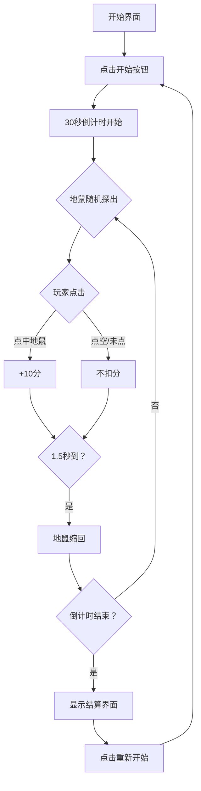

## 1. 产品概述
打地鼠反应挑战游戏是一款经典的休闲益智小游戏，玩家需要在限定时间内点击从洞口中探出的地鼠来获得分数。
- 主要目的：测试玩家的反应速度和手眼协调能力，提供轻松有趣的游戏体验
- 目标用户：全年龄段休闲游戏玩家

## 2. 核心功能

### 2.1 功能模块
1. **游戏主界面**：3×3洞口网格、计分板、倒计时器
2. **游戏控制**：开始/重新开始按钮
3. **结算界面**：显示总分、击中次数统计

### 2.2 页面详情
| 页面名称 | 模块名称 | 功能描述 |
|-----------|-------------|---------------------|
| 游戏主界面 | 洞口网格 | 3×3排列的九个洞口，地鼠随机从洞口探出 |
| 游戏主界面 | 计分板 | 实时显示当前得分 |
| 游戏主界面 | 倒计时器 | 显示剩余游戏时间（30秒倒计时） |
| 游戏主界面 | 控制按钮 | 开始游戏、重新开始游戏 |
| 结算弹窗 | 成绩统计 | 显示最终得分、击中次数 |

## 3. 核心流程
玩家点击开始按钮后，游戏进入30秒倒计时。地鼠会从9个洞口中随机探出，每次探出持续1.5秒后自动缩回。玩家点击探出的地鼠可获得10分，点击空洞口不扣分。倒计时结束后，显示本轮游戏的总分和击中次数统计，玩家可点击重新开始按钮进行新一轮游戏。

## 4. 用户界面设计
### 4.1 设计风格
- **主色调**：草地绿色（代表草坪）、土棕色（代表洞口）
- **点缀色**：亮黄色（地鼠）、红色（击中效果）
- **按钮风格**：圆角3D立体按钮，带有悬停和点击动效
- **字体**：使用可爱圆润的字体，适合休闲游戏氛围
- **布局**：居中卡片式布局，洞口呈3×3网格排列
- **动效**：地鼠探出/缩回有平滑动画，击中时有缩放和变色反馈

### 4.2 页面设计概述
| 页面名称 | 模块名称 | UI元素 |
|-----------|-------------|-------------|
| 游戏主界面 | 顶部信息栏 | 倒计时（大号数字）、当前得分 |
| 游戏主界面 | 游戏区域 | 3×3洞口网格，地鼠探出动画 |
| 游戏主界面 | 底部控制区 | 开始/重新开始按钮 |
| 结算弹窗 | 成绩展示 | 总分、击中次数、重新开始按钮 |

### 4.3 响应式
- 桌面端优先设计，适配移动端
- 移动端调整网格大小以适应屏幕宽度
- 触摸优化，确保点击区域足够大
