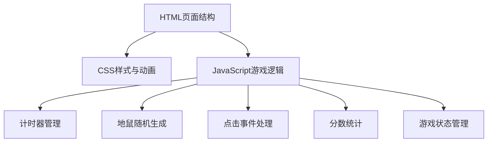

## 1. 架构设计
本项目为纯前端小游戏，无需后端服务。



## 2. 技术描述
- **前端**：原生 HTML + CSS + JavaScript（无需框架）
- **构建工具**：无，直接在浏览器中运行
- **部署方式**：静态文件，双击 index.html 即可运行

## 3. 文件结构
| 文件 | 用途 |
|-------|---------|
| index.html | 游戏主页面，包含HTML结构 |
| style.css | 样式文件，包含布局、颜色、动画 |
| script.js | 游戏逻辑，包含计时器、随机生成、点击处理等 |

## 4. 核心数据结构
### 4.1 游戏状态
```javascript
{
  score: number,        // 当前得分
  hitCount: number,     // 击中次数
  timeLeft: number,     // 剩余时间（秒）
  isPlaying: boolean,   // 游戏是否进行中
  activeMoles: number[] // 当前探出的地鼠洞口索引
}
```

### 4.2 常量配置
```javascript
{
  GAME_DURATION: 30,    // 游戏时长（秒）
  MOLE_APPEAR_TIME: 1500, // 地鼠出现时间（毫秒）
  POINTS_PER_HIT: 10,   // 每次击中得分
  GRID_SIZE: 3,         // 网格大小
  TOTAL_HOLES: 9        // 总洞口数
}
```

## 5. 核心函数
| 函数名 | 功能 |
|-------|---------|
| startGame() | 初始化游戏状态，启动计时器 |
| endGame() | 结束游戏，显示结算界面 |
| spawnMole() | 随机选择一个洞口让地鼠探出 |
| hideMole(index) | 让指定洞口的地鼠缩回 |
| handleHoleClick(index) | 处理洞口点击事件，判断是否击中 |
| updateTimer() | 更新倒计时显示 |
| updateScore() | 更新分数显示 |
| showResult() | 显示游戏结果弹窗 |
