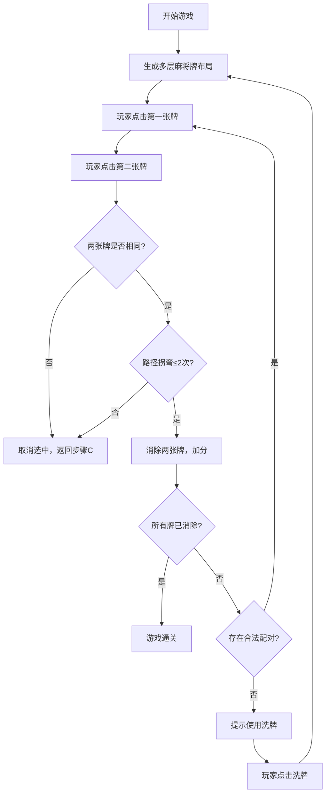

## 1. 产品概述

麻将连连看是一款经典的休闲益智游戏，玩家通过点击配对相同花色的麻将牌来消除它们，需要满足路径拐弯不超过两次的规则。

- 主要用途：休闲娱乐，锻炼观察力和思维能力
- 目标用户：各年龄段休闲游戏爱好者

## 2. 核心功能

### 2.1 功能模块

1. **游戏主界面**：多层麻将牌布局、得分显示、剩余牌数、洗牌按钮
2. **配对消除系统**：路径检测算法、消除动画、得分计算
3. **游戏状态管理**：开始游戏、通关判定、洗牌功能

### 2.2 页面详情

| 页面名称 | 模块名称 | 功能描述 |
|-----------|-------------|---------------------|
| 游戏主页面 | 牌桌区域 | 随机生成多层麻将牌，支持点击选牌和配对消除 |
| 游戏主页面 | 信息面板 | 显示当前得分、剩余牌数、洗牌按钮 |
| 游戏主页面 | 状态提示 | 通关提示、无合法配对提示 |

## 3. 核心流程

## 4. 用户界面设计

### 4.1 设计风格

- **主色调**：中国风红色 (#C41E3A) 搭配金色 (#D4AF37)，体现麻将传统文化
- **背景色**：深绿色 (#1B4D3E) 模拟真实麻将桌
- **按钮风格**：圆角矩形，带有轻微立体效果，悬停时有缩放动画
- **字体**：使用 'Noto Sans SC' 中文字体，标题加粗
- **布局风格**：居中牌桌布局，顶部信息栏，简洁大气

### 4.2 页面设计概述

| 页面名称 | 模块名称 | UI元素 |
|-----------|-------------|-------------|
| 游戏主页面 | 信息面板 | 得分数字、剩余牌数、洗牌按钮 |
| 游戏主页面 | 牌桌区域 | 3D立体麻将牌、选中高亮、消除动画 |
| 游戏主页面 | 弹窗 | 通关提示框、洗牌确认提示 |

### 4.3 响应性

- 桌面端优先设计，支持1280x720及以上分辨率
- 麻将牌大小根据屏幕自适应调整
- 按钮支持触摸操作，确保移动端可用

### 4.4 动效设计

- 麻将牌选中：边框高亮 + 轻微上浮
- 消除动画：渐隐缩小 + 粒子效果
- 配对成功：得分数字弹出动画
- 路径提示：连接线动画显示
