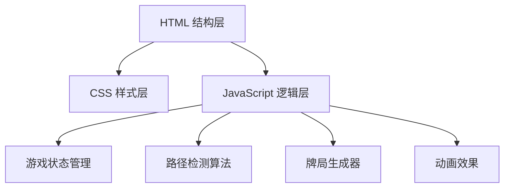

## 1. 架构设计



## 2. 技术描述

- **前端技术栈**：纯 HTML5 + CSS3 + Vanilla JavaScript（ES6+）
- **目录结构**：
  - `html/` - 存放 HTML 文件
  - `css/` - 存放 CSS 样式文件
  - `js/` - 存放 JavaScript 脚本文件
- **无需后端**：纯前端游戏，数据存储在内存中
- **无需数据库**：游戏状态为会话级存储

## 3. 目录结构

```
麻将连连看/
├── html/
│   └── index.html          # 游戏主页面
├── css/
│   └── style.css           # 游戏样式
├── js/
│   ├── game.js             # 游戏核心逻辑
│   ├── pathfinder.js       # 路径检测算法
│   ├── board.js            # 牌局管理
│   └── animation.js        # 动画效果
└── index.html              # 入口文件（重定向到 html/index.html）
```

## 4. 核心模块说明

### 4.1 游戏状态管理 (game.js)

```javascript
class Game {
  score: number;
  remainingTiles: number;
  selectedTile: Tile | null;
  board: Board;
  
  startGame();
  selectTile(tile);
  checkMatch(tile1, tile2);
  shuffleBoard();
  checkWin();
  hasValidMove();
}
```

### 4.2 路径检测算法 (pathfinder.js)

```javascript
class PathFinder {
  findPath(board, tile1, tile2);
  canConnectDirectly(tile1, tile2);
  canConnectWithOneTurn(tile1, tile2);
  canConnectWithTwoTurns(tile1, tile2);
  isLineClear(x1, y1, x2, y2);
}
```

### 4.3 牌局管理 (board.js)

```javascript
class Board {
  tiles: Tile[][][];  // 三层数组: [层][行][列]
  generateTiles(layers, rows, cols);
  getTileAt(x, y, z);
  removeTile(tile);
  isTileClickable(tile);
  shuffle();
}
```

## 5. 数据结构

### 5.1 麻将牌对象

```javascript
{
  id: string,
  type: string,        // 牌类型: 'wan', 'tiao', 'tong', 'feng', 'jian'
  value: number,       // 牌面值: 1-9
  x: number,           // 列位置
  y: number,           // 行位置
  z: number,           // 层级
  isSelected: boolean,
  isRemoved: boolean,
  element: HTMLElement // DOM元素引用
}
```

### 5.2 路径点

```javascript
{
  x: number,
  y: number
}
```

## 6. 算法说明

### 6.1 路径检测规则

1. **直线连接**：两张牌在同一行或同一列，中间无阻挡
2. **一个拐角**：通过一个中间点连接，形成L型路径
3. **两个拐角**：通过两个中间点连接，形成Z型或U型路径

### 6.2 可点击判断

麻将牌需要满足以下条件才可点击：
- 未被移除
- 上方无其他牌覆盖
- 左右至少有一侧是空的
