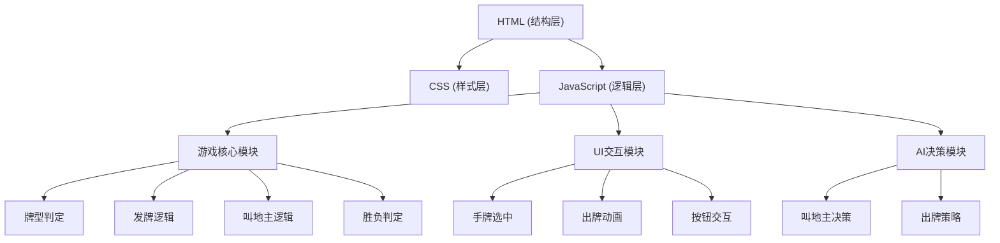

## 1. 架构设计



## 2. 技术描述
- 前端：纯HTML + CSS + JavaScript（无框架）
- 目录结构：
  - `index.html` - 页面结构
  - `css/style.css` - 样式文件
  - `js/game.js` - 游戏核心逻辑
  - `js/ui.js` - UI交互逻辑
  - `js/ai.js` - AI决策逻辑
- 无需后端服务，纯前端运行
- 数据存储：使用浏览器内存，游戏数据不持久化

## 3. 目录结构

```
斗地主扑克牌/
├── index.html              # 主页面
├── css/
│   └── style.css          # 样式文件
├── js/
│   ├── game.js            # 游戏核心逻辑（发牌、牌型、胜负）
│   ├── ui.js              # UI交互
│   └── ai.js              # AI决策
└── .trae/documents/
    ├── 斗地主游戏PRD.md
    └── 技术架构文档.md
```

## 4. 核心数据结构

### 4.1 扑克牌数据结构
```javascript
{
  id: number,        // 唯一标识
  suit: string,      // 花色: 'spade'(黑桃), 'heart'(红桃), 'club'(梅花), 'diamond'(方块), 'joker'(王)
  value: string,     // 牌值: '3','4',...,'K','A','2','smallJoker','bigJoker'
  rank: number       // 排序权重，用于比较大小
}
```

### 4.2 玩家数据结构
```javascript
{
  id: number,        // 0: 玩家, 1: 电脑左, 2: 电脑右
  name: string,
  cards: Array,      // 手牌数组
  isLandlord: boolean, // 是否地主
  isCurrentTurn: boolean // 是否当前回合
}
```

### 4.3 牌型数据结构
```javascript
{
  type: string,      // 牌型: single, pair, triple, triple+one, triple+two, straight, 
                     //        consecutivePairs, plane, bomb, rocket, four+two
  value: number,     // 牌型的主要值（用于比较）
  cards: Array,      // 包含的牌
  length: number     // 牌的数量
}
```

## 5. 核心算法

### 5.1 牌型识别算法
- 按牌值分组统计频率
- 根据频率分布和连续性判断牌型

### 5.2 牌型比较算法
- 相同牌型比较主值
- 炸弹大于普通牌型
- 王炸最大

### 5.3 AI出牌算法
- 贪心策略：优先出最小的可压牌
- 策略考虑：保留炸弹、顺子等组合牌
- 地主策略：优先出完牌
- 农民策略：合作对抗地主

## 6. 游戏状态机

```
初始化 → 发牌 → 叫地主 → 地主获底牌 → 出牌回合 → 游戏结束
     ↑                          ↓
     └────────── 都不叫地主 ────┘

出牌回合:
  玩家出牌/不出 → 下一家 → 都不出 → 新一轮开始
     ↓
  有人出完 → 游戏结束
```
