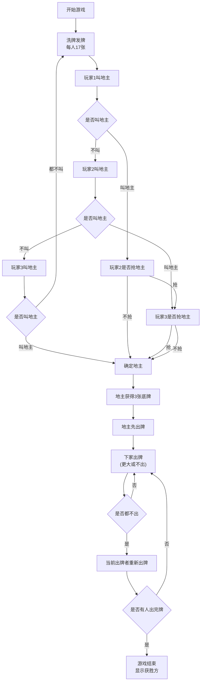

## 1. 产品概述
斗地主扑克牌游戏是一款经典的三人扑克牌游戏，包含叫地主、出牌对战等核心玩法。
- 主要目的：提供一款可在浏览器中直接运行的斗地主游戏，玩家通过点击操作进行游戏
- 目标用户：扑克牌游戏爱好者，休闲娱乐用户

## 2. 核心功能

### 2.1 用户角色
| 角色 | 注册方式 | 核心权限 |
|------|----------|----------|
| 玩家 | 无需注册，直接开始 | 叫地主、出牌、不出 |
| AI玩家 | 系统自动生成 | 自动叫地主、自动出牌 |

### 2.2 功能模块
1. **游戏主界面**：显示三名玩家手牌、底牌、出牌区、操作按钮
2. **发牌系统**：54张牌随机分配，每人17张，剩余3张为底牌
3. **叫地主阶段**：三名玩家依次竞价，可选择"不叫"或"叫地主"
4. **出牌阶段**：玩家轮流出牌，需比上家牌型更大或选择不出
5. **牌型判定系统**：支持单张、对子、三带、顺子、炸弹等标准牌型
6. **胜负判定**：一方先出完手牌则该阵营获胜

### 2.3 页面详情
| 页面名称 | 模块名称 | 功能描述 |
|----------|----------|----------|
| 游戏主界面 | 发牌模块 | 洗牌并分配54张牌，显示玩家手牌 |
| 游戏主界面 | 叫地主模块 | 三名玩家依次竞价，确定地主身份 |
| 游戏主界面 | 出牌模块 | 选中手牌、出牌、不出、提示功能 |
| 游戏主界面 | 胜负判定 | 判定游戏结束，显示获胜阵营 |

## 3. 核心流程
游戏流程：开始游戏 → 发牌 → 叫地主 → 地主获得底牌 → 轮流押出牌 → 一方出完 → 游戏结束

## 4. 用户界面设计
### 4.1 设计风格
- 主色调：深绿色（#1a5f3c）代表扑克牌桌
- 辅助色：金色（#d4af37）代表地主身份，红色（#e74c3c）、黑色（#2c3e50）代表牌面颜色
- 按钮风格：圆角矩形，有悬停效果和点击反馈
- 字体：使用清晰易读的无衬线字体，牌面数字使用粗体
- 布局风格：玩家位于屏幕底部，两名AI玩家分别位于左上和右上
- 图标：使用扑克牌花色符号（♠♥♦♣）

### 4.2 页面设计概述
| 页面名称 | 模块名称 | UI元素 |
|----------|----------|--------|
| 游戏主界面 | 玩家手牌区 | 底部横向排列，点击选中高亮，可多选 |
| 游戏主界面 | AI玩家区 | 左上角和右上角显示牌背和剩余数量 |
| 游戏主界面 | 出牌区 | 中央显示当前回合出牌 |
| 游戏主界面 | 底牌区 | 地主确定后显示3张底牌 |
| 游戏主界面 | 操作按钮 | 出牌、不出、提示、重新开始 |
| 游戏主界面 | 信息区 | 显示当前阶段、地主标识、胜负信息 |

### 4.3 响应式
- 桌面端优先设计，支持自适应宽度
- 手牌在小屏幕上自动调整大小和间距
- 按钮区域保持可点击尺寸

### 4.4 动画效果
- 发牌动画：牌从牌堆飞向各玩家
- 选中动画：牌向上移动高亮
- 出牌动画：牌从手牌区飞向出牌区
- 获胜动画：闪烁效果和庆祝文字
