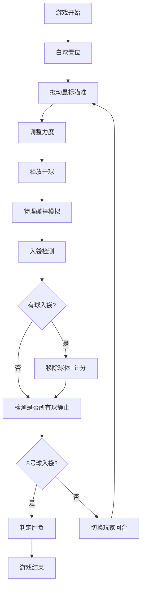

## 1. 产品概述
专业8球制台球游戏，提供真实物理碰撞模拟和流畅操作体验，面向休闲游戏玩家。
- 核心价值：还原真实台球物理效果，提供简单易上手的游戏体验
- 目标用户：休闲游戏爱好者、台球爱好者

## 2. 核心功能

### 2.1 用户角色
| 角色 | 注册方式 | 核心权限 |
|------|----------|----------|
| 玩家 | 无需注册 | 进行游戏、查看得分 |

### 2.2 功能模块
1. **游戏主界面**：台球桌、球杆、游戏信息面板
2. **物理引擎**：球的运动、碰撞检测、反弹效果
3. **游戏逻辑**：8球规则、入袋判定、胜负判定
4. **交互系统**：鼠标拖动瞄准、力度控制、击球操作

### 2.3 页面详情
| 页面名称 | 模块名称 | 功能描述 |
|----------|----------|----------|
| 游戏主界面 | 台球桌渲染 | 标准绿色台球桌、6个球袋、边框装饰 |
| 游戏主界面 | 球体系统 | 16颗球按规则排列、真实物理运动 |
| 游戏主界面 | 球杆系统 | 跟随鼠标旋转、力度指示、击球动画 |
| 游戏主界面 | 信息面板 | 当前玩家回合、已入袋球数、游戏状态 |
| 游戏主界面 | 物理引擎 | 碰撞检测、速度衰减、碰壁反弹 |
| 游戏主界面 | 规则判定 | 8球规则、入袋计分、胜负判定 |

## 3. 核心流程
玩家进入游戏 → 白球置位 → 拖动鼠标瞄准和调整力度 → 释放击球 → 球运动碰撞 → 入袋判定 → 切换玩家回合 → 循环直至8号球入袋判定胜负

## 4. 用户界面设计
### 4.1 设计风格
- 主色调：深绿色（台球桌）、深棕色（边框）、金色（装饰）
- 辅助色：白色（白球）、各色（彩球）
- 字体：现代无衬线字体，清晰易读
- 布局：居中台球桌，顶部信息面板，简洁专业
- 视觉效果：球体高光、阴影、球杆质感

### 4.2 页面设计概述
| 页面名称 | 模块名称 | UI元素 |
|----------|----------|--------|
| 游戏主界面 | 台球桌 | 绿色毛毡质感、金色边线、6个球袋 |
| 游戏主界面 | 球体 | 16颗彩色球、高光效果、阴影投射 |
| 游戏主界面 | 球杆 | 木质纹理、力度条指示、旋转跟随 |
| 游戏主界面 | 信息面板 | 玩家标识、球数统计、状态提示 |

### 4.3 响应式
- 桌面端优先设计
- Canvas自适应屏幕尺寸
- 保持台球桌比例

### 4.4 视觉效果
- 球体高光和阴影增强立体感
- 击球时的力度条渐变效果
- 入袋时的消失动画
- 球杆瞄准线辅助
