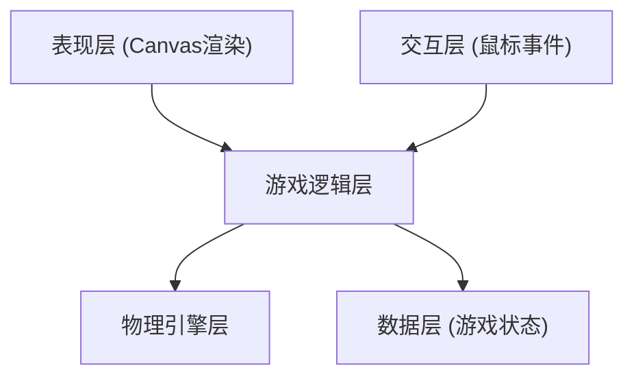

## 1. 架构设计
纯前端Canvas实现的台球游戏，采用分层架构设计。



## 2. 技术描述
- 前端：原生HTML5 + CSS3 + JavaScript (ES6+)
- 渲染：Canvas 2D API
- 物理引擎：自研2D刚体碰撞系统
- 目录结构：分离HTML/CSS/JS到不同目录

## 3. 目录结构
```
台球小游戏/
├── index.html              # 入口HTML文件
├── css/
│   └── style.css           # 样式文件
├── js/
│   ├── game.js             # 游戏主逻辑
│   ├── physics.js          # 物理引擎
│   ├── ball.js             # 球体类
│   ├── table.js            # 台球桌类
│   └── cue.js              # 球杆类
└── .trae/
    └── documents/          # 文档目录
```

## 4. 核心模块设计

### 4.1 物理引擎模块
- 位置/速度/加速度向量运算
- 球体间碰撞检测与响应
- 球体与边框碰撞检测与响应
- 摩擦力和速度衰减
- 入袋检测

### 4.2 游戏状态管理
- 当前玩家回合
- 已入袋球统计（单色球/花色球/8号球）
- 游戏状态（瞄准中/击球中/游戏结束）
- 胜负判定逻辑

### 4.3 渲染系统
- 台球桌绘制（毛毡、边框、球袋）
- 球体绘制（颜色、编号、高光、阴影）
- 球杆绘制（角度、力度指示）
- 瞄准辅助线
- 信息面板UI

## 5. 关键技术实现

### 5.1 碰撞检测算法
- 球体间：距离检测法（两球中心距离 < 半径和）
- 球体与边框：边界检测 + 法向量反射
- 弹性碰撞：动量守恒公式计算速度分解

### 5.2 8球规则实现
- 开球后确定玩家球型（单色/花色）
- 本方球未全部入袋前打入8号球判负
- 8号球合法入袋判定胜负
- 白球入袋犯规处理

### 5.3 交互控制
- mousedown：开始瞄准
- mousemove：更新球杆角度和力度
- mouseup：释放击球
- 力度根据拖动距离计算
