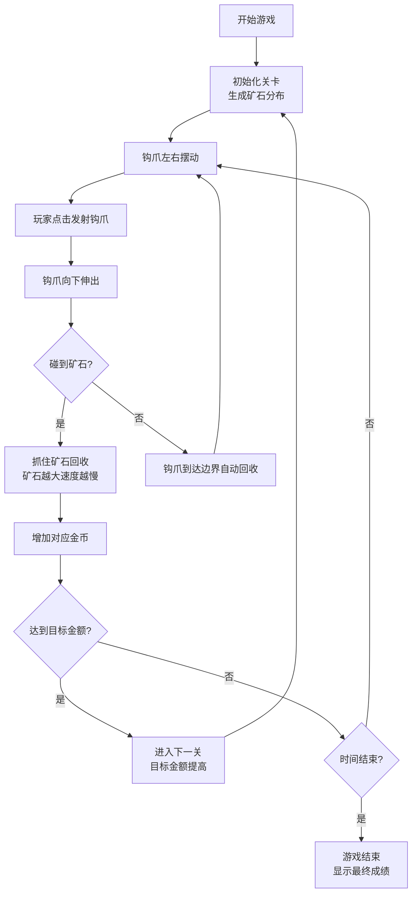

## 1. 产品概述

黄金矿工是一款经典休闲小游戏，玩家操控矿工发射钩爪抓取地下矿石获取金币，在规定时间内达到目标金额即可通关。游戏易上手，适合各年龄段玩家休闲娱乐。

- 核心玩法：点击发射钩爪抓取矿石，不同矿石价值不同，矿石越大回收速度越慢
- 目标用户：休闲游戏玩家，各年龄段用户
- 产品价值：提供轻松有趣的游戏体验，锻炼玩家的时机把握和策略选择能力

## 2. 核心功能

### 2.1 功能模块

1. **游戏主界面**：矿工角色、钩爪系统、矿石分布、游戏状态显示
2. **关卡系统**：目标金额设定、难度递增、关卡切换
3. **计分系统**：当前金额、目标金额、倒计时显示
4. **矿石系统**：多种矿石类型（金块、钻石、石块）、大小和价值关联

### 2.2 页面详情

| 页面名称 | 模块名称 | 功能描述 |
|---------|---------|---------|
| 游戏主页面 | 矿工与钩爪 | 矿工位于顶部，钩爪自动摆动，点击发射抓取矿石 |
| 游戏主页面 | 矿石区域 | 随机分布大小不一的金块、钻石、石块 |
| 游戏主页面 | 状态栏 | 显示当前金额、目标金额、剩余时间、当前关卡 |
| 游戏主页面 | 关卡切换 | 达到目标金额后进入下一关，金额累计 |
| 游戏主页面 | 游戏结束 | 时间结束未达标显示最终成绩，可重新开始 |

## 3. 核心流程

## 4. 用户界面设计

### 4.1 设计风格

- **主题色彩**：大地色系为主，天空蓝（顶部）、土黄色（矿区背景）、深棕色（地下层）
- **主色调**：#8B4513（棕色）、#FFD700（金色）、#00CED1（钻石蓝）、#696969（石块灰）
- **按钮风格**：圆角矩形按钮，金色边框，棕色填充，悬停时有金色光晕效果
- **字体**：使用游戏风格字体，数字使用等宽字体突出显示
- **布局风格**：游戏区域居中，状态栏位于顶部，采用复古游戏像素风格
- **视觉元素**：使用Canvas绘制矿工、钩爪、矿石，带有轻微的卡通风格

### 4.2 页面设计概述

| 页面名称 | 模块名称 | UI元素 |
|---------|---------|---------|
| 游戏主页面 | 状态栏 | 金色边框的信息面板，显示金额、目标、时间、关卡 |
| 游戏主页面 | 矿工角色 | 位于屏幕顶部中央，戴黄色安全帽的矿工形象 |
| 游戏主页面 | 钩爪系统 | 银色金属钩爪，带绳索，摆动和伸缩动画 |
| 游戏主页面 | 矿石区域 | 渐变地下背景，矿石随机分布，碰撞检测区域 |
| 游戏主页面 | 游戏弹窗 | 半透明黑色背景，金色边框的提示框，显示通关/失败信息 |

### 4.3 响应式设计

- 桌面端优先设计，游戏区域固定尺寸
- 支持窗口大小自适应，游戏内容居中显示
- 鼠标点击操作，适配桌面端交互

### 4.4 动画效果

- 钩爪摆动：平滑的左右摆动物理效果
- 钩爪伸缩：匀速伸出和回收动画
- 矿石抓取：矿石被抓住时有轻微抖动效果
- 金币增加：数字跳动动画，+数值飘字效果
- 关卡切换：淡入淡出过渡动画
