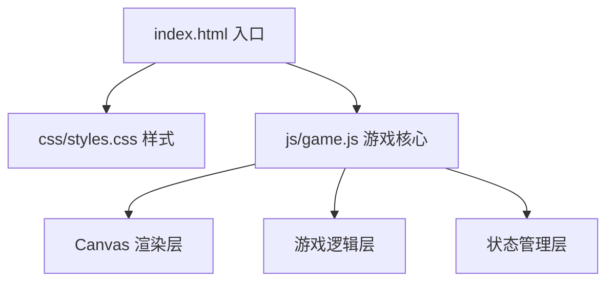

## 1. 架构设计



纯前端项目，无后端依赖。HTML 作为入口，CSS 负责界面样式，JavaScript 负责游戏逻辑和 Canvas 渲染。

## 2. 技术说明

- 前端：原生 HTML5 + CSS3 + JavaScript (ES6+)
- 渲染：Canvas 2D API
- 初始化方式：手动创建目录结构，无需构建工具
- 后端：无
- 数据库：无（纯前端本地游戏）

## 3. 目录结构

```
黄金矿工小游戏/
├── index.html          # 入口HTML
├── css/
│   └── styles.css      # 游戏样式
├── js/
│   └── game.js         # 游戏核心逻辑
└── assets/             # 预留资源目录（可选）
```

## 4. 核心数据模型

### 4.1 矿石对象 (Ore)

| 属性 | 类型 | 说明 |
|------|------|------|
| type | string | 'gold' / 'diamond' / 'stone' |
| x | number | X坐标 |
| y | number | Y坐标 |
| size | number | 半径大小 |
| value | number | 金币价值 |
| weight | number | 重量（影响回收速度） |

### 4.2 钩爪对象 (Hook)

| 属性 | 类型 | 说明 |
|------|------|------|
| angle | number | 当前摆动角度（弧度） |
| length | number | 伸出长度 |
| state | string | 'swinging' / 'extending' / 'retracting' |
| speed | number | 摆动速度 |
| extendSpeed | number | 伸出/回收速度 |
| caughtOre | Ore/null | 抓住的矿石 |

### 4.3 游戏状态 (GameState)

| 属性 | 类型 | 说明 |
|------|------|------|
| level | number | 当前关卡 |
| money | number | 当前金额 |
| targetMoney | number | 目标金额 |
| timeLeft | number | 剩余时间（秒） |
| ores | Ore[] | 当前关卡矿石 |
| isPlaying | boolean | 是否在游戏中 |
| isLevelComplete | boolean | 关卡是否完成 |

## 5. 游戏常量

| 常量 | 值 | 说明 |
|------|-----|------|
| 金块基础价值 | 100-500 | 根据大小 |
| 钻石基础价值 | 500-1500 | 根据大小 |
| 石块基础价值 | 20-80 | 根据大小 |
| 初始目标金额 | 1000 | 第1关 |
| 每关时间 | 60秒 | 初始 |
| 目标金额增长率 | 1.5x | 每关递增 |
