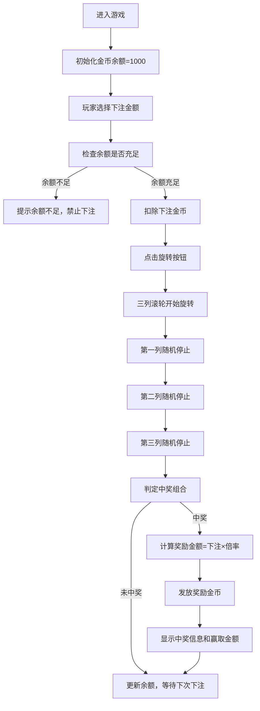

## 1. 产品概述

一款基于Web的经典水果机老虎机游戏，玩家通过押注金币旋转三列滚轮，根据停止后的图标组合获得不同倍率的金币奖励。游戏界面华丽复古，操作简单，带有流畅的动画效果。

- 主要功能：三列滚轮随机旋转、中奖组合判定、金币押注与奖励系统
- 目标用户：休闲游戏爱好者
- 产品价值：提供轻松有趣的娱乐体验，模拟真实老虎机的刺激感

## 2. 核心功能

### 2.1 用户角色
| 角色 | 注册方式 | 核心权限 |
|------|----------|----------|
| 玩家 | 无需注册，首次进入赠送初始金币 | 游戏操作、查看金币余额、选择押注金额 |

### 2.2 功能模块
1. **游戏主界面**：三列滚轮区域、控制按钮区、信息显示区
2. **滚轮旋转系统**：三列独立滚动、随机停止动画
3. **中奖判定系统**：图标组合匹配、倍率计算
4. **金币管理系统**：余额显示、押注选择、奖励发放
5. **状态提示系统**：中奖提示、余额不足提示

### 2.3 页面详情
| 页面名称 | 模块名称 | 功能描述 |
|---------|----------|----------|
| 游戏主界面 | 滚轮显示区 | 三列垂直排列的滚轮，每列显示多种水果图标，支持滚动动画 |
| 游戏主界面 | 押注控制区 | 提供多种下注金额选择按钮，显示当前押注金额 |
| 游戏主界面 | 旋转按钮 | 点击后开始旋转滚轮，旋转过程中按钮禁用 |
| 游戏主界面 | 信息显示区 | 显示当前金币余额、最近一次赢取金额 |
| 游戏主界面 | 中奖提示区 | 显示中奖组合、倍率和赢取金币数 |

## 3. 核心流程

## 4. 用户界面设计

### 4.1 设计风格
- **设计主题**：复古赌场风格，霓虹灯效果
- **主色调**：深红色 (#8B0000) 搭配金色 (#FFD700) 点缀
- **辅助色**：深紫色 (#4B0082)、霓虹绿 (#39FF14)
- **按钮风格**：3D立体按钮，圆角设计，带有发光悬停效果
- **字体**：主标题使用 "Lilita One" 加粗字体，数字显示使用 "Orbitron" 等宽字体
- **布局**：居中卡片式布局，滚轮区域为视觉焦点
- **图标风格**：使用生动的emoji水果图标（🍒🍋🍊🍇🍉⭐💎7️⃣）

### 4.2 页面设计概述
| 页面名称 | 模块名称 | UI元素 |
|---------|----------|--------|
| 游戏主界面 | 标题区域 | 霓虹发光效果的"水果老虎机"标题，复古赌场风格 |
| 游戏主界面 | 滚轮区域 | 三个独立的滚轮窗口，带有金属边框装饰，内部图标快速滚动 |
| 游戏主界面 | 中奖线 | 中间一条高亮的中奖线，带有闪烁效果 |
| 游戏主界面 | 押注区 | 多个金币按钮，当前选中的按钮高亮发光 |
| 游戏主界面 | 旋转按钮 | 大型金色按钮，带有"开始旋转"文字，悬停时放大 |
| 游戏主界面 | 信息栏 | 左右两侧分别显示金币余额和最近赢取金额，数字滚动效果 |
| 游戏主界面 | 中奖提示 | 中奖时弹出的彩色提示框，显示中奖组合和奖励 |

### 4.3 响应式
- 桌面端优先设计，支持自适应布局
- 移动端：滚轮区域垂直排列，按钮区域优化触控体验
- 支持触摸滑动操作

### 4.4 视觉特效
- 滚轮旋转时的模糊滚动效果
- 中奖时图标闪烁和放大动画
- 金币增加时的数字滚动动画
- 霓虹灯呼吸灯效果
- 按钮点击的弹性反馈
