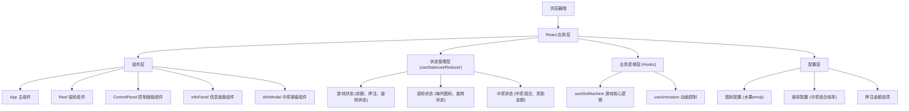

## 1. 架构设计



## 2. 技术描述

- **前端框架**: React@18 + TypeScript
- **构建工具**: Vite@5
- **样式方案**: TailwindCSS@3 + CSS动画
- **状态管理**: React Hooks (useState, useEffect, useCallback)
- **图标方案**: Emoji 水果图标（无需额外图标库）
- **动画方案**: CSS Keyframes + Transform 动画
- **数据持久化**: localStorage 保存金币余额

## 3. 核心数据结构

### 3.1 游戏状态类型定义

```typescript
// 图标类型
type SymbolType = '🍒' | '🍋' | '🍊' | '🍇' | '🍉' | '⭐' | '💎' | '7️⃣';

// 中奖配置
interface WinCombination {
  symbols: [SymbolType, SymbolType, SymbolType];
  multiplier: number;
  name: string;
}

// 游戏状态
interface GameState {
  balance: number;           // 金币余额
  currentBet: number;        // 当前押注金额
  betOptions: number[];      // 可选押注金额
  lastWin: number;           // 最近赢取金额
  isSpinning: boolean;       // 是否正在旋转
  reels: SymbolType[][];     // 三列滚轮的图标
  reelStates: boolean[];     // 每列是否停止
  winInfo: WinInfo | null;   // 中奖信息
}

// 中奖信息
interface WinInfo {
  combination: SymbolType[];
  multiplier: number;
  winAmount: number;
  name: string;
}
```

### 3.2 中奖组合配置

| 组合 | 倍率 | 名称 |
|------|------|------|
| 7️⃣ 7️⃣ 7️⃣ | 100倍 | 幸运七 |
| 💎 💎 💎 | 50倍 | 钻石大奖 |
| ⭐ ⭐ ⭐ | 25倍 | 星星奖 |
| 🍒 🍒 🍒 | 15倍 | 樱桃奖 |
| 🍇 🍇 🍇 | 10倍 | 葡萄奖 |
| 🍊 🍊 🍊 | 8倍 | 橙子奖 |
| 🍋 🍋 🍋 | 5倍 | 柠檬奖 |
| 🍉 🍉 🍉 | 5倍 | 西瓜奖 |
| 任意两个相同 | 2倍 | 小奖 |

## 4. 核心模块说明

### 4.1 useSlotMachine Hook

游戏核心逻辑Hook，包含以下功能：
- `spin()`: 开始旋转，扣除押注，启动三列滚轮
- `stopReel(index: number)`: 停止指定列的滚轮
- `checkWin()`: 检查是否中奖并计算奖励
- `placeBet(amount: number)`: 选择押注金额
- `canBet()`: 检查余额是否足够下注

### 4.2 Reel 组件

单条滚轮组件：
- 显示一列图标
- 支持滚动动画
- 支持随机停止
- 中奖时高亮显示

### 4.3 ControlPanel 组件

控制面板组件：
- 押注金额选择按钮
- 旋转按钮
- 按钮状态管理（禁用/可用）

### 4.4 InfoPanel 组件

信息面板组件：
- 显示当前金币余额（带数字滚动动画）
- 显示最近赢取金额
- 余额不足时警告提示

### 4.5 WinModal 组件

中奖弹窗组件：
- 显示中奖组合
- 显示倍率和赢取金额
- 带有庆祝动画

## 5. 路由定义

| 路由 | 用途 |
|------|------|
| / | 游戏主界面 |

## 6. 项目结构

```
老虎机游戏/
├── src/
│   ├── components/
│   │   ├── Reel.tsx           # 滚轮组件
│   │   ├── ControlPanel.tsx   # 控制面板
│   │   ├── InfoPanel.tsx      # 信息面板
│   │   └── WinModal.tsx       # 中奖弹窗
│   ├── hooks/
│   │   └── useSlotMachine.ts  # 游戏核心逻辑Hook
│   ├── config/
│   │   └── gameConfig.ts      # 游戏配置（图标、赔率、押注选项）
│   ├── types/
│   │   └── game.ts            # 类型定义
│   ├── App.tsx                # 主应用组件
│   ├── main.tsx               # 入口文件
│   └── index.css              # 全局样式和Tailwind
├── public/
├── index.html
├── package.json
├── vite.config.ts
├── tsconfig.json
└── tailwind.config.js
```

## 7. 性能优化

- 使用 `useCallback` 优化事件处理函数
- 使用 `React.memo` 优化组件渲染
- CSS硬件加速动画（transform + opacity）
- 避免在动画期间进行复杂计算
- 使用requestAnimationFrame控制动画时序
