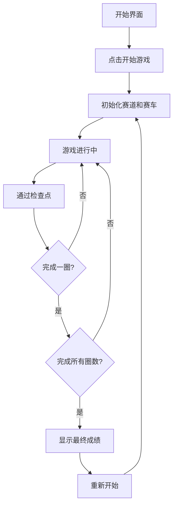

## 1. 产品概述
一款基于HTML5 Canvas的2D赛车漂移竞速游戏，玩家通过键盘控制赛车在赛道上行驶，完成指定圈数后比赛结束。
- 核心目标：提供刺激的漂移竞速体验，包含检查点系统、计时系统和碰撞检测
- 目标用户：休闲游戏玩家、赛车游戏爱好者

## 2. 核心功能

### 2.1 用户角色
| 角色 | 注册方式 | 核心权限 |
|------|----------|----------|
| 玩家 | 无需注册 | 开始游戏、控制赛车、查看成绩 |

### 2.2 功能模块
1. **游戏主界面**：开始按钮、游戏说明、控制提示
2. **游戏场景**：赛道渲染、赛车控制、碰撞检测
3. **HUD显示**：圈数、排名、单圈时间、总计时
4. **结果界面**：最终排名、用时统计、重新开始

### 2.3 页面详情
| 页面名称 | 模块名称 | 功能描述 |
|----------|----------|----------|
| 开始界面 | 开始模块 | 游戏标题、开始按钮、操作说明 |
| 游戏界面 | 游戏模块 | Canvas赛道渲染、赛车控制、检查点系统 |
| 游戏界面 | HUD模块 | 实时显示圈数、排名、单圈时间、总计时 |
| 结束界面 | 结果模块 | 显示最终排名、各圈用时、总用时 |

## 3. 核心流程
玩家打开游戏 → 点击开始按钮 → 进入游戏场景 → 使用方向键控制赛车 → 按顺序通过检查点 → 完成指定圈数 → 显示最终成绩 → 可重新开始游戏

## 4. 用户界面设计
### 4.1 设计风格
- 主色调：深黑色背景配合霓虹蓝色和红色，营造科技感赛车氛围
- 按钮风格：圆角矩形按钮，带有发光效果和悬停动画
- 字体：使用Orbitron等赛车风格字体，数字使用等宽字体
- 布局：全屏Canvas游戏，HUD信息覆盖在左上角和右上角
- 视觉效果：赛道发光效果、赛车尾焰、漂移痕迹

### 4.2 页面设计概览
| 页面名称 | 模块名称 | UI元素 |
|----------|----------|--------|
| 开始界面 | 开始模块 | 霓虹风格标题、发光按钮、键盘控制图示 |
| 游戏界面 | 游戏模块 | 深色赛道、发光路肩、检查点标记、赛车精灵 |
| 游戏界面 | HUD模块 | 半透明背景面板、白色文字、实时更新数据 |
| 结束界面 | 结果模块 | 居中显示成绩表、排名高亮、重新开始按钮 |

### 4.3 响应式
- Desktop-first设计，优先保证PC端游戏体验
- Canvas自适应屏幕大小，保持宽高比
- 键盘操作优化，支持方向键和WASD双控制方案
