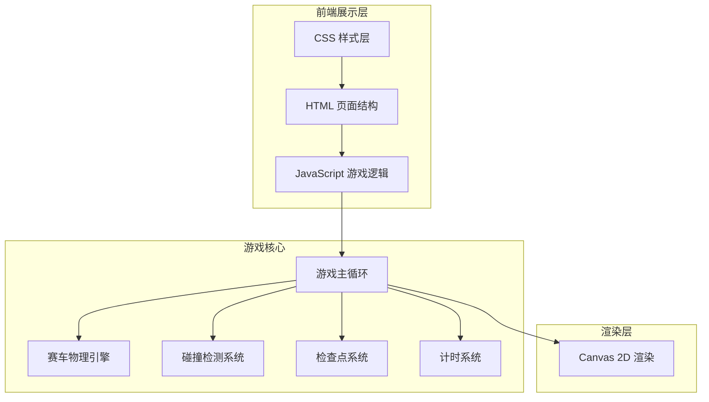

## 1. 架构设计



## 2. 技术描述
- 前端：原生 HTML5 + CSS3 + JavaScript (ES6+)
- 渲染引擎：Canvas 2D API
- 构建工具：无（纯静态文件）
- 后端：无（纯前端游戏）
- 数据库：无（本地存储可选）

## 3. 目录结构
```
赛车漂移竞速游戏/
├── index.html          # 主页面
├── css/
│   └── style.css       # 样式文件
└── js/
    ├── game.js         # 游戏主逻辑
    ├── car.js          # 赛车物理引擎
    ├── track.js        # 赛道数据和渲染
    ├── checkpoint.js   # 检查点系统
    └── utils.js        # 工具函数
```

## 4. 核心类和函数定义

### 4.1 Car 类 - 赛车物理
```javascript
class Car {
    constructor(x, y, angle)
    update(keys, deltaTime)
    applyFriction()
    checkCollision(track)
    getPosition()
    getAngle()
}
```

### 4.2 Track 类 - 赛道管理
```javascript
class Track {
    constructor()
    getTrackPoints()
    getCheckpoints()
    isOnTrack(x, y)
    draw(ctx)
}
```

### 4.3 Game 类 - 游戏主控制器
```javascript
class Game {
    constructor()
    init()
    start()
    update(deltaTime)
    draw()
    gameLoop()
    checkCheckpoints()
    updateLapTime()
    endGame()
}
```

### 4.4 计时系统
```javascript
class Timer {
    constructor()
    start()
    lap()
    stop()
    getTotalTime()
    getLapTimes()
}
```

## 5. 游戏参数配置
| 参数 | 数值 | 说明 |
|------|------|------|
| TOTAL_LAPS | 3 | 总圈数 |
| MAX_SPEED | 8 | 赛车最大速度 |
| ACCELERATION | 0.2 | 加速度 |
| FRICTION | 0.98 | 摩擦系数 |
| TURN_SPEED | 0.05 | 转向速度 |
| DRIFT_FACTOR | 0.85 | 漂移系数 |
| COLLISION_DECELERATION | 0.5 | 碰撞减速 |
| CHECKPOINT_COUNT | 8 | 检查点数量 |
