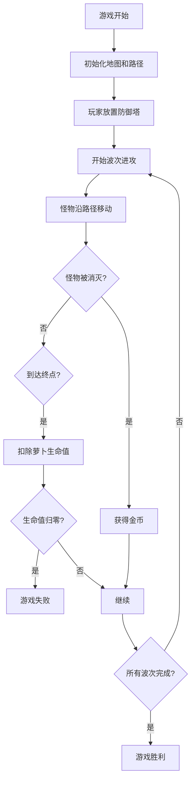

# 保卫萝卜塔防游戏 产品需求文档 (PRD)

## 1. 产品概述

保卫萝卜是一款经典塔防游戏，玩家通过在地图空地上放置防御塔，阻止怪物沿固定路径到达终点，保护萝卜生命值。游戏包含多波次怪物进攻，玩家需要合理规划防御塔布局和升级策略来取得胜利。

- 核心玩法：策略塔防，资源管理
- 目标用户：休闲游戏玩家
- 产品价值：提供轻松有趣的策略游戏体验

## 2. 核心功能

### 2.1 用户角色

| 角色 | 注册方式 | 核心权限 |
|------|---------|---------|
| 玩家 | 无需注册 | 进行游戏、放置防御塔、升级防御塔 |

### 2.2 功能模块

1. **游戏主界面**：地图显示、怪物路径、萝卜生命值、金币显示、波次信息
2. **防御塔系统**：拖拽放置、自动攻击、升级功能、攻击范围显示
3. **怪物系统**：沿路径移动、波次生成、生命值显示
4. **经济系统**：消灭怪物获得金币、建造/升级消耗金币
5. **游戏状态**：开始/暂停、胜利/失败判定

### 2.3 页面详情

| 页面名称 | 模块名称 | 功能描述 |
|---------|---------|---------|
| 游戏主页面 | 游戏画布 | 渲染地图、路径、怪物、防御塔、子弹特效 |
| 游戏主页面 | 顶部状态栏 | 显示萝卜生命值、当前金币、当前波次、总波次 |
| 游戏主页面 | 底部塔选择栏 | 展示可建造的防御塔类型、价格、拖拽放置 |
| 游戏主页面 | 塔信息面板 | 点击已放置的塔显示属性、升级选项、出售选项 |
| 游戏主页面 | 游戏结束弹窗 | 显示胜利/失败结果、重新开始按钮 |

## 3. 核心流程

## 4. 用户界面设计

### 4.1 设计风格

- **主色调**：绿色系（代表草地和生机）、橙色（代表胡萝卜）
- **辅助色**：蓝色（防御塔）、红色（怪物血量）、黄色（金币）
- **整体风格**：卡通可爱、色彩明亮、圆角设计
- **字体**：圆润可爱的无衬线字体

### 4.2 页面设计概览

| 页面名称 | 模块名称 | UI元素 |
|---------|---------|--------|
| 游戏主页面 | 游戏画布 | 网格地图、蜿蜒路径、可爱的怪物、卡通风格防御塔、萝卜终点 |
| 游戏主页面 | 状态栏 | 胡萝卜图标+生命值条、金币图标+数字、波次进度 |
| 游戏主页面 | 塔选择栏 | 卡片式塔预览、价格标签、拖拽高亮效果 |
| 游戏主页面 | 信息面板 | 半透明背景、升级按钮、出售按钮、属性数值 |
| 游戏主页面 | 结束弹窗 | 居中大标题、emoji图标、重新开始按钮 |

### 4.3 响应式设计

- 桌面端优先，游戏画布固定尺寸（800x600）
- 移动端自适应缩放，保持游戏比例
- 触摸操作支持：点击选择、长按拖拽

### 4.4 动效设计

- 防御塔攻击：子弹飞行轨迹、命中爆炸效果
- 怪物受伤：血量条减少动画、闪烁效果
- 放置防御塔：缩放出现动画
- 金币获得：数字跳动+漂浮特效
- 波次开始：倒计时动画
