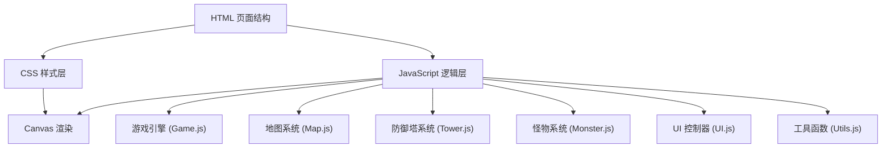

# 保卫萝卜塔防游戏 技术架构文档

## 1. 架构设计



## 2. 技术栈说明

- **前端技术**：原生 HTML5 + CSS3 + JavaScript (ES6+)
- **渲染方式**：HTML5 Canvas 2D
- **构建工具**：无需构建，直接运行
- **动画引擎**：requestAnimationFrame
- **事件处理**：原生 DOM 事件 + 自定义事件系统

## 3. 项目目录结构

```
保卫萝卜塔防游戏/
├── index.html              # 主页面入口
├── css/
│   └── style.css          # 样式文件
├── js/
│   ├── main.js            # 入口文件
│   ├── game/
│   │   ├── Game.js        # 游戏主引擎
│   │   ├── Map.js         # 地图系统
│   │   ├── Tower.js       # 防御塔系统
│   │   ├── Monster.js     # 怪物系统
│   │   └── Projectile.js  # 子弹系统
│   └── ui/
│       └── UI.js          # UI 控制器
└── assets/
    └── (可选) 图片资源
```

## 4. 核心数据结构

### 4.1 防御塔配置

```javascript
const TOWER_TYPES = {
  basic: {
    name: '基础塔',
    cost: 50,
    damage: 10,
    range: 100,
    fireRate: 1000, // ms
    color: '#4A90D9',
    upgrades: [
      { cost: 75, damage: 15, range: 120 },
      { cost: 150, damage: 25, range: 140 }
    ]
  },
  sniper: {
    name: '狙击塔',
    cost: 100,
    damage: 30,
    range: 180,
    fireRate: 2000,
    color: '#9B59B6',
    upgrades: [...]
  },
  rapid: {
    name: '速射塔',
    cost: 75,
    damage: 5,
    range: 80,
    fireRate: 300,
    color: '#E74C3C',
    upgrades: [...]
  }
};
```

### 4.2 怪物配置

```javascript
const MONSTER_TYPES = {
  normal: {
    name: '小怪',
    health: 50,
    speed: 1,
    reward: 10,
    color: '#2ECC71'
  },
  fast: {
    name: '快速怪',
    health: 30,
    speed: 2,
    reward: 15,
    color: '#F39C12'
  },
  tank: {
    name: '坦克怪',
    health: 200,
    speed: 0.5,
    reward: 30,
    color: '#8B4513'
  }
};
```

### 4.3 波次配置

```javascript
const WAVES = [
  { monsters: [{ type: 'normal', count: 5 }], delay: 1000 },
  { monsters: [{ type: 'normal', count: 8 }], delay: 800 },
  { monsters: [{ type: 'normal', count: 5 }, { type: 'fast', count: 3 }], delay: 700 },
  // ... 更多波次
];
```

## 5. 核心类设计

### 5.1 Game 类

- **属性**：canvas, ctx, map, towers, monsters, projectiles, gold, lives, currentWave, gameState
- **方法**：init(), update(), render(), startWave(), gameOver(), victory()

### 5.2 Map 类

- **属性**：grid, path, width, height, cellSize
- **方法**：isPathCell(), canPlaceTower(), getPathPosition()

### 5.3 Tower 类

- **属性**：x, y, type, level, damage, range, fireRate, lastFireTime
- **方法**：update(), findTarget(), fire(), upgrade(), sell()

### 5.4 Monster 类

- **属性**：x, y, type, health, maxHealth, speed, pathIndex, reward
- **方法**：update(), takeDamage(), isDead(), hasReachedEnd()

### 5.5 Projectile 类

- **属性**：x, y, target, damage, speed
- **方法**：update(), hasHitTarget()

## 6. 核心算法

### 6.1 路径寻路
- 使用预定义路径点数组
- 怪物沿路径点顺序移动
- 使用线性插值计算平滑移动

### 6.2 目标选择
- 防御塔检测范围内所有怪物
- 优先攻击路径进度最靠前的怪物

### 6.3 碰撞检测
- 圆形碰撞检测（子弹与怪物）
- 距离计算使用欧几里得公式

## 7. 性能优化

- 使用对象池管理子弹对象
- 离屏渲染静态地图元素
- 限制每帧渲染的怪物和子弹数量
- 使用 requestAnimationFrame 进行平滑动画
