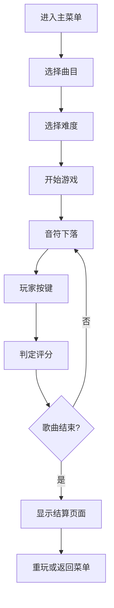

## 1. 产品概述

节奏大师是一款经典的音乐节奏游戏，玩家需要根据音乐节奏在正确时机按下对应按键，获得高分和评级。

- 核心玩法：音符沿轨道下落，玩家在判定线处按键得分
- 目标用户：音乐游戏爱好者、休闲玩家
- 产品价值：提供沉浸式的音乐节奏体验，锻炼反应能力和节奏感

## 2. 核心功能

### 2.1 功能模块
1. **主菜单页面**：曲目选择、难度选择、游戏开始
2. **游戏页面**：四轨道音符下落、按键判定、分数连击显示
3. **结算页面**：总分展示、评级显示、重玩/返回菜单

### 2.2 页面详情
| 页面名称 | 模块名称 | 功能描述 |
|---------|----------|----------|
| 主菜单 | 曲目列表 | 展示可选歌曲，支持点击选择 |
| 主菜单 | 难度选择 | 简单/普通/困难三档难度切换 |
| 主菜单 | 开始按钮 | 进入游戏界面 |
| 游戏 | 轨道区域 | 四条轨道，音符从上向下掉落 |
| 游戏 | 判定系统 | Perfect/Great/Good/Miss 四级判定 |
| 游戏 | 计分系统 | 不同判定获得不同分数，连击累加 |
| 游戏 | 状态显示 | 实时分数、连击数、判定反馈 |
| 结算 | 总分展示 | 显示最终得分和最大连击 |
| 结算 | 评级系统 | S/A/B/C/D 五档评级 |
| 结算 | 操作按钮 | 重玩当前曲目或返回主菜单 |

## 3. 核心流程

## 4. 界面设计

### 4.1 设计风格
- **主色调**：深色背景配合霓虹色彩（紫、蓝、粉），营造夜店/舞台氛围
- **视觉效果**：音符发光、判定线闪烁、连击特效
- **按钮风格**：圆角渐变按钮，带有发光悬停效果
- **字体**：使用现代无衬线字体，数字使用等宽字体
- **动画**：音符下落动画、按键反馈动画、结算页面淡入效果

### 4.2 页面设计
| 页面名称 | 模块名称 | UI 元素 |
|---------|----------|----------|
| 主菜单 | 背景 | 动态渐变背景，音乐波形装饰 |
| 主菜单 | 曲目卡片 | 歌曲封面、名称、时长 |
| 主菜单 | 难度按钮 | 三个切换按钮，选中高亮 |
| 游戏 | 轨道区域 | 四条垂直轨道，底部判定线 |
| 游戏 | 音符 | 彩色方块，带发光效果 |
| 游戏 | 按键提示 | D/F/J/K 键位标识 |
| 游戏 | 判定反馈 | 击中时显示判定文字和特效 |
| 结算 | 分数面板 | 大字号总分、评级徽章 |
| 结算 | 统计信息 | 各判定数量统计 |

### 4.3 响应式设计
- 桌面端优先，固定分辨率布局
- 支持窗口缩放自适应
- 键盘操作，无移动端触摸优化

### 4.4 视觉特效
- 音符下落时带有拖尾效果
- 按键击中时轨道闪光
- 连击数达到阈值时显示特效
- 背景随音乐节奏轻微律动
