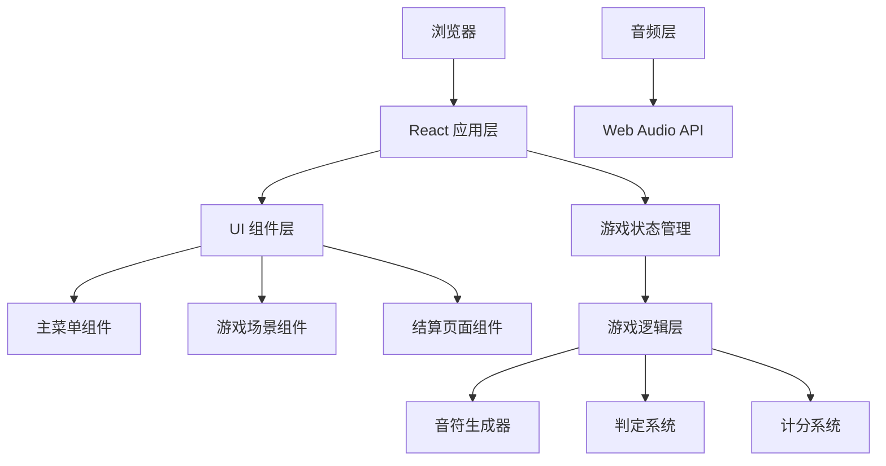

## 1. 架构设计



## 2. 技术选型

- **前端框架**: React 18 + TypeScript
- **构建工具**: Vite
- **样式方案**: TailwindCSS 3 + 自定义 CSS 动画
- **状态管理**: React useState/useReducer
- **音频处理**: Web Audio API
- **动画**: CSS Keyframes + requestAnimationFrame

## 3. 项目结构

```
src/
├── components/          # UI 组件
│   ├── MainMenu.tsx     # 主菜单
│   ├── GameScene.tsx    # 游戏场景
│   ├── ResultScreen.tsx # 结算页面
│   ├── Track.tsx        # 轨道组件
│   ├── Note.tsx         # 音符组件
│   └── JudgeLine.tsx    # 判定线组件
├── hooks/               # 自定义 Hooks
│   ├── useGameLoop.ts   # 游戏循环
│   ├── useAudio.ts      # 音频控制
│   └── useKeyboard.ts   # 键盘输入
├── utils/               # 工具函数
│   ├── judge.ts         # 判定逻辑
│   ├── score.ts         # 分数计算
│   └── noteGenerator.ts # 音符生成
├── types/               # 类型定义
│   └── game.ts          # 游戏相关类型
├── data/                # 数据
│   └── songs.ts         # 曲目数据
├── App.tsx              # 主应用
└── main.tsx             # 入口文件
```

## 4. 核心数据模型

### 4.1 游戏状态

```typescript
type GameState = 'menu' | 'playing' | 'result';

interface GameStatus {
  state: GameState;
  score: number;
  combo: number;
  maxCombo: number;
  perfect: number;
  great: number;
  good: number;
  miss: number;
}
```

### 4.2 音符数据

```typescript
interface Note {
  id: number;
  track: number;      // 0-3 对应 D/F/J/K
  time: number;       // 出现时间 (ms)
  duration?: number;  // 长按音符持续时间
  hit: boolean;       // 是否已被击中
  judge?: JudgeType;  // 判定结果
}

type JudgeType = 'perfect' | 'great' | 'good' | 'miss';
```

### 4.3 曲目数据

```typescript
interface Song {
  id: string;
  name: string;
  artist: string;
  bpm: number;
  duration: number;
  audioUrl: string;
  difficulties: {
    easy: NoteData[];
    normal: NoteData[];
    hard: NoteData[];
  };
}
```

## 5. 核心算法

### 5.1 判定算法

判定时机根据音符到达判定线的时间差：
- Perfect: ±50ms
- Great: ±100ms
- Good: ±150ms
- Miss: >150ms 或未按键

### 5.2 计分算法

- Perfect: 100 分 × (1 + combo/100)
- Great: 70 分 × (1 + combo/100)
- Good: 30 分 × (1 + combo/100)
- Miss: 0 分，combo 清零

### 5.3 评级算法

根据准确率评级：
- S: 准确率 ≥ 95%
- A: 准确率 ≥ 85%
- B: 准确率 ≥ 70%
- C: 准确率 ≥ 50%
- D: 准确率 < 50%

## 6. 配置项

| 配置项 | 值 | 说明 |
|--------|----|------|
| 轨道数量 | 4 | 对应 D/F/J/K 四键 |
| 音符下落速度 | 随难度变化 | 简单: 300px/s, 普通: 450px/s, 困难: 600px/s |
| 判定线位置 | 屏幕底部 100px | 固定位置 |
| 判定窗口 | Perfect: ±50ms, Great: ±100ms, Good: ±150ms | |
