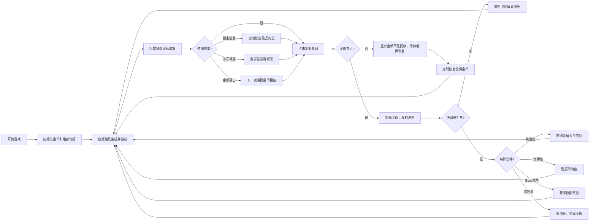

## 1. 产品概述
捕鱼达人是一款经典的休闲射击类网页游戏，玩家控制炮台发射渔网捕捉各种鱼类获得金币奖励。
- 主要目的：提供轻松有趣的休闲娱乐体验，通过策略性的射击和金币管理获得成就感
- 目标用户：休闲游戏爱好者，适合各年龄段玩家

## 2. 核心 Features

### 2.1 Feature Module
1. **游戏主界面**：海底场景渲染、鱼类游动、炮台控制、金币/等级显示
2. **鱼类系统**：12种鱼类（不同体型、速度、捕捉难度、金币奖励）
3. **特殊鱼种**：黄金鱼（全屏奖励）、炸弹鱼（清屏）、Boss龙鱼
4. **鱼群AI**：躲避子弹、集群游动、加速冲刺行为
5. **炮台系统**：鼠标瞄准、点击发射、7级炮台升级
6. **技能系统**：锁定瞄准、冰冻减速、金币暴击
7. **碰撞检测**：渔网与鱼类的碰撞判定、捕捉成功/失败处理
8. **经济系统**：金币奖励、低保金币恢复、金币不足提示
9. **场景系统**：分层视差滚动、光影特效、动态海底

### 2.2 Page Details
| Page Name | Module Name | Feature description |
|-----------|-------------|---------------------|
| 游戏主页面 | 海底场景 | 分层视差滚动背景、动态光影、气泡效果、水草装饰 |
| 游戏主页面 | 鱼类系统 | 12种不同鱼类从左右两侧随机生成，速度大小各不相同 |
| 游戏主页面 | 特殊鱼种 | 黄金鱼全屏奖励、炸弹鱼清屏效果、Boss龙鱼挑战 |
| 游戏主页面 | 鱼群AI | 躲避子弹、集群游动、加速冲刺智能行为 |
| 游戏主页面 | 炮台系统 | 7级炮台升级，等级越高威力越大消耗越高 |
| 游戏主页面 | 技能系统 | 锁定瞄准、冰冻减速全屏鱼、金币暴击三大技能 |
| 游戏主页面 | 碰撞检测 | 渔网击中鱼后鱼消失并奖励金币 |
| 游戏主页面 | UI面板 | 显示当前金币数量、炮台等级、技能冷却、低保恢复倒计时 |

## 3. Core Process

## 4. User Interface Design

### 4.1 Design Style
- **主色调**：深海蓝 (#0a1628)、水蓝 (#1e3a5f)、珊瑚橙 (#ff7f50)、金色 (#ffd700)、紫色 (#9b59b6)
- **视觉风格**：卡通风格的海底世界，半透明效果营造水下氛围
- **动画风格**：流畅的鱼鳍摆动、气泡上浮、渔网展开等动画效果
- **字体**：使用圆润可爱的字体，适合休闲游戏氛围

### 4.2 鱼类配置
| 鱼类名称 | 类型 | 大小 | 速度 | 捕捉难度 | 金币奖励 | 特殊能力 |
|---------|------|------|------|----------|----------|----------|
| 小丑鱼 | 普通 | 小 | 快 | 低 | 1 | - |
| 蓝唐王鱼 | 普通 | 中 | 中 | 中 | 3 | - |
| 神仙鱼 | 普通 | 中 | 慢 | 中 | 5 | - |
| 蝴蝶鱼 | 普通 | 小 | 中 | 中 | 4 | - |
| 狮子鱼 | 普通 | 中 | 慢 | 高 | 8 | 有毒刺 |
| 金枪鱼 | 普通 | 大 | 快 | 高 | 10 | 加速冲刺 |
| 灯笼鱼 | 普通 | 中 | 慢 | 中 | 6 | 发光 |
| 章鱼 | 普通 | 大 | 慢 | 极高 | 15 | 喷墨 |
| 美人鱼 | 稀有 | 中 | 中 | 极高 | 50 | 躲避子弹 |
| 鲨鱼 | 普通 | 特大 | 慢 | 极高 | 30 | - |
| 黄金鱼 | 特殊 | 中 | 快 | 极高 | 100 | 全屏奖励 |
| 炸弹鱼 | 特殊 | 中 | 中 | 高 | 0 | 清屏 |
| 龙鱼 | Boss | 超大 | 慢 | 最高 | 500 | 多条血条 |

### 4.3 炮台等级配置
| 炮台等级 | 消耗金币 | 渔网大小 | 捕捉概率加成 | 颜色 |
|---------|----------|----------|--------------|------|
| 1 | 1 | 小 | 0% | 天蓝 |
| 2 | 2 | 中 | 5% | 草绿 |
| 3 | 3 | 大 | 10% | 金色 |
| 4 | 4 | 特大 | 15% | 橙色 |
| 5 | 5 | 超大 | 20% | 粉红 |
| 6 | 8 | 巨型 | 25% | 紫色 |
| 7 | 12 | 究极 | 30% | 红色 |

### 4.4 技能系统
| 技能名称 | 图标 | 冷却时间 | 效果描述 |
|---------|------|----------|----------|
| 锁定瞄准 | 🎯 | 15秒 | 自动锁定屏幕上最近的鱼，持续3秒 |
| 冰冻减速 | ❄️ | 20秒 | 全屏鱼速度减慢50%，持续5秒 |
| 金币暴击 | ✨ | 30秒 | 下一次成功捕捉获得双倍金币 |

### 4.5 Page Design Overview
| Page Name | Module Name | UI Elements |
|-----------|-------------|-------------|
| 游戏主页面 | 海底场景 | 分层视差背景、动态光影、光线投射、气泡群、摇曳水草 |
| 游戏主页面 | 鱼类 | 12种不同卡通鱼，特殊鱼有发光特效 |
| 游戏主页面 | 炮台 | 底部中央可旋转炮台，7级不同外观 |
| 游戏主页面 | 渔网 | 圆形半透明网，飞行时展开，高等级有特效 |
| 游戏主页面 | UI面板 | 左上角金币、右上角炮台等级、底部技能栏、低保提示 |
| 游戏主页面 | 技能栏 | 底部三个技能按钮，显示冷却时间 |
| 游戏主页面 | 特效 | 捕捉粒子、金币飞出、冰冻效果、爆炸特效 |

### 4.6 Responsiveness
- 桌面端优先，全屏游戏体验
- 响应式适配不同屏幕尺寸，保持游戏区域比例
- 移动端支持触摸操作

### 4.7 交互细节
- 鼠标移动时炮台平滑旋转跟随
- 点击发射时有明显的反馈动画
- 金币变化时有数字跳动动画
- 捕捉成功时有粒子特效
- 技能使用时有全屏特效反馈
- 特殊鱼出现时有提示音效和视觉提示
