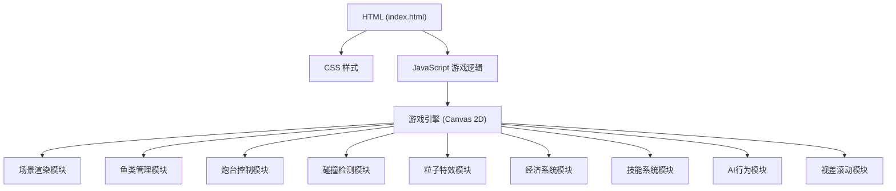

## 1. Architecture Design



## 2. Technology Description
- **前端技术栈**：纯原生 HTML5 + CSS3 + JavaScript (ES6+)
- **渲染引擎**：HTML5 Canvas 2D API
- **动画系统**：requestAnimationFrame 实现 60fps 流畅动画
- **目录结构**：
  - `index.html` - 主页面结构
  - `css/style.css` - 样式文件
  - `js/` - JavaScript 代码目录
    - `game.js` - 游戏主循环和核心逻辑
    - `fish.js` - 鱼类类定义和AI行为
    - `cannon.js` - 炮台类定义
    - `bullet.js` - 渔网/子弹类定义
    - `utils.js` - 工具函数

## 3. Project Structure

```
捕鱼达人/
├── index.html              # 主页面
├── css/
│   └── style.css           # 样式文件
├── js/
│   ├── game.js             # 游戏主类和主循环
│   ├── fish.js             # 鱼类定义和AI
│   ├── cannon.js           # 炮台定义
│   ├── bullet.js           # 渔网/子弹定义
│   └── utils.js            # 工具函数
└── .trae/
    └── documents/
        ├── prd.md
        └── tech-arch.md
```

## 4. Core Data Structures

### 4.1 鱼类配置（13种）
| 鱼类类型 | 大小 | 速度 | 捕捉难度 | 金币奖励 | 出现概率 | 特殊能力 |
|---------|------|------|----------|----------|----------|----------|
| 小丑鱼 | 小(40) | 快(3.0) | 低(0.8) | 1 | 20% | - |
| 蓝唐王鱼 | 中(55) | 中(2.2) | 中(0.65) | 3 | 15% | - |
| 神仙鱼 | 中(60) | 慢(1.8) | 中(0.55) | 5 | 12% | - |
| 蝴蝶鱼 | 小(45) | 中(2.5) | 中(0.6) | 4 | 12% | - |
| 狮子鱼 | 中(65) | 慢(1.5) | 高(0.45) | 8 | 8% | 有毒刺 |
| 金枪鱼 | 大(80) | 快(3.5) | 高(0.4) | 10 | 8% | 加速冲刺 |
| 灯笼鱼 | 中(55) | 慢(1.6) | 中(0.55) | 6 | 8% | 发光 |
| 章鱼 | 大(90) | 慢(1.2) | 极高(0.3) | 15 | 5% | 喷墨 |
| 鲨鱼 | 特大(120) | 中(2.0) | 极高(0.25) | 30 | 5% | - |
| 美人鱼 | 中(70) | 中(2.3) | 极高(0.2) | 50 | 3% | 躲避子弹 |
| 黄金鱼 | 中(60) | 快(3.2) | 极高(0.15) | 100 | 2% | 全屏奖励 |
| 炸弹鱼 | 中(55) | 中(2.0) | 高(0.35) | 0 | 1% | 清屏 |
| 龙鱼(Boss) | 超大(200) | 极慢(0.8) | 最高(0.08) | 500 | 0.5% | 3条血条 |

### 4.2 炮台等级配置（1-7级）
| 炮台等级 | 消耗金币 | 渔网大小 | 捕捉概率加成 | 颜色 |
|---------|----------|----------|--------------|------|
| 1 | 1 | 30 | 0% | #87ceeb |
| 2 | 2 | 38 | 5% | #98fb98 |
| 3 | 3 | 46 | 10% | #ffd700 |
| 4 | 4 | 54 | 15% | #ff7f50 |
| 5 | 5 | 62 | 20% | #ff69b4 |
| 6 | 8 | 72 | 25% | #9b59b6 |
| 7 | 12 | 85 | 30% | #e74c3c |

### 4.3 技能配置
| 技能名称 | 冷却时间 | 持续时间 | 效果 |
|---------|----------|----------|------|
| 锁定瞄准 | 15000ms | 3000ms | 自动锁定最近的鱼 |
| 冰冻减速 | 20000ms | 5000ms | 全屏鱼速度-50% |
| 金币暴击 | 30000ms | 一次 | 下次捕捉金币x2 |

### 4.4 游戏状态
```javascript
GameState = {
  coins: 100,
  cannonLevel: 1,
  isPlaying: true,
  welfareTimer: 0,
  welfareInterval: 10000,
  welfareAmount: 10,
  minCoinsForWelfare: 20,
  skills: {
    lockOn: { cooldown: 0, active: false, duration: 0 },
    freeze: { cooldown: 0, active: false, duration: 0 },
    crit: { cooldown: 0, ready: false }
  },
  targetFish: null,
  freezeMultiplier: 1,
  critActive: false
}
```

## 5. Key Implementation Points

### 5.1 鱼类AI行为
- **躲避子弹**：美人鱼等特殊鱼检测附近子弹并改变方向
- **集群游动**：同类型鱼保持距离，形成鱼群
- **加速冲刺**：金枪鱼随机触发加速冲刺
- **血条系统**：Boss龙鱼有3条血条，需要多次击中

### 5.2 特殊鱼种效果
- **黄金鱼**：捕捉后触发全屏金币奖励，所有屏幕上的鱼都奖励金币
- **炸弹鱼**：捕捉后清屏，所有普通鱼消失并奖励金币
- **龙鱼Boss**：3条血条，每次打掉一条血条奖励金币，全部打完奖励500金币

### 5.3 技能系统
- **锁定瞄准**：自动寻找最近的鱼，炮台自动瞄准，子弹追踪
- **冰冻减速**：全屏覆盖冰冻效果，所有鱼速度减半
- **金币暴击**：下一次成功捕捉获得双倍金币

### 5.4 视差滚动场景
- 三层背景：远景（深海水纹）、中景（岩石珊瑚）、近景（水草气泡）
- 不同层移动速度不同，营造深度感
- 动态光影：从上向下投射的光线效果，随时间变化

### 5.5 性能优化
- 使用对象池复用鱼类和渔网对象
- 离屏渲染静态背景元素
- 限制最大同屏鱼类数量（25条）
- 粒子系统数量限制（最多100个）
