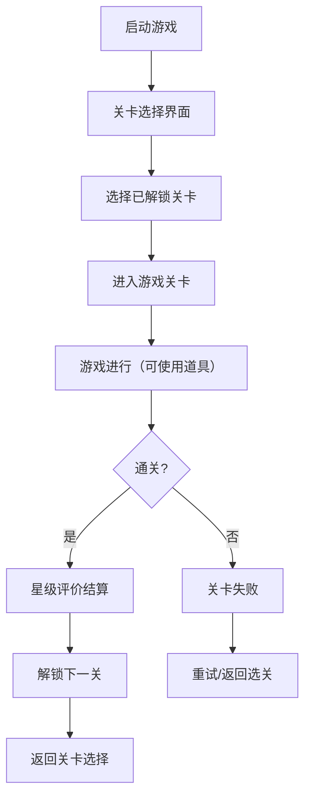

## 1. 产品概述（v2.0）

泡泡龙射击消除游戏 v2.0 版本在经典玩法基础上，新增瞄准辅助线、特殊泡泡、多关卡系统、道具系统、连消奖励、关卡解锁等功能，大幅提升游戏策略性和可玩性。

- 核心玩法：射击泡泡 → 匹配消除 → 道具策略 → 过关挑战
- 目标用户：休闲游戏爱好者、追求策略深度的玩家

## 2. 新增功能模块

### 2.1 瞄准辅助线系统
- 实时预测泡泡飞行路径，支持墙壁反弹
- 虚线显示完整轨迹，包括多次反弹
- 道具"瞄准镜"可延长辅助线显示距离

### 2.2 特殊泡泡系统

| 特殊泡泡 | 图标/颜色 | 效果说明 |
|----------|----------|----------|
| 炸弹泡 | 💣 黑色带炸弹图案 | 爆炸消除周围3x3范围内所有泡泡 |
| 彩虹万能泡 | 🌈 彩虹渐变色 | 可匹配任意颜色的泡泡 |
| 锁链泡 | ⛓️ 灰色带锁链 | 需要消除2次才能消除，首次消除锁链 |
| 毒泡 | ☠️ 紫色带毒标记 | 消除时随机将周围2个泡泡变成毒泡 |

### 2.3 多关卡地图系统
- 共10个关卡，难度递增
- 每关初始布局不同：三角形、心形、阶梯形等
- 通关条件：消除所有顶部固定泡泡
- 失败条件：泡泡越过警戒线

### 2.4 道具系统

| 道具 | 图标 | 效果说明 | 初始数量 |
|------|------|----------|----------|
| 瞄准镜 | 🔍 | 本次射击辅助线延长2倍，显示精确落点 | 3 |
| 回退 | ↩️ | 撤销上一步操作，恢复到射击前状态 | 2 |
| 洗牌 | 🔀 | 随机更换当前待发射泡泡的颜色 | 5 |

### 2.5 连消奖励机制
- 单次消除泡泡数≥3：基础分×1
- 单次消除泡泡数≥5：基础分×1.5
- 单次消除泡泡数≥8：基础分×2
- 单次消除泡泡数≥12：基础分×3
- 连击消除（连续2次消除）：额外+50分

### 2.6 关卡解锁与星级评价
- 初始仅解锁第1关
- 通关后解锁下一关
- 星级评价：
  - ⭐ 一星：基础通关
  - ⭐⭐ 二星：得分≥目标分数×1.5
  - ⭐⭐⭐ 三星：得分≥目标分数×2，且剩余道具≥2个

### 2.7 多人联机对战（技术方案）

**架构设计：**
```
玩家A ←→ WebSocket服务器 ←→ 玩家B
```

**技术栈：**
- 后端：Node.js + Socket.io
- 前端：现有Canvas + Socket.io客户端
- 实时同步：双方游戏状态、泡泡位置、得分

**核心玩法：**
- 两名玩家各自独立消除
- 消除≥5个泡泡时，向对方发送1排干扰泡泡
- 先消除完所有泡泡或对方失败的玩家获胜

## 3. 新增页面流程



## 4. UI设计变更

### 4.1 关卡选择界面
- 网格布局显示10个关卡图标
- 已解锁关卡显示星级
- 未解锁关卡显示锁图标

### 4.2 游戏内HUD
- 左上角：关卡号、目标分数
- 顶部中央：当前得分
- 右上角：下一发泡泡预览
- 底部中央：发射器
- 底部左侧：道具栏（3个道具按钮）
- 底部右侧：回退按钮

### 4.3 结算界面
- 显示获得的星级
- 显示得分详情（基础分、连消奖励、道具剩余加分）
- 按钮：重玩、下一关、返回选关

## 5. 游戏参数调整

| 参数 | v1.0 | v2.0 | 说明 |
|------|------|------|------|
| SHOOT_THRESHOLD | 5 | 动态 | 不同关卡下压频率不同 |
| 初始行数 | 5 | 动态 | 不同关卡初始行数不同 |
| 泡泡颜色数 | 5 | 5+4特殊 | 普通5色 + 4种特殊泡泡 |
| 得分规则 | 固定 | 倍率 | 连消倍率加成 |
