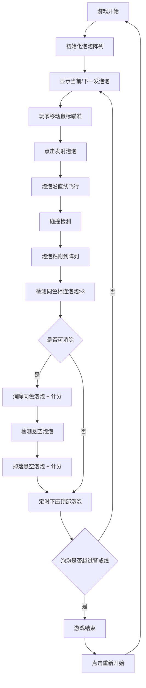

## 1. 产品概述

泡泡龙射击消除游戏是一款经典休闲益智游戏，玩家通过控制底部发射器射击彩色泡泡，当三个及以上同色泡泡相连时自动消除得分。游戏具有简单易上手、节奏感强的特点，适合各年龄段用户休闲娱乐。

- 核心玩法：射击泡泡 → 匹配消除 → 得分闯关
- 目标用户：休闲游戏爱好者、各年龄段玩家

## 2. 核心功能

### 2.1 功能模块

1. **游戏主界面**：游戏画布、得分显示、下一发泡泡预览
2. **发射控制系统**：鼠标/触控瞄准、点击发射
3. **泡泡物理系统**：泡泡飞行、碰撞检测、粘附
4. **消除判定系统**：同色匹配检测、级联消除、悬空掉落
5. **游戏进度系统**：泡泡下压、警戒线判定、游戏结束

### 2.2 页面详情

| 页面名称 | 模块名称 | 功能描述 |
|-----------|-------------|---------------------|
| 游戏主界面 | 游戏画布 | 显示顶部泡泡阵列、发射的飞行泡泡、底部发射器 |
| 游戏主界面 | 信息面板 | 显示当前得分、下一发泡泡颜色预览 |
| 游戏主界面 | 控制区域 | 鼠标移动瞄准、点击发射泡泡 |
| 游戏主界面 | 游戏状态 | 游戏进行中、游戏结束提示、重新开始 |

## 3. 核心流程

## 4. 用户界面设计

### 4.1 设计风格

- **主色调**：深色背景搭配明亮的彩色泡泡（红、蓝、绿、黄、紫）
- **视觉风格**：卡通休闲风格，泡泡带有渐变光泽效果
- **布局**：居中游戏画布，顶部信息栏，底部发射区域
- **动效**：泡泡消除有缩放消失动画，掉落有下落加速度效果

### 4.2 页面设计概述

| 页面名称 | 模块名称 | UI元素 |
|-----------|-------------|-------------|
| 游戏主界面 | 游戏画布 | 600x700像素Canvas，深色渐变背景 |
| 游戏主界面 | 信息面板 | 顶部显示得分（大号字体）、右侧显示下一发泡泡预览 |
| 游戏主界面 | 发射器 | 底部居中三角形箭头，随鼠标旋转瞄准 |
| 游戏主界面 | 警戒线 | 底部红色虚线，提示危险区域 |
| 游戏主界面 | 结束弹窗 | 半透明遮罩 + 游戏结束文字 + 重玩按钮 |

### 4.3 响应性

- 桌面端优先设计，支持鼠标操作
- 固定画布尺寸，居中显示
- 弹窗和UI元素适配画布尺寸

## 5. 游戏规则说明

- **泡泡颜色**：5种颜色（红、蓝、绿、黄、紫）随机生成
- **消除规则**：3个及以上同色泡泡相连（上下左右斜向）即消除
- **悬空判定**：消除后不与顶部边界相连的泡泡全部掉落
- **得分规则**：每消除1个泡泡10分，掉落泡泡每个20分
- **下压机制**：每发射5个泡泡，顶部整体下压一排
- **失败条件**：任意泡泡触底警戒线（底部100px处）
