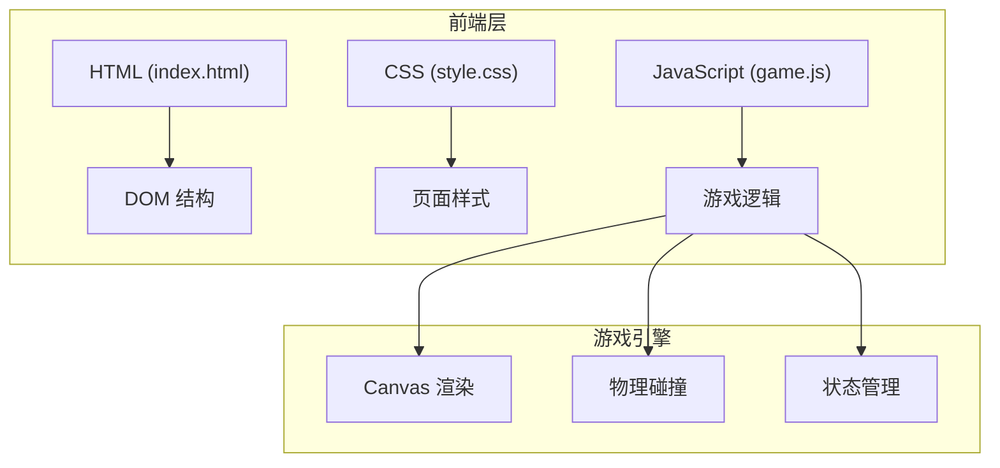

## 1. 架构设计



## 2. 技术描述

- **前端**：原生 HTML5 + CSS3 + JavaScript (ES6+)
- **渲染引擎**：HTML5 Canvas 2D
- **无后端**：纯前端单页应用，无需服务器
- **构建工具**：无需构建，直接浏览器运行

## 3. 目录结构

```
泡泡龙小游戏/
├── index.html              # 主页面
├── css/
│   └── style.css          # 样式文件
├── js/
│   └── game.js            # 游戏逻辑
└── .trae/
    └── documents/
        ├── PRD.md
        └── Technical-Architecture.md
```

## 4. 核心数据模型

### 4.1 泡泡对象

```javascript
{
  row: number,           // 网格行号
  col: number,           // 网格列号
  x: number,             // 像素X坐标
  y: number,             // 像素Y坐标
  color: string,         // 颜色索引 0-4
  falling: boolean,      // 是否正在掉落
  vy: number,            // 下落速度
  scale: number          // 缩放比例（消除动画）
}
```

### 4.2 飞行泡泡对象

```javascript
{
  x: number,             // 当前X坐标
  y: number,             // 当前Y坐标
  vx: number,            // X方向速度
  vy: number,            // Y方向速度
  color: string,         // 颜色
  active: boolean        // 是否在飞行中
}
```

### 4.3 游戏状态

```javascript
{
  score: number,         // 当前得分
  grid: Bubble[][],      // 泡泡网格
  currentBubble: number, // 当前发射泡泡颜色
  nextBubble: number,    // 下一发泡泡颜色
  shootCount: number,    // 发射计数（用于下压）
  gameOver: boolean,     // 游戏结束标志
  angle: number          // 发射角度
}
```

## 5. 核心算法

### 5.1 网格坐标转换

- 偶数行：`x = col * 2 * radius + radius`
- 奇数行：`x = col * 2 * radius + 2 * radius`
- `y = row * radius * Math.sqrt(3) + radius`

### 5.2 碰撞检测

- 计算飞行泡泡与所有静止泡泡的距离
- 距离小于 `2 * radius` 即发生碰撞

### 5.3 同色连通检测

- BFS/DFS 遍历相邻泡泡（6个方向：左上、右上、左、右、左下、右下）
- 统计同色连通区域大小

### 5.4 悬空检测

- 从顶部边界开始 BFS 标记所有连通泡泡
- 未被标记的即为悬空泡泡

### 5.5 相邻方向偏移

```javascript
const evenRowOffsets = [
  [-1, -1], [-1, 0], [0, -1], [0, 1], [1, -1], [1, 0]
];
const oddRowOffsets = [
  [-1, 0], [-1, 1], [0, -1], [0, 1], [1, 0], [1, 1]
];
```

## 6. 游戏参数

| 参数 | 值 | 说明 |
|------|----|------|
| CANVAS_WIDTH | 600 | 画布宽度 |
| CANVAS_HEIGHT | 700 | 画布高度 |
| BUBBLE_RADIUS | 25 | 泡泡半径 |
| COLS | 12 | 每行泡泡数量 |
| COLORS | ['#ff4757', '#3742fa', '#2ed573', '#ffa502', '#a55eea'] | 5种颜色 |
| BUBBLE_SPEED | 12 | 泡泡飞行速度 |
| GRAVITY | 0.5 | 掉落加速度 |
| SHOOT_THRESHOLD | 5 | 每发射N次下压一排 |
| DANGER_LINE | 600 | 警戒线Y坐标 |
