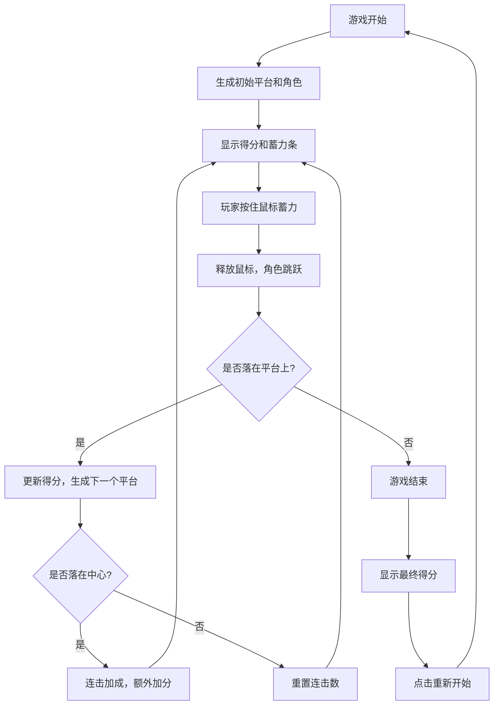

## 1. 产品概述

"跳一跳"跳跃挑战游戏是一款休闲益智类网页游戏，玩家通过按住鼠标蓄力控制角色跳跃到下一个平台，考验玩家的判断力和节奏感。

- 主要目的：提供轻松有趣的游戏体验，锻炼玩家的手眼协调能力
- 目标用户：各年龄段休闲游戏爱好者
- 产品价值：简单易上手，具有挑战性和重玩价值

## 2. 核心功能

### 2.1 用户角色

游戏为单人模式，无角色区分。

### 2.2 功能模块

1. **游戏主界面**：游戏画布、得分显示、蓄力条
2. **游戏结束界面**：最终得分展示、重新开始按钮

### 2.3 页面详情

| 页面名称 | 模块名称 | 功能描述 |
|-----------|-------------|---------------------|
| 游戏主界面 | 游戏画布 | 渲染3D场景、平台、角色 |
| 游戏主界面 | 得分显示 | 实时显示当前得分和连击数 |
| 游戏主界面 | 蓄力条 | 显示当前按住时间对应的蓄力程度 |
| 游戏结束界面 | 得分面板 | 显示本局最终得分 |
| 游戏结束界面 | 重新开始按钮 | 点击后重新开始游戏 |

## 3. 核心流程

## 4. 用户界面设计

### 4.1 设计风格

- 主色调：清新的渐变色背景，从浅蓝到紫色
- 平台配色：多种鲜艳的渐变色（红、橙、黄、绿、蓝、紫等）
- 角色：简约的几何造型，搭配动态效果
- 整体风格：现代、简约、活泼，具有视觉吸引力

### 4.2 页面设计概述

| 页面名称 | 模块名称 | UI元素 |
|-----------|-------------|-------------|
| 游戏主界面 | 游戏画布 | 3D透视效果、阴影、平台渐变、角色动画 |
| 游戏主界面 | 得分显示 | 顶部居中，大号字体，半透明背景 |
| 游戏主界面 | 蓄力条 | 底部居中，宽度随蓄力变化，颜色从绿到红渐变 |
| 游戏结束界面 | 遮罩层 | 半透明黑色背景 |
| 游戏结束界面 | 得分面板 | 白色圆角卡片，居中显示 |
| 游戏结束界面 | 重新开始按钮 | 渐变色按钮，悬停有缩放效果 |

### 4.3 响应性

- 桌面端：全屏游戏，鼠标操作
- 移动端：自适应屏幕，支持触摸操作
- 蓄力条和得分显示会根据屏幕尺寸调整

### 4.4 3D场景指南

- 环境：简洁的渐变背景，突出游戏主体
- 光照：柔和的环境光 + 方向光，营造立体感
- 相机：固定45度俯视角，跟随角色移动
- 动画：角色跳跃有抛物线轨迹和旋转效果，平台有出现动画
- 特效：跳跃蓄力时角色有挤压效果，落地时有回弹效果，中心命中有特效
