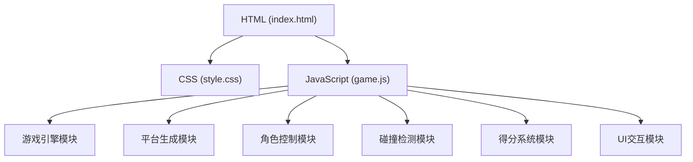

## 1. 架构设计



## 2. 技术描述

- 前端：纯HTML5 + CSS3 + 原生JavaScript (ES6+)
- 渲染：HTML5 Canvas 2D API，通过伪3D投影实现立体效果
- 动画：requestAnimationFrame实现流畅动画
- 事件：鼠标事件（mousedown/mouseup）和触摸事件（touchstart/touchend）

**目录结构：**
```
跳一跳跳跃挑战/
├── index.html          # 主HTML文件
├── css/
│   └── style.css       # 样式文件
├── js/
│   └── game.js         # 游戏逻辑
└── .trae/
    └── documents/
        ├── PRD.md
        └── TECHNICAL_ARCHITECTURE.md
```

## 3. 核心模块说明

| 模块 | 功能描述 | 关键技术 |
|------|---------|----------|
| 游戏引擎 | 主循环、渲染控制、状态管理 | requestAnimationFrame |
| 平台生成 | 随机生成平台位置、大小、颜色 | 随机数算法、渐变色生成 |
| 角色控制 | 蓄力计算、跳跃轨迹、动画效果 | 物理运动公式、缓动函数 |
| 碰撞检测 | 判断角色是否落在平台上 | 矩形碰撞检测、中心点计算 |
| 得分系统 | 基础得分、连击加成、最高分记录 | localStorage存储 |
| UI交互 | 蓄力条、得分显示、游戏结束界面 | DOM操作、CSS动画 |

## 4. 游戏参数配置

| 参数 | 值 | 说明 |
|------|----|------|
| 画布宽度 | 自适应窗口 | 响应式设计 |
| 画布高度 | 自适应窗口 | 响应式设计 |
| 平台最小宽度 | 80px | 保证可落脚 |
| 平台最大宽度 | 150px | 增加难度 |
| 平台最小间距 | 100px | 保证跳跃空间 |
| 平台最大间距 | 300px | 控制难度上限 |
| 最小蓄力时间 | 100ms | 避免误触 |
| 最大蓄力时间 | 2000ms | 限制最大跳跃距离 |
| 跳跃重力 | 0.8 | 调整跳跃手感 |
| 初始跳跃速度 | 随蓄力变化 | 蓄力时间决定 |
| 中心判定范围 | 15px | 连击加成分数范围 |
