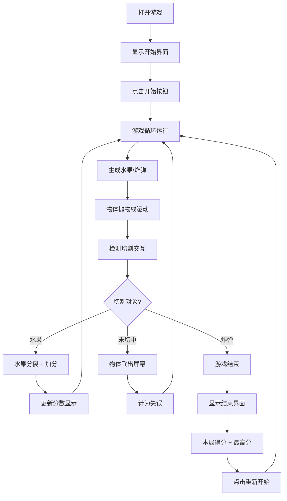

## 1. 产品概述

切水果反应游戏是一款经典的休闲益智类网页游戏，玩家通过滑动鼠标或手指模拟刀刃切割从屏幕底部抛出的水果来获得分数。游戏简单易上手，考验玩家的反应速度和手眼协调能力。

- 目标用户：所有年龄段的休闲游戏玩家
- 产品价值：提供轻松愉快的游戏体验，锻炼反应能力

## 2. 核心功能

### 2.1 用户角色

| 角色 | 注册方式 | 核心权限 |
|------|---------|---------|
| 玩家 | 无需注册 | 进行游戏、查看分数、保存最高分 |

### 2.2 功能模块

1. **游戏主界面**：Canvas 游戏画布、分数显示、游戏控制
2. **水果系统**：水果生成、抛物线运动、切割检测、切割效果
3. **炸弹系统**：炸弹生成、碰撞检测、游戏结束逻辑
4. **分数系统**：实时得分、最高分记录、游戏结束统计
5. **交互系统**：鼠标/触摸滑动检测、刀刃轨迹效果

### 2.3 页面详情

| 页面名称 | 模块名称 | 功能描述 |
|---------|---------|---------|
| 游戏主页面 | 游戏画布 | 渲染水果、炸弹、切割效果、刀刃轨迹 |
| 游戏主页面 | 顶部状态栏 | 实时显示当前得分 |
| 游戏主页面 | 开始界面 | 显示游戏标题、开始按钮、历史最高分 |
| 游戏主页面 | 结束界面 | 显示本局得分、历史最高分、重新开始按钮 |

## 3. 核心流程

玩家打开游戏 → 点击开始按钮 → 水果和炸弹从底部随机抛出 → 玩家滑动切割水果获得分数 → 切到炸弹或选择结束 → 显示最终得分和最高分 → 可重新开始游戏

## 4. 用户界面设计

### 4.1 设计风格

- **主色调**：深色背景（#1a1a2e），突出水果的鲜艳色彩
- **强调色**：水果原色（红、橙、黄、绿），刀刃白色发光效果
- **按钮风格**：圆角渐变按钮，悬停时有缩放动画
- **字体**：使用具有游戏感的粗体字体，数字清晰醒目
- **整体风格**：动感、活力、具有切割爽快感

### 4.2 页面设计概述

| 页面名称 | 模块名称 | UI 元素 |
|---------|---------|---------|
| 游戏主页面 | 游戏画布 | 深色背景、彩色水果、黑色炸弹带红色警示标志、白色刀刃轨迹、水果切割飞溅效果 |
| 游戏主页面 | 顶部状态栏 | 半透明黑色背景、白色大号数字分数 |
| 游戏主页面 | 开始界面 | 居中游戏标题"切水果"、大号开始按钮、底部显示历史最高分 |
| 游戏主页面 | 结束界面 | 半透明遮罩、"游戏结束"标题、本局得分、历史最高分、"再来一局"按钮 |

### 4.3 响应性

- 桌面端优先设计，支持鼠标操作
- 移动端自适应，支持触摸滑动操作
- 游戏画布根据屏幕尺寸自动调整
- 按钮和文字在小屏幕上保持可点击性和可读性

### 4.4 动效设计

- 水果抛出时带有旋转动画
- 切割水果时有分裂飞散和果汁飞溅效果
- 刀刃滑动时带有拖尾光效
- 分数增加时有数字跳动动画
- 按钮点击有缩放反馈效果
