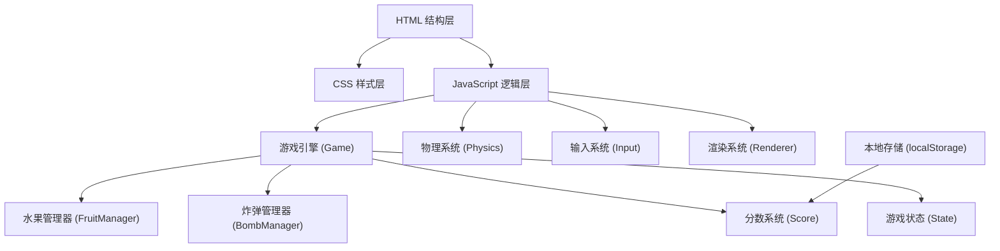

## 1. 架构设计



## 2. 技术描述

- **前端技术栈**：原生 HTML5 + CSS3 + JavaScript (ES6+)
- **渲染技术**：HTML5 Canvas 2D API
- **数据存储**：浏览器 localStorage 存储最高分记录
- **动画方案**：requestAnimationFrame 实现游戏主循环
- **无外部依赖**：纯原生实现，无需任何第三方库

## 3. 目录结构

```
切水果反应游戏/
├── index.html          # 主页面
├── css/
│   └── style.css       # 样式文件
├── js/
│   ├── game.js         # 游戏主逻辑
│   ├── fruit.js        # 水果类和管理器
│   ├── bomb.js         # 炸弹类和管理器
│   ├── input.js        # 输入处理（鼠标/触摸）
│   ├── renderer.js     # 渲染系统
│   └── utils.js        # 工具函数
└── .trae/
    └── documents/
        ├── PRD.md
        └── 技术架构.md
```

## 4. 核心数据结构

### 4.1 水果对象 (Fruit)

| 属性 | 类型 | 说明 |
|-----|------|-----|
| x | number | 当前 x 坐标 |
| y | number | 当前 y 坐标 |
| vx | number | 水平速度 |
| vy | number | 垂直速度 |
| type | string | 水果类型 (watermelon/orange/apple/lemon) |
| radius | number | 碰撞半径 |
| rotation | number | 旋转角度 |
| rotationSpeed | number | 旋转速度 |
| isSliced | boolean | 是否已被切割 |

### 4.2 炸弹对象 (Bomb)

| 属性 | 类型 | 说明 |
|-----|------|-----|
| x | number | 当前 x 坐标 |
| y | number | 当前 y 坐标 |
| vx | number | 水平速度 |
| vy | number | 垂直速度 |
| radius | number | 碰撞半径 |
| rotation | number | 旋转角度 |

### 4.3 游戏状态 (GameState)

| 属性 | 类型 | 说明 |
|-----|------|-----|
| score | number | 当前得分 |
| highScore | number | 历史最高分 |
| isPlaying | boolean | 游戏是否进行中 |
| isGameOver | boolean | 游戏是否结束 |
| fruits | Fruit[] | 活跃水果数组 |
| bombs | Bomb[] | 活跃炸弹数组 |
| particles | Particle[] | 粒子效果数组 |

## 5. 核心算法

### 5.1 抛物线运动

```javascript
// 每一帧更新位置
vy += gravity;  // 重力加速度
x += vx;
y += vy;
```

### 5.2 切割检测

使用线段与圆的碰撞检测算法，检测刀刃轨迹（线段）是否与水果/炸弹（圆形）相交。

### 5.3 随机生成

- 水果生成位置：屏幕底部随机 x 坐标
- 初速度：随机水平和垂直速度（向上）
- 炸弹概率：约 15% 概率生成炸弹

## 6. 性能优化

- 对象池复用水果和炸弹对象，减少 GC
- 离屏 Canvas 预渲染水果图形
- 限制最大同时存在的物体数量
- 粒子效果自动清理过期粒子
