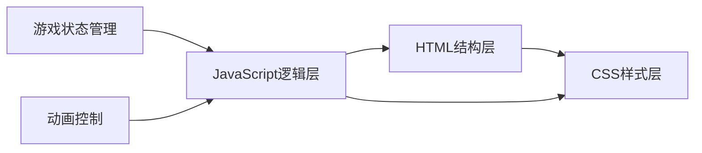

## 1. 架构设计



## 2. 技术描述
- **前端技术**：纯HTML5 + CSS3 + Vanilla JavaScript (ES6+)，无框架依赖
- **动画实现**：CSS3 Transitions + JavaScript requestAnimationFrame
- **数据存储**：内存存储游戏状态，无需后端和数据库

## 3. 目录结构
```
/
├── index.html          # 主页面
├── css/
│   └── style.css       # 样式文件
└── js/
    └── game.js         # 游戏逻辑
```

## 4. 核心数据结构

### 4.1 游戏配置常量
```javascript
const CONFIG = {
    GRID_SIZE: 8,           // 网格大小
    COLORS: 6,              // 颜色种类
    MAX_STEPS: 30,          // 最大步数
    SCORE_PER_BLOCK: 10     // 每个方块基础分
};
```

### 4.2 游戏状态
```javascript
const state = {
    grid: [],               // 8×8二维数组，存储每个方块的颜色
    score: 0,               // 当前分数
    steps: 30,              // 剩余步数
    selected: null,         // 当前选中的方块坐标
    isAnimating: false,     // 是否正在播放动画
    gameOver: false         // 游戏是否结束
};
```

### 4.3 核心函数
| 函数名 | 功能描述 |
|-------|---------|
| `initGame()` | 初始化游戏，生成随机网格 |
| `createGrid()` | 创建8×8随机颜色网格，确保初始无三消 |
| `swapBlocks(x1, y1, x2, y2)` | 交换两个方块 |
| `checkMatches()` | 检测所有三消匹配 |
| `removeMatches(matches)` | 消除匹配的方块 |
| `dropBlocks()` | 方块下落填充 |
| `generateNewBlocks()` | 顶部生成新方块 |
| `calculateScore(count)` | 根据消除数量计算得分 |
| `endGame()` | 结束游戏，显示结果 |
| `resetGame()` | 重置游戏 |
