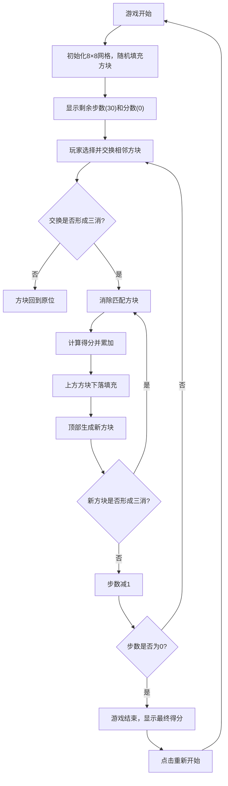

## 1. 产品概述

消消乐三消游戏是一款经典的休闲益智游戏，玩家通过交换相邻方块使三个或更多同色方块连成一线来消除方块获得分数。目标用户为所有年龄段的休闲游戏爱好者，在有限的30步内追求最高分。

## 2. 核心功能

### 2.1 功能模块
1. **游戏主界面**：8×8网格游戏区域、顶部状态栏、操作提示
2. **游戏逻辑**：方块交换、三消检测、消除动画、下落填充、分数计算
3. **游戏状态**：步数计数、分数统计、游戏结束判定、重新开始

### 2.2 页面详情
| 页面名称 | 模块名称 | 功能描述 |
|---------|---------|---------|
| 游戏主页面 | 顶部状态栏 | 显示剩余步数和当前总分 |
| 游戏主页面 | 8×8网格区域 | 显示彩色方块，支持点击/拖拽交换 |
| 游戏主页面 | 游戏结束弹窗 | 显示最终得分，提供重新开始按钮 |

## 3. 核心流程

## 4. 用户界面设计

### 4.1 设计风格
- **主色调**：采用鲜艳活泼的糖果色系，6种不同颜色的方块（红、橙、黄、绿、蓝、紫）
- **背景**：深色渐变背景，营造游戏氛围
- **方块样式**：圆角矩形，带有高光效果和阴影，选中时有边框高亮
- **字体**：现代无衬线字体，数字清晰醒目
- **动画**：方块消除时缩放淡出，下落时平滑过渡，选中时轻微放大

### 4.2 页面设计概述
| 页面名称 | 模块名称 | UI元素 |
|---------|---------|--------|
| 游戏主页面 | 顶部状态栏 | 深色卡片，左右分布显示步数和分数，大号数字 |
| 游戏主页面 | 游戏网格 | 8×8居中布局，方块之间有间隙，整体带圆角和阴影 |
| 游戏主页面 | 游戏结束弹窗 | 半透明遮罩，居中白色卡片，显示最终分数和重新开始按钮 |

### 4.3 响应性
- 桌面端优先设计，支持移动端自适应
- 方块大小根据屏幕宽度自动调整
- 支持触摸设备的滑动操作
