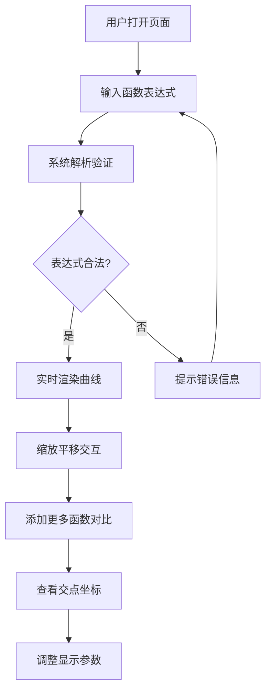

## 1. 产品概述

微积分可视化趣味游戏是一款交互式数学学习工具，让用户通过输入函数表达式，实时观察函数曲线图像，从而直观理解微积分概念。产品采用游戏化闯关设计，结合欢乐的视觉风格，让枯燥的数学变得生动有趣。

- **核心目标**：让微积分学习变得可视化、趣味化、互动化
- **目标用户**：学生、数学爱好者、教师
- **市场价值**：填补数学可视化教育工具的趣味性空白

## 2. 核心特性

### 2.1 功能模块

1. **主界面**：函数输入区、图像显示区、参数设置面板
2. **函数绘图引擎**：支持数学表达式解析、实时渲染
3. **交互控制**：图像缩放、平移、坐标系调整
4. **多函数对比**：同时显示多条曲线，支持颜色区分
5. **智能分析**：自动计算并显示坐标轴交点

### 2.2 页面详情

| 页面名称 | 模块名称 | 功能描述 |
|-----------|-------------|---------------------|
| 主游戏页面 | 函数输入区 | 支持输入数学表达式如x^2, sin(x), 实时验证语法 |
| 主游戏页面 | 图像画布 | Canvas渲染函数曲线，支持缩放平移 |
| 主游戏页面 | 参数设置 | 调整线条粗细、颜色、网格密度、坐标范围 |
| 主游戏页面 | 函数列表 | 管理多个函数，支持显隐切换、删除、颜色设置 |
| 主游戏页面 | 交点显示 | 自动标记函数与X轴、Y轴交点坐标 |

## 3. 核心流程

用户打开页面 → 输入函数表达式 → 系统解析并验证 → 实时渲染函数曲线 → 用户缩放平移查看细节 → 添加多个函数对比 → 查看交点坐标 → 调整参数优化显示效果

## 4. 用户界面设计

### 4.1 设计风格

- **主色调**：活力橙 `#FF6B35` + 科技蓝 `#4ECDC4` + 梦幻紫 `#9B5DE5`
- **辅色调**：明亮黄 `#FEE440` + 清新绿 `#00BBF9`
- **背景**：深色渐变背景配合网格纹理，营造科技感
- **按钮风格**：圆润3D效果，悬停时有弹性动画
- **字体**：标题使用活泼的`'Fredoka One'`，正文使用清晰的`'Noto Sans SC'`
- **布局风格**：卡片式布局，模块清晰，层次分明
- **图标风格**：圆润可爱的线性图标，配合emoji增强趣味性

### 4.2 页面设计概述

| 页面名称 | 模块名称 | UI元素 |
|-----------|-------------|-------------|
| 主游戏页面 | 顶部标题栏 | 渐变文字标题、游戏等级显示、重置按钮 |
| 主游戏页面 | 左侧输入面板 | 函数输入框（带自动补全）、添加按钮、函数列表 |
| 主游戏页面 | 中央画布区 | Canvas绘图区、缩放控制条、平移提示、坐标读数 |
| 主游戏页面 | 右侧设置面板 | 线条粗细滑块、颜色选择器、网格开关、坐标范围设置 |
| 主游戏页面 | 底部状态栏 | 交点信息显示、当前鼠标坐标、帮助提示 |

### 4.3 响应式设计

- **桌面优先**：1920px以上为主要设计目标
- **平板适配**：1024px-1920px，调整面板宽度比例
- **移动适配**：768px-1024px，面板改为上下布局
- **触摸优化**：支持双指缩放、单指平移手势

### 4.4 动效设计

- 页面加载时各模块错落入场动画
- 函数曲线绘制时的路径动画效果
- 按钮悬停时的弹性缩放效果
- 交点标记出现时的脉冲发光效果
- 参数调整时的平滑过渡动画
