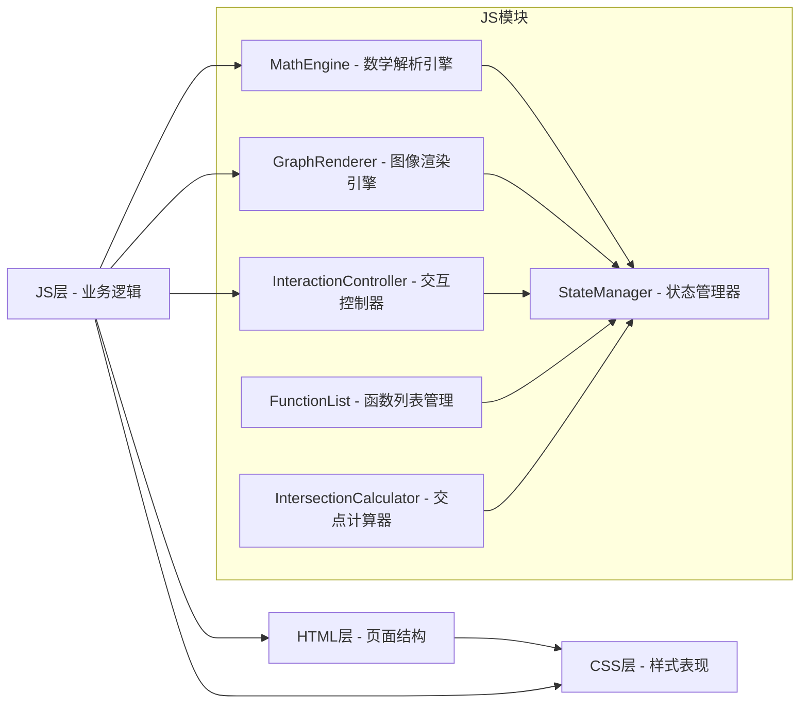

## 1. 架构设计

本项目采用纯前端技术栈，HTML/CSS/JS分层架构，无需后端服务。所有计算和渲染均在浏览器端完成。



## 2. 技术描述

- **前端框架**：原生 HTML5 + CSS3 + JavaScript (ES6+)
- **数学库**：math.js (用于表达式解析和计算)
- **渲染技术**：HTML5 Canvas 2D API
- **图标**：lucide (CDN引入)
- **字体**：Google Fonts (Fredoka One, Noto Sans SC)
- **构建工具**：无，纯静态页面
- **部署方式**：直接部署静态文件到任意Web服务器

## 3. 目录结构

```
微积分可视化/
├── index.html                 # 主页面
├── css/
│   ├── style.css              # 主样式文件
│   ├── animations.css         # 动画样式
│   └── responsive.css         # 响应式样式
├── js/
│   ├── main.js                # 入口文件
│   ├── math-engine.js         # 数学解析引擎
│   ├── graph-renderer.js      # 图像渲染引擎
│   ├── interaction.js         # 交互控制器
│   ├── state-manager.js       # 状态管理器
│   ├── function-manager.js    # 函数列表管理
│   └── utils.js               # 工具函数
└── assets/
    └── (预留静态资源目录)
```

## 4. 核心模块说明

### 4.1 数学解析引擎 (math-engine.js)
- 职责：解析用户输入的数学表达式，转换为可计算的函数
- 关键功能：
  - 表达式语法验证
  - 支持常见数学函数：sin, cos, tan, log, sqrt, abs, pow等
  - 变量替换与计算
  - 错误处理与提示

### 4.2 图像渲染引擎 (graph-renderer.js)
- 职责：Canvas绑定、坐标系转换、曲线绘制
- 关键功能：
  - 画布初始化与自适应
  - 坐标系统（世界坐标 ↔ 屏幕坐标转换）
  - 网格线与坐标轴绘制
  - 函数曲线绘制（抗锯齿优化）
  - 交点标记绘制
  - 缩放平移变换

### 4.3 交互控制器 (interaction.js)
- 职责：处理用户输入事件
- 关键功能：
  - 鼠标滚轮缩放
  - 鼠标拖拽平移
  - 触摸手势支持（双指缩放、单指平移）
  - 鼠标悬停坐标显示
  - 函数曲线点击检测

### 4.4 状态管理器 (state-manager.js)
- 职责：全局状态管理与事件通知
- 关键功能：
  - 存储当前视图参数（缩放级别、偏移量）
  - 存储函数列表数据
  - 存储显示参数（线条粗细、颜色、网格开关）
  - 状态变更事件订阅与通知

### 4.5 函数列表管理 (function-manager.js)
- 职责：管理多个函数的增删改查
- 关键功能：
  - 添加/删除函数
  - 切换函数显隐
  - 设置函数颜色
  - 计算函数交点

## 5. 数据模型

### 5.1 函数对象定义
```javascript
{
  id: string,           // 唯一标识
  expression: string,   // 原始表达式
  color: string,        // 曲线颜色
  lineWidth: number,    // 线条粗细
  visible: boolean,     // 是否可见
  compiled: Function    // 编译后的可执行函数
}
```

### 5.2 视图状态定义
```javascript
{
  scale: number,        // 缩放级别 (像素/单位)
  offsetX: number,      // X轴偏移量
  offsetY: number,      // Y轴偏移量
  showGrid: boolean,    // 显示网格
  showAxis: boolean,    // 显示坐标轴
  showIntersections: boolean  // 显示交点
}
```

### 5.3 交点对象定义
```javascript
{
  x: number,            // X坐标
  y: number,            // Y坐标
  type: 'x-axis' | 'y-axis' | 'function',  // 交点类型
  functionId: string    // 所属函数ID
}
```

## 6. 核心算法

### 6.1 函数曲线绘制算法
1. 将表达式编译为可执行函数 f(x)
2. 在当前可见的X范围内，以固定步长采样点
3. 将数学坐标转换为屏幕坐标
4. 使用贝塞尔曲线平滑连接采样点
5. 应用抗锯齿绘制

### 6.2 交点计算算法
- **X轴交点**：使用二分法求解 f(x) = 0
- **Y轴交点**：直接计算 f(0)
- **函数间交点**：求解 f1(x) - f2(x) = 0

### 6.3 坐标转换算法
```
屏幕X = (数学X - offsetX) * scale + canvasWidth / 2
屏幕Y = canvasHeight / 2 - (数学Y - offsetY) * scale
```

## 7. 性能优化策略

1. **按需渲染**：仅在参数变化时重新绘制
2. **节流处理**：鼠标移动事件节流，避免频繁重绘
3. **离屏Canvas**：网格和坐标轴预渲染到离屏Canvas
4. **采样优化**：根据缩放级别动态调整采样密度
5. **Web Worker**：复杂计算（如交点求解）在Worker中执行
