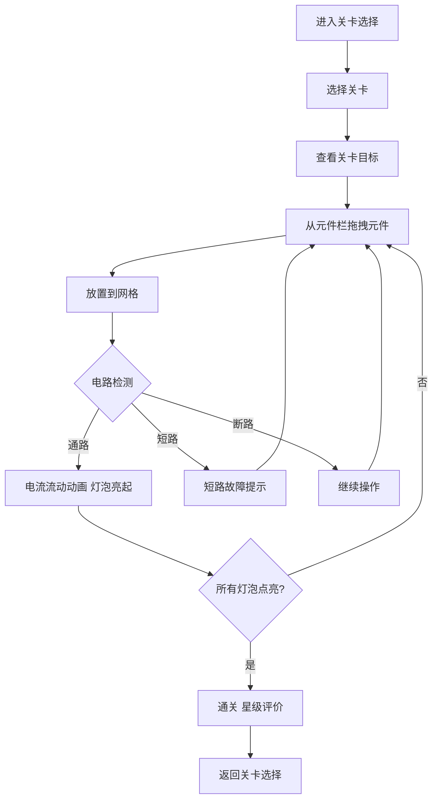

## 1. 产品概述

趣味电路连接逻辑游戏——玩家在网格上拖拽导线连接电源、开关和灯泡等元件，规划合理电路使所有灯泡点亮通关。目标用户为喜欢益智解谜的休闲玩家及电路初学者。

## 2. 核心功能

### 2.1 功能模块

1. **游戏主界面**：网格画布、元件栏、关卡信息栏、操作按钮
2. **关卡选择界面**：关卡列表、星级评价、解锁状态

### 2.2 页面详情

| 页面名称 | 模块名称 | 功能描述 |
|----------|----------|----------|
| 游戏主界面 | 网格画布 | 显示6×8网格，放置电源、导线、开关、灯泡等元件 |
| 游戏主界面 | 元件栏 | 展示当前可用元件及数量，玩家从中拖拽元件到网格 |
| 游戏主界面 | 关卡信息栏 | 显示关卡名称、目标描述、剩余元件数量 |
| 游戏主界面 | 操作按钮 | 重置、撤销、提示、返回关卡选择 |
| 游戏主界面 | 电路反馈 | 电流流动动画、灯泡亮起效果、短路/故障提示 |
| 关卡选择界面 | 关卡列表 | 网格布局展示各关卡，显示星级、锁定/解锁状态 |

## 3. 核心流程

玩家进入关卡 → 查看关卡目标 → 从元件栏拖拽导线/元件到网格 → 连接电源与灯泡形成通路 → 系统实时检测电路状态 → 正确连接则电流流通、灯泡亮起 → 短路/错误连接弹出故障提示 → 所有目标灯泡点亮 → 通关并显示星级评价

## 4. 用户界面设计

### 4.1 设计风格

- 主色调：深蓝黑背景（#0a0e27）+ 荧光绿电流色（#00ff88）+ 暖黄灯泡色（#ffcc00）
- 辅助色：电路板绿（#1a3a2a）、故障红（#ff3344）、开关橙（#ff8800）
- 按钮：3D立体按钮，带发光边框和悬停脉冲效果
- 字体：标题使用科技感字体 Orbitron，正文使用 Rajdhani
- 布局：居中画布，顶部关卡信息，左侧元件栏，底部操作栏
- 图标/元件：像素风+霓虹发光效果，模拟电路板风格

### 4.2 页面设计概览

| 页面名称 | 模块名称 | UI元素 |
|----------|----------|--------|
| 游戏主界面 | 网格画布 | 深色背景荧光网格线，元件带霓虹发光，电流沿导线流动动画 |
| 游戏主界面 | 元件栏 | 半透明面板，元件图标可拖拽，数量角标，选中态发光 |
| 游戏主界面 | 关卡信息栏 | 顶部条带，关卡名+目标描述，背景渐变 |
| 游戏主界面 | 操作按钮 | 圆形3D按钮，图标+悬停放大+点击缩放反馈 |
| 游戏主界面 | 电路反馈 | 灯泡渐亮动画+光晕，短路闪红+震动，通关烟花粒子 |
| 关卡选择界面 | 关卡列表 | 卡片网格布局，每卡片显示关卡缩略图+星级+锁定遮罩 |

### 4.3 响应式

桌面优先设计，最小支持1024×768分辨率。移动端适配触摸拖拽，网格和元件等比缩放。

## 5. 元件定义

| 元件 | 图标 | 功能 | 连接点 |
|------|------|------|--------|
| 电源 | 电池图标 | 提供电能，电路起点 | 正极+负极 |
| 导线 | 直线/弯角线 | 连接各元件 | 两端 |
| 开关 | 闸刀图标 | 控制通断，点击切换 | 两端 |
| 灯泡 | 灯泡图标 | 通电后亮起，通关判定 | 两端 |
| 电阻 | 锯齿线图标 | 增加电路电阻 | 两端 |

## 6. 关卡设计（初期5关）

| 关卡 | 名称 | 目标 | 可用元件 | 难度 |
|------|------|------|----------|------|
| 1 | 初识电路 | 点亮1个灯泡 | 电源1、导线3、灯泡1 | ★ |
| 2 | 开关控制 | 用开关控制灯泡 | 电源1、导线4、开关1、灯泡1 | ★ |
| 3 | 双灯并联 | 点亮2个灯泡 | 电源1、导线6、灯泡2 | ★★ |
| 4 | 混联电路 | 用开关分别控制2灯 | 电源1、导线8、开关2、灯泡2 | ★★ |
| 5 | 电阻限流 | 加入电阻使电路正常 | 电源1、导线7、电阻1、开关1、灯泡2 | ★★★ |
