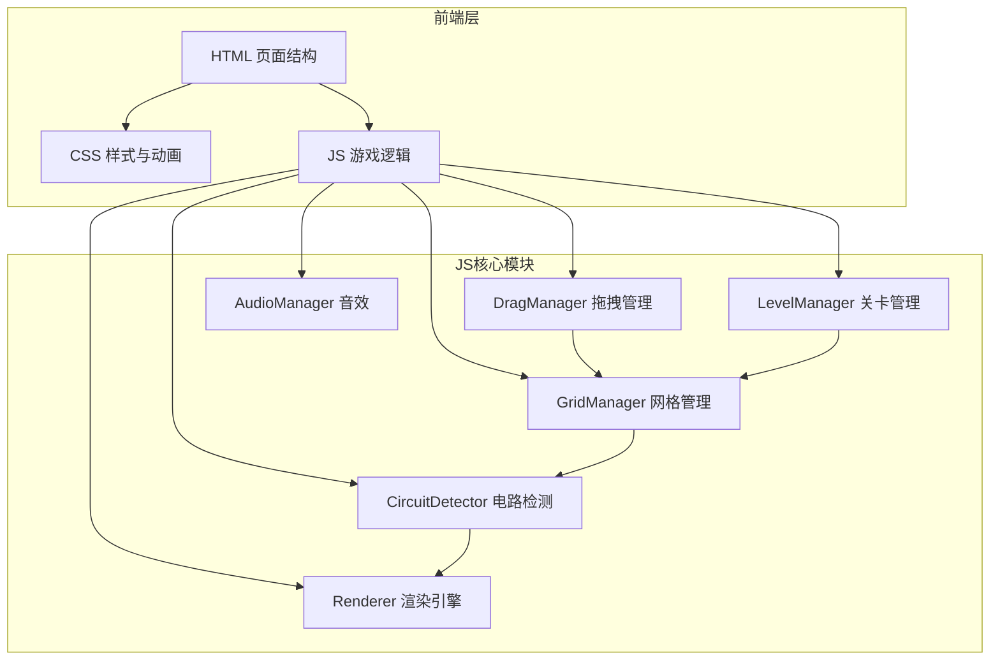

## 1. 架构设计



## 2. 技术说明

- 前端：纯 HTML5 + CSS3 + ES6 JavaScript（无框架，用户要求HTML/CSS/JS分离）
- 构建工具：无，直接浏览器运行
- 后端：无
- 数据：关卡数据以JSON格式内嵌JS中

## 3. 目录结构

```
d:\标注作业\电路连接逻辑\
├── index.html              # 入口页面
├── css/
│   └── style.css           # 样式与动画
├── js/
│   ├── main.js             # 入口与初始化
│   ├── grid.js             # 网格管理器
│   ├── circuit.js           # 电路检测器
│   ├── drag.js             # 拖拽管理器
│   ├── level.js            # 关卡管理器
│   ├── renderer.js          # 渲染引擎
│   └── levels.js           # 关卡数据定义
└── .trae/
    └── documents/          # 项目文档
```

## 4. 核心算法

### 4.1 电路检测算法

使用图论中的深度优先搜索（DFS）从电源出发，沿导线和元件连接点遍历，判断是否存在从电源正极到灯泡再到电源负极的完整回路。

- 每个网格单元格可包含一个元件，元件有方向（上下左右）和连接点
- 导线根据方向连接相邻格子
- 开关有开/关状态，关断时不传导电流
- 检测短路：电流路径不经过任何负载（灯泡/电阻）直接形成回路

### 4.2 拖拽系统

- HTML5 Drag & Drop API + 触摸事件兼容
- 元件从元件栏拖入网格时，实时高亮可放置位置
- 已放置元件可拖拽移除或旋转

### 4.3 渲染引擎

- Canvas 2D 绘制网格、元件和电流动画
- 电流流动使用粒子沿导线路径运动
- 灯泡亮起使用径向渐变 + 外发光滤镜

## 5. 数据模型

### 5.1 元件模型

```javascript
{
  type: "power|wire|switch|bulb|resistor",
  id: "comp_1",
  row: 0,
  col: 0,
  rotation: 0,       // 0, 90, 180, 270
  connections: ["top", "right", "bottom", "left"],
  state: "on|off",   // 仅开关使用
  powered: false,     // 是否通电
  count: 3            // 元件栏可用数量
}
```

### 5.2 关卡模型

```javascript
{
  id: 1,
  name: "初识电路",
  description: "连接电源和灯泡，点亮灯泡",
  difficulty: 1,
  gridSize: { rows: 6, cols: 8 },
  fixedComponents: [
    { type: "power", row: 0, col: 0, rotation: 0 },
    { type: "bulb", row: 5, col: 7, rotation: 0 }
  ],
  availableComponents: [
    { type: "wire", count: 5, allowedRotations: [0, 90] },
    { type: "switch", count: 1, allowedRotations: [0, 90, 180, 270] }
  ],
  objectives: [
    { type: "lightAllBulbs" }
  ]
}
```

## 6. 性能优化

- Canvas 仅在状态变化时重绘
- 电流粒子动画使用 requestAnimationFrame
- 关卡数据预加载，切换无延迟
- 触摸事件使用 passive listener 提升滚动性能
