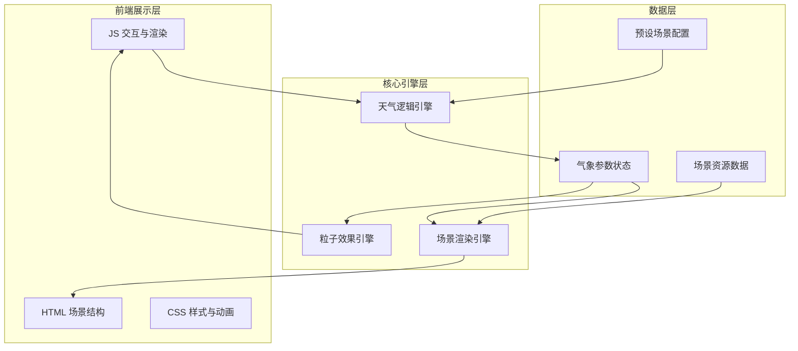

## 1. 架构设计



## 2. 技术说明
- **前端**: 纯 HTML5 + CSS3 + Vanilla JavaScript（用户指定 html/css/js 分目录存放）
- **渲染**: Canvas 2D API 绘制天气粒子效果 + SVG/CSS 绘制场景元素
- **动画**: CSS Keyframes + requestAnimationFrame 双引擎
- **构建工具**: 无需构建工具，直接浏览器运行
- **后端**: 无
- **数据库**: 无，所有数据内置

## 3. 项目目录结构

```
气象模拟实验室/
├── index.html                  # 主入口
├── css/
│   ├── main.css               # 全局样式与布局
│   ├── scene.css              # 场景样式与动画
│   └── controls.css           # 控制面板样式
├── js/
│   ├── main.js                # 入口与初始化
│   ├── weather-engine.js      # 天气逻辑引擎
│   ├── particle-engine.js     # 粒子效果引擎
│   ├── scene-renderer.js      # 场景渲染器
│   ├── scene-elements.js      # 场景元素（植物/建筑）
│   └── presets.js             # 预设场景配置
└── .trae/
    └── documents/             # 项目文档
```

## 4. 天气逻辑引擎设计

### 4.1 参数到天气的映射规则
| 条件 | 天气类型 |
|------|---------|
| 温度 > 25°C 且 湿度 < 40% 且 气压 > 1010hPa | ☀️ 晴天 |
| 温度 > 20°C 且 湿度 40~70% | ⛅ 多云 |
| 温度 > 5°C 且 湿度 > 70% 且 气压 < 1000hPa | 🌧️ 雨天 |
| 温度 ≤ 0°C 且 湿度 > 60% | ❄️ 雪天 |
| 湿度 > 85% 且 气压 < 980hPa 且 温度 > 15°C | ⛈️ 风暴 |

### 4.2 风速计算
风速 = f(气压差, 温度差) — 基于气压梯度和温差的简化模型

### 4.3 场景元素响应
- **植物**: 风速→弯曲角度，温度→颜色（绿→黄→枯），雨天→水滴，雪天→积雪
- **建筑**: 雨天→积水反光，雪天→屋顶积雪，风暴→窗户闪烁

## 5. 预设场景配置
| 预设名称 | 温度 | 湿度 | 气压 | 场景 |
|---------|------|------|------|------|
| 晴空万里 | 32°C | 25% | 1020hPa | 草地 |
| 暴风骤雨 | 22°C | 95% | 965hPa | 海洋 |
| 银装素裹 | -10°C | 75% | 1005hPa | 城市 |
| 春暖花开 | 20°C | 55% | 1015hPa | 草地 |
| 海上风暴 | 28°C | 90% | 970hPa | 海洋 |
| 雾都迷城 | 12°C | 88% | 995hPa | 城市 |
