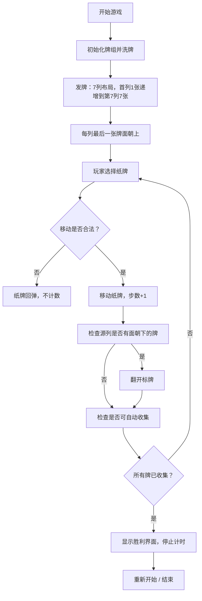

## 1. 产品概述

创意克朗代克纸牌接龙游戏，融合复古赌场美学与现代交互体验，为玩家提供经典纸牌游戏的全新视觉享受。

- 面向所有年龄段的休闲游戏玩家，提供放松解压的娱乐体验
- 通过精美视觉设计和流畅交互，打造令人难忘的纸牌游戏体验

## 2. 核心功能

### 2.2 功能模块
1. **游戏主界面**：7列牌桌布局、4个收集堆、发牌堆、游戏信息面板
2. **纸牌交互系统**：拖拽移动、点击翻开、自动吸附
3. **游戏规则引擎**：红黑交替校验、降序排列校验、收集堆升序校验
4. **状态统计系统**：实时计时、步数统计、游戏状态管理
5. **胜利结算系统**：完成检测、胜利动画、重新开始

### 2.3 页面详情
| 页面名称 | 模块名称 | 功能描述 |
|-----------|-------------|---------------------|
| 游戏主界面 | 牌桌布局区 | 7列纸牌堆叠展示，支持拖拽交互，面朝下纸牌可点击翻开 |
| 游戏主界面 | 收集堆区域 | 4个收集堆，接收A牌并按同花色升序排列 |
| 游戏主界面 | 发牌堆区域 | 剩余纸牌储备，点击可发牌 |
| 游戏主界面 | 信息统计栏 | 显示当前用时、移动步数、重新开始按钮 |
| 游戏主界面 | 胜利弹窗 | 游戏完成时展示最终成绩和庆祝动画 |

## 3. 核心流程

## 4. 用户界面设计

### 4.1 设计风格
- **主色调**：深绿色绒布质感背景 (#0B4619)，搭配金色装饰 (#D4AF37)，红色 (#C41E3A) 和黑色 (#1A1A1A) 纸牌
- **辅助色**：象牙白纸牌底色 (#FFFFF0)，深棕色边框 (#3E2723)
- **按钮风格**：复古金属质感，圆角矩形，金色描边，悬停时有光泽流动效果
- **字体**：标题使用 "Playfair Display" 奢华衬线字体，数字使用 "Roboto Mono" 等宽字体
- **布局风格**：经典赌场牌桌布局，纸牌有精致阴影和立体感，轻微悬浮效果
- **装饰元素**：金色装饰边框、微妙的噪点纹理、复古角花装饰

### 4.2 页面设计概述
| 页面名称 | 模块名称 | UI Elements |
|-----------|-------------|-------------|
| 游戏主界面 | 牌桌区域 | 深绿色绒布纹理背景，金色装饰边框，7列纸牌间距均匀，纸牌有3D立体感和投影 |
| 游戏主界面 | 顶部状态栏 | 左右对称布局，左侧显示计时器，中间显示游戏标题，右侧显示步数和重新开始按钮 |
| 游戏主界面 | 纸牌样式 | 象牙白底色，精致角花图案，红色/黑色花色符号，金色细边框，背面有复古花纹 |
| 游戏主界面 | 拖拽效果 | 拖拽时纸牌轻微放大，有金色光晕跟随，释放时有平滑吸附动画 |
| 胜利界面 | 弹窗 | 金色边框半透明弹窗，礼花动画效果，显示最终用时和步数，优雅的进入动画 |

### 4.3 响应性
- 采用桌面优先设计，最小支持 1024px 宽度
- 纸牌尺寸根据屏幕宽度自适应调整
- 触摸设备支持拖拽交互
- 整体布局保持经典牌桌比例

### 4.4 动效设计
- 页面加载：纸牌依次滑入到位，形成发牌动画
- 纸牌翻转：3D翻转动画，带有微妙的闪光效果
- 拖拽移动：跟随鼠标平滑移动，释放时有弹性吸附
- 胜利效果：彩色礼花粒子从牌桌四周迸发，纸牌闪烁金光
- 悬停效果：可移动纸牌有轻微上浮和光晕效果
