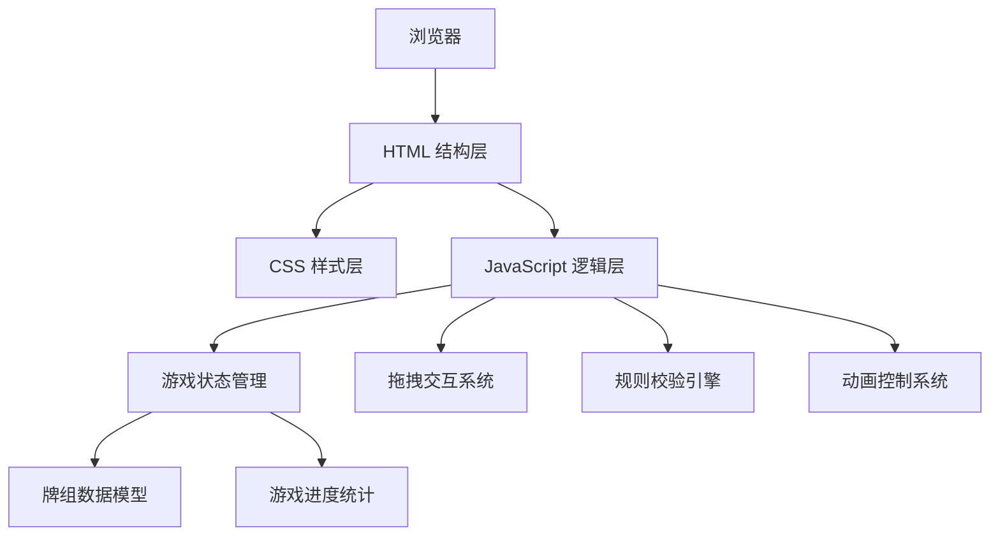

## 1. 架构设计



## 2. 技术描述

- **前端**：纯 HTML5 + CSS3 + 原生 JavaScript (ES6+)，无需框架和构建工具
- **样式方案**：CSS 变量管理主题，CSS3 动画和过渡，Flexbox 布局
- **交互**：原生 HTML5 Drag and Drop API + 鼠标事件监听
- **数据存储**：纯内存状态管理，无需后端和数据库

## 3. 目录结构

```
纸牌接龙/
├── index.html              # 游戏主页面
├── css/
│   └── style.css           # 样式文件（包含主题变量、布局、纸牌样式、动画）
├── js/
│   └── game.js             # 游戏逻辑（牌组、拖拽、规则、统计、动画）
└── .trae/
    └── documents/
        ├── PRD.md
        └── 技术架构.md
```

## 4. 核心数据模型

### 4.1 纸牌对象 (Card)

```javascript
{
  suit: 'hearts' | 'diamonds' | 'clubs' | 'spades',  // 花色
  rank: 1-13,                                        // 点数 (1=A, 11=J, 12=Q, 13=K)
  faceUp: boolean,                                   // 是否面朝上
  color: 'red' | 'black',                            // 颜色
  element: HTMLElement                               // DOM 元素引用
}
```

### 4.2 游戏状态 (GameState)

```javascript
{
  columns: Array<Array<Card>>,      // 7列牌堆
  foundations: Array<Array<Card>>,  // 4个收集堆
  stock: Array<Card>,               // 发牌堆
  waste: Array<Card>,               // 弃牌堆
  moves: number,                    // 移动步数
  startTime: number,                // 开始时间戳
  elapsedTime: number,              // 已用时间(秒)
  timerInterval: number,            // 计时器ID
  isWon: boolean                    // 是否获胜
}
```

### 4.3 拖拽状态 (DragState)

```javascript
{
  isDragging: boolean,              // 是否正在拖拽
  draggedCards: Array<Card>,        // 被拖拽的牌组
  sourceColumn: number,             // 来源列索引
  sourceType: 'column' | 'waste' | 'foundation',  // 来源类型
  startX: number,                   // 拖拽起始X
  startY: number,                   // 拖拽起始Y
  offsetX: number,                  // 鼠标偏移X
  offsetY: number                   // 鼠标偏移Y
}
```

## 5. 核心模块与函数

### 5.1 游戏初始化模块
- `createDeck()`: 创建52张标准扑克牌
- `shuffleDeck()`: Fisher-Yates 洗牌算法
- `dealCards()`: 按克朗代克规则发牌到7列
- `initGame()`: 游戏初始化入口

### 5.2 规则校验模块
- `isValidColumnMove(card, targetCard)`: 校验列间移动（红黑交替、降序）
- `isValidFoundationMove(card, foundationIndex)`: 校验收集堆移动（同花色升序）
- `canMoveToFoundation(card)`: 检查牌是否可自动收集
- `checkWin()`: 检查是否所有牌已收集

### 5.3 拖拽交互模块
- `startDrag()`: 开始拖拽事件处理
- `onDrag()`: 拖拽移动事件处理
- `endDrag()`: 结束拖拽事件处理
- `getDropTarget()`: 获取放置目标
- `moveCards()`: 执行牌的移动

### 5.4 游戏状态管理
- `incrementMoves()`: 增加步数
- `startTimer()`: 启动计时器
- `stopTimer()`: 停止计时器
- `updateStatsDisplay()`: 更新统计显示
- `resetGame()`: 重置游戏

### 5.5 动画控制模块
- `animateCardMove()`: 纸牌移动动画
- `animateCardFlip()`: 纸牌翻转动画
- `showWinAnimation()`: 胜利动画
- `createConfetti()`: 创建礼花粒子

## 6. 关键技术实现

### 6.1 拖拽实现
- 使用原生 `mousedown`, `mousemove`, `mouseup` 事件实现自定义拖拽
- 拖拽时创建浮动元素跟随鼠标
- 检测碰撞目标并提供视觉反馈

### 6.2 3D 纸牌翻转
- 使用 CSS `transform-style: preserve-3d` 和 `rotateY` 实现3D翻转
- 正反面分别渲染，通过 `backface-visibility` 控制可见性

### 6.3 性能优化
- 使用 CSS `transform` 和 `opacity` 实现硬件加速动画
- 事件委托减少事件监听器数量
- 拖拽时使用 `requestAnimationFrame` 确保流畅

### 6.4 响应式适配
- 使用 CSS 变量和 `clamp()` 函数实现自适应尺寸
- 基于 `vw` 单位的响应式布局
- 触摸事件支持移动端操作
