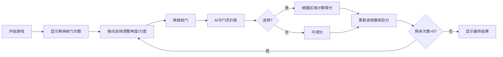

## 1. 产品概述

趣味足球射门模拟游戏，玩家通过拖动足球调整射门角度和力度，挑战10次射门机会，与AI守门员斗智斗勇，追求最高分。

- 核心目标：提供简单有趣的足球射门体验，通过精准射门获得高分
- 目标用户：所有年龄段的休闲游戏玩家
- 产品价值：随时随地享受足球射门的乐趣，锻炼手眼协调能力

## 2. 核心功能

### 2.1 用户角色
| 角色 | 注册方式 | 核心权限 |
|------|----------|----------|
| 玩家 | 无需注册 | 进行游戏、查看分数 |

### 2.2 功能模块
1. **游戏主界面**：3D视角足球场、可拖动足球、球门、AI守门员
2. **射门系统**：角度调整、力度显示、足球飞行轨迹
3. **得分系统**：球门区域得分判定、死角高分机制
4. **AI守门员**：随机移动扑救、反应速度模拟
5. **统计面板**：进球数统计、总得分显示、剩余射门次数

### 2.3 页面详情
| 页面名称 | 模块名称 | 功能描述 |
|---------|----------|----------|
| 游戏主界面 | 3D足球场 | 俯视视角展示球门区域、草地纹理、球门框架 |
| 游戏主界面 | 足球控制 | 拖动调整角度和力度、释放射门 |
| 游戏主界面 | AI守门员 | 左右移动、随机扑救动作 |
| 游戏主界面 | 得分判定 | 球门分区、碰撞检测、分数计算 |
| 游戏主界面 | 统计面板 | 显示当前得分、进球数、剩余次数 |

## 3. 核心流程

玩家进入游戏 → 查看剩余射门次数 → 拖动足球调整角度和力度 → 释放足球射门 → AI守门员扑救 → 判断进球与否及得分区域 → 更新统计面板 → 重复直到10次机会用完 → 显示最终结果

## 4. 用户界面设计

### 4.1 设计风格
- **主色调**：绿茵场绿色 (#2E7D32)、足球白 (#FFFFFF)、球门黄 (#FFD600)
- **辅助色**：天空蓝 (#87CEEB)、草地深绿 (#1B5E20)
- **按钮风格**：圆角按钮、悬浮效果、点击反馈
- **字体**：使用现代无衬线字体，数字醒目易读
- **布局**：居中游戏区域、顶部统计面板、底部操作提示
- **图标**：使用足球、球门、得分等运动相关图标

### 4.2 页面设计概述
| 页面名称 | 模块名称 | UI元素 |
|---------|----------|--------|
| 游戏主界面 | 3D足球场 | 渐变草地、球门框架、阴影效果、景深 |
| 游戏主界面 | 足球控制 | 力度条、角度指示线、拖动光标 |
| 游戏主界面 | AI守门员 | 守门员精灵、移动动画、扑救动作 |
| 游戏主界面 | 统计面板 | 半透明背景、醒目数字、图标提示 |
| 游戏主界面 | 得分动画 | 飞入数字、闪光效果、震动反馈 |

### 4.3 响应性
- 桌面端：全屏游戏体验，鼠标拖动操作
- 移动端：自适应屏幕尺寸，触摸滑动操作
- 优化触摸区域，确保移动端操作流畅

### 4.4 3D场景指导
- **视角**：俯视45度角，聚焦球门区域
- **环境**：明亮日间光照，天空背景
- **灯光**：主光源模拟阳光，柔和阴影
- **相机**：固定位置，轻微跟随足球移动
- **动画**：足球旋转、守门员移动、得分特效
- **后处理**：轻微泛光效果，增强视觉冲击力
