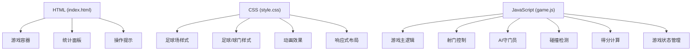

## 1. 架构设计



## 2. 技术描述

- **前端技术栈**：原生 HTML5 + CSS3 + JavaScript (ES6+)
- **渲染方式**：Canvas 2D 渲染游戏场景
- **动画系统**：requestAnimationFrame 实现流畅动画
- **交互方式**：鼠标/触摸事件处理拖拽操作
- **目录结构**：
  - `html/` - HTML文件目录
  - `css/` - CSS样式文件目录  
  - `js/` - JavaScript脚本文件目录

## 3. 目录结构

```
足球射门模拟/
├── html/
│   └── index.html          # 游戏主页面
├── css/
│   └── style.css           # 样式文件
├── js/
│   └── game.js             # 游戏主逻辑
└── .trae/
    └── documents/
        ├── prd.md
        └── tech-architecture.md
```

## 4. 核心数据结构

### 4.1 游戏状态
```javascript
const gameState = {
  shotsRemaining: 10,      // 剩余射门次数
  goalsScored: 0,          // 进球数
  totalScore: 0,           // 总得分
  isDragging: false,       // 是否正在拖动
  isShooting: false,       // 是否正在射门
  gameOver: false          // 游戏是否结束
};
```

### 4.2 足球对象
```javascript
const ball = {
  x: number,              // X坐标
  y: number,              // Y坐标
  vx: number,             // X方向速度
  vy: number,             // Y方向速度
  radius: number,         // 半径
  rotation: number        // 旋转角度
};
```

### 4.3 守门员对象
```javascript
const goalkeeper = {
  x: number,              // X坐标
  y: number,              // Y坐标
  width: number,          // 宽度
  height: number,         // 高度
  targetX: number,        // 目标位置
  speed: number           // 移动速度
};
```

### 4.4 球门得分区域
```javascript
const goalZones = [
  { name: '左上死角', points: 100, x1: 0, y1: 0, x2: 80, y2: 60 },
  { name: '右上死角', points: 100, x1: 220, y1: 0, x2: 300, y2: 60 },
  { name: '左侧', points: 50, x1: 0, y1: 60, x2: 80, y2: 180 },
  { name: '右侧', points: 50, x1: 220, y1: 60, x2: 300, y2: 180 },
  { name: '中心', points: 20, x1: 80, y1: 0, x2: 220, y2: 180 }
];
```

## 5. 核心算法

### 5.1 射门角度和力度计算
```
角度 = atan2(拖动终点Y - 足球Y, 拖动终点X - 足球X) + π
力度 = min(距离(拖动起点, 拖动终点) / 最大距离, 1) * 最大速度
```

### 5.2 碰撞检测
- 足球与球门框架碰撞
- 足球与守门员碰撞
- 足球边界检测

### 5.3 AI守门员逻辑
- 射门时预测足球落点
- 根据难度随机调整反应速度
- 随机左右移动增加不确定性

## 6. 性能优化

- 使用 requestAnimationFrame 进行渲染
- 合理的碰撞检测频率
- 图片资源预加载（如使用）
- 避免内存泄漏（及时清理动画帧）
