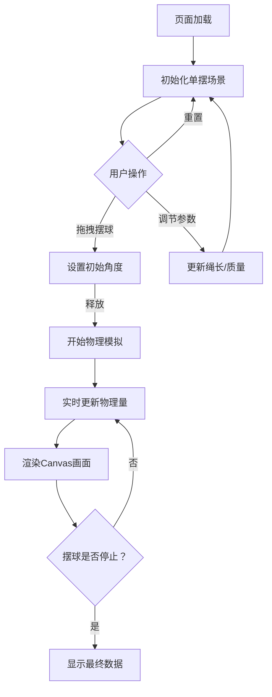

## 1. 产品概述

物理摆锤实验游戏是一款基于浏览器的交互式物理模拟应用，让用户通过拖拽摆球设置初始角度，观察单摆在重力和空气阻力作用下的摆动行为，并实时查看运动参数。
- 面向物理学习者和教育场景，帮助直观理解单摆运动规律
- 提供可调节参数和实时数据展示，兼具趣味性和教学价值

## 2. 核心功能

### 2.1 功能模块

1. **主实验区**：Canvas画布绘制单摆（支点、绳子、摆球），支持拖拽交互
2. **控制面板**：绳长调节滑块、摆球质量调节滑块、重置按钮
3. **实时数据面板**：角度、周期、速度、加速度、能量（动能/势能/总能量）

### 2.2 页面详情

| 页面名称 | 模块名称 | 功能描述 |
|----------|----------|----------|
| 实验页面 | Canvas画布 | 渲染单摆物理场景，支持拖拽摆球设置初始角度，释放后开始摆动模拟 |
| 实验页面 | 控制面板 | 提供绳长和质量滑块调节，重置实验按钮 |
| 实验页面 | 实时数据面板 | 实时显示角度θ、周期T、线速度v、角加速度α、动能Ek、势能Ep、总能量E |

## 3. 核心流程

1. 用户进入页面，看到静止的单摆（默认竖直状态）
2. 用户拖拽摆球到指定角度（显示角度引导线）
3. 用户释放摆球，摆球在重力作用下开始摆动
4. 空气阻力使摆动逐渐衰减，实时数据面板持续更新
5. 用户可随时调整绳长/质量参数，或拖拽摆球重新开始

## 4. 用户界面设计

### 4.1 设计风格

- **主色调**：深蓝黑背景（#0a0e1a）配合科技蓝强调色（#00d4ff）和暖橙辅助色（#ff6b35）
- **按钮风格**：圆角胶囊按钮，半透明玻璃态背景
- **字体**：数据面板使用等宽字体 JetBrains Mono，UI文案使用 Noto Sans SC
- **布局风格**：左侧大画布区域，右侧半透明浮动面板
- **图标风格**：线条图标，配合微光效果

### 4.2 页面设计概览

| 页面名称 | 模块名称 | UI元素 |
|----------|----------|--------|
| 实验页面 | Canvas画布 | 深色背景，白色绳子，渐变摆球，角度刻度弧线，运动轨迹淡影 |
| 实验页面 | 控制面板 | 玻璃态面板，自定义滑块，发光按钮，参数标签 |
| 实验页面 | 实时数据面板 | 等宽数字，发光数值，彩色能量条形图，物理量单位标注 |

### 4.3 响应式设计

- 桌面端优先：左侧Canvas占据主要空间，右侧面板
- 平板端：Canvas上方，面板下方
- 移动端：Canvas全宽，面板可折叠

### 4.4 动效设计

- 摆球拖拽时显示角度引导弧线和数值
- 释放时微弹效果
- 数据面板数值变化时有数字滚动动画
- 摆球运动留下渐隐轨迹
- 能量条形图实时动态变化
