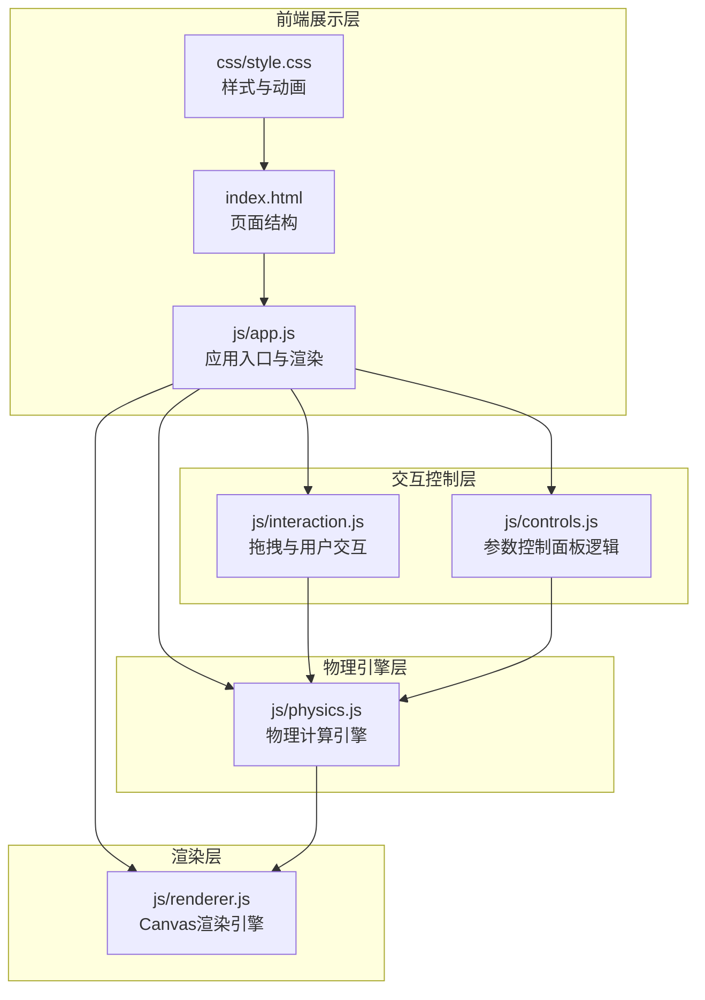

## 1. 架构设计



## 2. 技术说明

- **前端**：纯HTML5 + CSS3 + JavaScript（ES6+），无需构建工具
- **渲染**：HTML5 Canvas 2D API
- **物理模拟**：自定义物理引擎，基于牛顿力学和微分方程数值积分（四阶Runge-Kutta法）
- **交互**：原生DOM事件（mousedown/mousemove/mouseup + touch事件）
- **样式**：CSS3自定义属性、Glassmorphism效果、CSS动画
- **外部依赖**：无（纯原生实现）

## 3. 项目结构

```
物理摆锤实验/
├── index.html          # 主页面入口
├── css/
│   └── style.css       # 全局样式、布局、动画
├── js/
│   ├── app.js          # 应用入口，初始化与主循环
│   ├── physics.js      # 物理引擎（运动方程、能量计算）
│   ├── renderer.js     # Canvas渲染（绳子、摆球、轨迹、刻度）
│   ├── interaction.js  # 拖拽交互逻辑
│   └── controls.js     # 参数面板控制逻辑
└── .trae/
    └── documents/      # 项目文档
```

## 4. 物理模型

### 4.1 运动方程

单摆运动方程（含空气阻力）：

```
θ'' = -(g/L) * sin(θ) - b * θ'
```

其中：
- θ：摆角（弧度）
- g：重力加速度（9.8 m/s²）
- L：绳子长度
- b：阻尼系数（模拟空气阻力）

### 4.2 数值积分

使用四阶Runge-Kutta法求解微分方程，确保模拟精度。

### 4.3 能量计算

- 动能：Ek = 0.5 * m * v² = 0.5 * m * (L * θ')²
- 势能：Ep = m * g * L * (1 - cos(θ))（以最低点为零势能面）
- 总能量：E = Ek + Ep

### 4.4 周期计算

理论周期（小角度近似）：T = 2π * √(L/g)

实测周期：通过检测摆球过零点的时间间隔计算

## 5. 关键实现细节

### 5.1 拖拽交互

- 鼠标按下时检测是否在摆球区域内
- 拖拽时计算鼠标位置相对于支点的角度
- 角度限制在 [-π/2, π/2] 范围内
- 释放时将当前角度设为初始角度，角速度设为0

### 5.2 渲染策略

- 使用requestAnimationFrame驱动动画循环
- Canvas分辨率适配设备像素比（devicePixelRatio）
- 摆球使用径向渐变模拟3D球体效果
- 运动轨迹使用逐渐透明的点序列
- 角度刻度弧线显示当前摆动范围

### 5.3 参数调节

- 绳长范围：0.5m ~ 3.0m，步长0.1m
- 质量范围：0.5kg ~ 5.0kg，步长0.1kg
- 阻尼系数：0.01 ~ 0.5
- 参数变化时重置模拟状态
