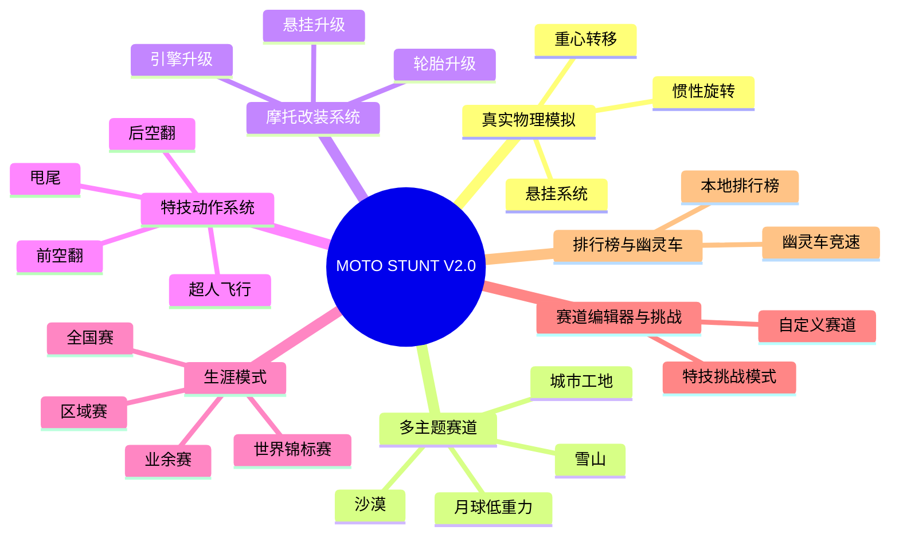
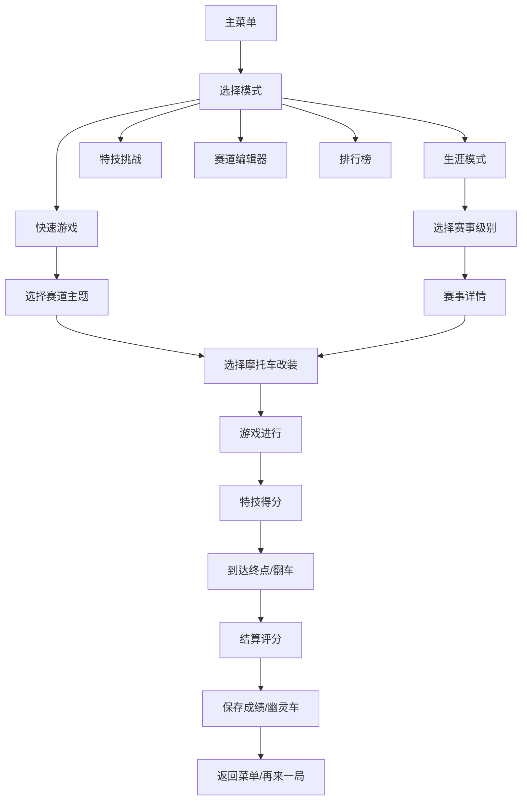

## 1. 产品概述

一款侧视视角的摩托赛车特技游戏，玩家驾驶摩托车在起伏地形上行驶，通过特技动作获取分数，追求最短通关时间。支持多主题赛道、摩托改装、生涯模式和特技挑战。

- **核心玩法**：驾驶摩托车穿越起伏赛道，通过空中翻转特技获取高分
- **目标用户**：休闲游戏爱好者、特技游戏玩家、赛车游戏玩家
- **产品价值**：提供紧张刺激的特技赛车体验，考验玩家操作技巧和策略规划

---

## 2. 核心功能模块（V2.0 七大功能）

### 2.1 功能模块总览



### 2.2 页面详情

| 页面名称 | 模块名称 | 功能描述 |
|-----------|-------------|---------------------|
| 主菜单 | 导航系统 | 开始游戏、改装、生涯、编辑器、排行榜 |
| 游戏主界面 | 游戏画布 | 侧视视角渲染地形、摩托车、粒子特效 |
| 游戏主界面 | HUD信息面板 | 实时显示分数、速度、特技连击、用时 |
| 改装界面 | 改装系统 | 引擎、轮胎、悬挂升级选择和预览 |
| 生涯界面 | 生涯模式 | 赛事选择、进度显示、奖励领取 |
| 赛道编辑器 | 编辑器 | 地形编辑、坡道放置、保存赛道 |
| 特技挑战 | 挑战模式 | 特技目标、计时挑战、评分系统 |
| 排行榜 | 排行系统 | 最佳成绩、幽灵车选择 |

---

## 3. 七大功能详细设计

### 3.1 真实物理模拟

**悬挂系统**
- 双轮独立悬挂，前后轮分别有压缩/回弹阻尼
- 悬挂行程影响着地稳定性和颠簸吸收
- 硬悬挂适合平整赛道，软悬挂适合越野

**重心转移**
- 玩家前后倾斜控制重心转移
- 加速时重心后移，刹车时重心前移
- 重心位置影响抓地力和转向

**惯性旋转**
- 空中保持角动量，不能瞬间改变旋转方向
- 空中姿态调整有角加速度限制
- 着陆时旋转动量会影响平衡

### 3.2 多主题赛道系统

| 主题 | 地形特征 | 物理参数 | 视觉风格 | 难度 |
|------|----------|----------|----------|------|
| **沙漠** | 大起伏沙丘、松软沙地 | 高滚动阻力、低抓地力 | 土黄/橙色调、沙尘粒子 | ★★☆☆☆ |
| **雪山** | 冰面、陡峭悬崖、雪坡 | 低摩擦、易打滑 | 蓝白色调、雪花粒子 | ★★★☆☆ |
| **城市工地** | 障碍物、斜坡跳板、钢管 | 多段碰撞、弹跳平台 | 灰/黄色调、建筑背景 | ★★★★☆ |
| **月球** | 陨石坑、低重力、超长跳跃 | 1/6重力、无空气阻力 | 黑色星空、灰色地表 | ★★★★★ |

### 3.3 摩托改装系统

**升级分类**
- **引擎**：影响加速、最高速度、价格递增
- **轮胎**：影响抓地力、滚动阻力、地形适应性
- **悬挂**：影响悬挂行程、稳定性、着地容错度

**升级等级**（每类5级）
- Lv1 基础款（免费）
- Lv2 运动款（5000分）
- Lv3 专业款（15000分）
- Lv4 竞速款（40000分）
- Lv5 传奇款（100000分）

**改装属性计算**
```
加速力 = 基础加速 × 引擎等级系数
抓地力 = 基础抓地力 × 轮胎等级系数
悬挂容错 = 基础容错 + 悬挂等级加成
```

### 3.4 特技动作系统

| 特技名称 | 操作方式 | 判定条件 | 基础分数 | 难度 |
|----------|----------|----------|----------|------|
| **后空翻** | 空中长按 ← | 向后旋转360°+ | 500 | ★★☆☆☆ |
| **前空翻** | 空中长按 → | 向前旋转360°+ | 600 | ★★★☆☆ |
| **超人飞行** | 空中长按 ↑ + ←/→ | 空中保持特定姿态2秒+ | 800 | ★★★★☆ |
| **甩尾** | 着地时 ↓ + 方向 | 着地时侧滑角度>30° | 300 | ★★☆☆☆ |
| **双后空翻** | 空中连续后翻 | 向后旋转720°+ | 1500 | ★★★★☆ |
| **完美着陆** | 角度差<5°着陆 | 着陆角度与坡度差<5° | 200 | ★☆☆☆☆ |

**特技计分公式**
```
最终得分 = 基础分 × 难度系数 × 连击倍率 × 完美加成
完美加成 = 1.0 + (1.0 - 着陆角度/最大容错角度)
```

### 3.5 生涯模式

**赛事级别**
1. **业余赛**（初始解锁）：奖励基础升级资金
2. **区域赛**（累计5000分解锁）：解锁中级改装
3. **全国赛**（累计30000分解锁）：解锁高级改装
4. **世界锦标赛**（累计100000分解锁）：解锁全部内容

**进度系统**
- 每关3星评级（时间、分数、特技数量）
- 星数累计解锁隐藏内容
- 本地存档保存进度（localStorage）

### 3.6 赛道编辑器与特技挑战

**赛道编辑器**
- 高度曲线编辑（拖拽控制点）
- 坡道/障碍放置
- 赛道保存/加载（本地存储）
- 测试模式

**特技挑战模式**
- 指定特技挑战（如"完成3次后空翻"）
- 计时挑战（限定时间内获取最高分数）
- 精准着陆挑战（连续完美着陆）
- 每周挑战（自动生成挑战目标）

### 3.7 排行榜与幽灵车

**本地排行榜**
- 每条赛道保存前10名
- 记录时间、分数、所用车辆
- 按时间/分数两种排序

**幽灵车竞速**
- 录制最佳比赛路径
- 保存输入序列和运动数据
- 比赛中显示半透明幽灵车
- 可选择不同玩家的幽灵车

---

## 4. 用户界面设计

### 4.1 设计风格扩展

- **主色调**: 深邃夜空蓝 (#0a1628)
- **辅助色**: 火焰橙 (#ff6b35)、霓虹绿 (#00ff88)、赛博紫 (#9d4edd)
- **字体**: Orbitron（显示）、Roboto（正文）
- **风格**: 未来科技感，赛博朋克风格
- **主题切换**: 每个赛道有独立的色调和粒子系统

### 4.2 新增页面设计

| 页面名称 | 布局 | 关键交互 |
|-----------|--------|----------|
| 主菜单 | 垂直按钮列表 + 摩托预览 | 悬停光效、点击震动 |
| 改装界面 | 左摩托预览 + 右升级列表 | 升级对比、金币显示 |
| 生涯界面 | 赛事地图 + 进度条 | 关卡解锁动画、奖励弹窗 |
| 赛道编辑器 | 顶工具栏 + 主编辑区 | 拖拽控制点、缩放预览 |
| 排行榜 | 排名列表 + 幽灵车选择 | 查看详细数据、播放幽灵车 |

---

## 5. 核心流程（扩展）



---

## 6. 数据持久化

使用 localStorage 保存以下数据：
- 玩家金币和总分数
- 改装升级等级
- 生涯进度和星数
- 最佳成绩和排行榜
- 幽灵车回放数据
- 自定义赛道

