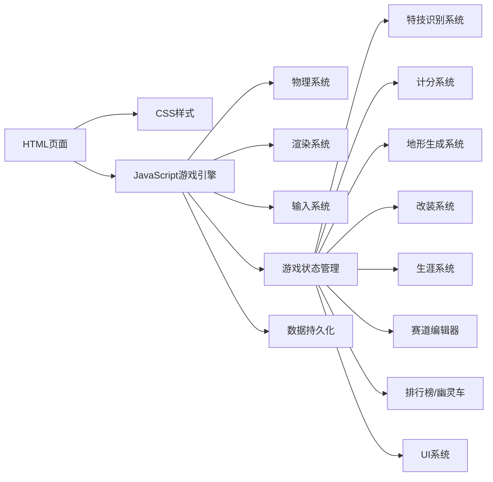

## 1. 架构设计（V2.0）

纯前端HTML5 Canvas游戏，使用原生JavaScript实现游戏引擎和渲染。采用模块化设计，支持多系统扩展。



---

## 2. 技术说明

- **前端**: 原生HTML5 + CSS3 + JavaScript (ES6+)
- **渲染**: Canvas 2D API
- **物理引擎**: 自定义2D刚体物理系统（悬挂、重心、惯性）
- **数据存储**: localStorage 本地持久化
- **目录结构**: css/、js/ 分离，按功能模块组织

---

## 3. 目录结构（V2.0 扩展）

```
摩托赛车特技/
├── css/
│   └── style.css              # 游戏样式（菜单、HUD、改装、生涯）
├── js/
│   ├── core/                  # 核心引擎
│   │   ├── game.js            # 游戏主入口和状态管理
│   │   ├── physics.js         # 物理引擎（悬挂、重心、惯性）
│   │   ├── renderer.js        # 渲染系统（多主题支持）
│   │   └── input.js           # 输入系统（键盘、触摸）
│   ├── entities/              # 实体类
│   │   ├── motorcycle.js      # 摩托车类（含改装属性）
│   │   ├── terrain.js         # 地形类（多主题生成）
│   │   └── ghost.js           # 幽灵车类
│   ├── systems/               # 游戏系统
│   │   ├── trick_system.js    # 特技动作识别系统
│   │   ├── upgrade_system.js  # 摩托改装升级系统
│   │   ├── career_system.js   # 生涯模式系统
│   │   ├── leaderboard.js     # 排行榜系统
│   │   └── save_system.js     # 数据持久化系统
│   ├── ui/                    # UI组件
│   │   ├── ui.js              # HUD界面
│   │   ├── menu.js            # 主菜单
│   │   ├── upgrade_ui.js      # 改装界面
│   │   ├── career_ui.js       # 生涯界面
│   │   ├── editor_ui.js       # 编辑器界面
│   │   └── leaderboard_ui.js  # 排行榜界面
│   ├── editor/                # 赛道编辑器
│   │   └── track_editor.js    # 编辑器核心逻辑
│   ├── data/                  # 数据配置
│   │   ├── track_themes.js    # 赛道主题配置
│   │   ├── upgrades.js        # 升级数据配置
│   │   ├── tricks.js          # 特技配置
│   │   └── career.js          # 生涯赛事配置
│   └── utils/                 # 工具函数
│       ├── math.js            # 数学工具
│       └── storage.js         # 存储工具
└── index.html                 # 主页面
```

---

## 4. 核心类定义（V2.0 扩展）

### 4.1 Physics 物理引擎（增强版）

```javascript
class Physics {
  gravity: number;               // 重力加速度（可配置为月球1/6）
  airResistance: number;         // 空气阻力
  wheelBase: number;             // 前后轮间距
  
  // 悬挂参数
  frontSuspension: {
    travel: number;              // 悬挂行程
    compression: number;         // 压缩阻尼
    rebound: number;             // 回弹阻尼
    springRate: number;          // 弹簧刚度
  }
  
  rearSuspension: { same as front }
  
  // 重心参数
  centerOfMass: { x: number, y: number }  // 动态重心位置
  
  // 方法
  updateWheelSuspension(): void  // 计算每个车轮的悬挂压缩
  updateCenterOfMass(): void     // 更新重心位置
  updateInertialRotation(): void // 惯性旋转物理
  getGripMultiplier(): number    // 根据重心和轮胎计算抓地力
}
```

### 4.2 Motorcycle 摩托车类（增强版）

```javascript
class Motorcycle {
  // 基础属性
  x: number; y: number;
  angle: number; velocityX: number; velocityY: number;
  angularVelocity: number;
  
  // 双轮独立属性
  frontWheel: {
    x: number; y: number;
    compression: number;         // 当前悬挂压缩量
    isGrounded: boolean;
    slipAngle: number;           // 侧滑角度
  }
  rearWheel: { same as front }
  
  // 改装属性
  upgrades: {
    engineLevel: number;         // 引擎等级 1-5
    tireLevel: number;           // 轮胎等级 1-5
    suspensionLevel: number;     // 悬挂等级 1-5
  }
  
  // 特技状态
  trickState: {
    isInTrick: boolean;
    currentTrick: string;
    trickProgress: number;
    rotationCount: number;
    supermanTime: number;        // 超人飞行持续时间
    driftAngle: number;          // 甩尾角度
  }
  
  // 改装属性计算
  getMaxSpeed(): number          // 根据引擎等级计算
  getAcceleration(): number      // 根据引擎等级计算
  getGrip(): number              // 根据轮胎等级计算
  getSuspensionTravel(): number  // 根据悬挂等级计算
}
```

### 4.3 Terrain 地形类（多主题支持）

```javascript
class Terrain {
  theme: 'desert' | 'snow' | 'city' | 'moon';
  points: Array<{x, y}>;
  ramps: Array<Ramp>;
  obstacles: Array<Obstacle>;
  
  // 主题物理参数
  themePhysics: {
    gravity: number;
    friction: number;
    rollingResistance: number;
    airDensity: number;
  }
  
  // 主题视觉参数
  themeVisual: {
    skyColors: string[];
    terrainColors: string[];
    particleType: string;
    ambientColor: string;
  }
  
  generate(theme: string): void;
  getHeight(x: number): number;
  getAngle(x: number): number;
  getTheme(): string;
  getPhysicsParams(): object;
}
```

### 4.4 TrickSystem 特技识别系统

```javascript
class TrickSystem {
  registeredTricks: Array<TrickDefinition>;
  activeTrick: TrickInstance;
  completedTricks: Array<CompletedTrick>;
  
  detectTrickStart(moto: Motorcycle): void;
  updateTrickProgress(moto: Motorcycle, dt: number): void;
  checkTrickCompletion(moto: Motorcycle): CompletedTrick | null;
  calculateTrickScore(trick: CompletedTrick): number;
  getTrickName(trickType: string): string;
}

interface TrickDefinition {
  id: string;
  name: string;
  baseScore: number;
  difficulty: number;
  detect: (moto: Motorcycle) => boolean;
  complete: (moto: Motorcycle) => boolean;
}

interface CompletedTrick {
  id: string;
  name: string;
  score: number;
  quality: 'perfect' | 'good' | 'ok';
  comboMultiplier: number;
}
```

### 4.5 UpgradeSystem 改装系统

```javascript
class UpgradeSystem {
  upgrades: {
    engine: Array<UpgradeLevel>;
    tire: Array<UpgradeLevel>;
    suspension: Array<UpgradeLevel>;
  }
  currentLevel: {
    engine: number;
    tire: number;
    suspension: number;
  }
  
  canUpgrade(type: string, coins: number): boolean;
  purchaseUpgrade(type: string, coins: number): number;  // 返回剩余金币
  getUpgradeInfo(type: string, level: number): UpgradeLevel;
  getAppliedStats(): AppliedStats;
}

interface UpgradeLevel {
  level: number;
  name: string;
  price: number;
  description: string;
  stats: {
    speedBonus?: number;
    accelBonus?: number;
    gripBonus?: number;
    suspensionBonus?: number;
  }
}
```

### 4.6 CareerSystem 生涯系统

```javascript
class CareerSystem {
  currentTier: number;           // 0=业余, 1=区域, 2=全国, 3=世界
  totalStars: number;
  totalCoins: number;
  events: Array<CareerEvent>;
  progress: Map<string, EventProgress>;
  
  unlockNextTier(): boolean;
  completeEvent(eventId: string, score: number, time: number): EventResult;
  getAvailableEvents(): Array<CareerEvent>;
  getStarRating(eventId: string, score: number, time: number): number;  // 1-3星
}

interface CareerEvent {
  id: string;
  name: string;
  tier: number;
  trackTheme: string;
  unlockRequirement: number;     // 需要的星数
  rewardCoins: number;
  starRequirements: {
    one: number;
    two: number;
    three: number;
  }
}
```

### 4.7 GhostRecorder/Player 幽灵车系统

```javascript
class GhostRecorder {
  recording: boolean;
  frameData: Array<GhostFrame>;
  startTime: number;
  
  startRecording(): void;
  recordFrame(moto: Motorcycle, input: InputState): void;
  stopRecording(): GhostData;
  saveToStorage(trackId: string): void;
}

class GhostPlayer {
  ghostData: GhostData;
  currentFrame: number;
  isPlaying: boolean;
  
  loadFromStorage(trackId: string, rank: number): GhostData;
  update(dt: number): Motorcycle;
  getPosition(): {x: number, y: number, angle: number};
}

interface GhostFrame {
  time: number;
  x: number; y: number;
  angle: number;
  velocityX: number;
  velocityY: number;
}

interface GhostData {
  trackId: string;
  totalTime: number;
  score: number;
  frames: Array<GhostFrame>;
  metadata: {
    playerName: string;
    date: string;
    upgrades: object;
  }
}
```

### 4.8 Leaderboard 排行榜系统

```javascript
class Leaderboard {
  getTopScores(trackId: string, limit: number = 10): Array<LeaderboardEntry>;
  addScore(trackId: string, entry: LeaderboardEntry): number;  // 返回排名
  getPlayerRank(trackId: string, score: number): number;
  clearScores(trackId: string): void;
}

interface LeaderboardEntry {
  rank: number;
  playerName: string;
  score: number;
  time: number;
  date: string;
  ghostAvailable: boolean;
}
```

---

## 5. 游戏状态机

```javascript
enum GameState {
  MAIN_MENU = 'main_menu',
  TRACK_SELECT = 'track_select',
  UPGRADE = 'upgrade',
  CAREER = 'career',
  EDITOR = 'editor',
  LEADERBOARD = 'leaderboard',
  COUNTDOWN = 'countdown',
  PLAYING = 'playing',
  PAUSED = 'paused',
  GAME_OVER = 'game_over',
  FINISHED = 'finished',
  TRICK_CHALLENGE = 'trick_challenge',
}
```

---

## 6. 性能优化策略

1. **对象池**: 粒子系统、特技记录帧使用对象池避免GC
2. **视口裁剪**: 仅渲染屏幕范围内的地形和粒子
3. **分级更新**: 远距离背景使用低更新频率
4. **数据压缩**: 幽灵车数据使用差分编码压缩存储
5. **懒加载**: 编辑器等非核心功能按需加载

---

## 7. 数据持久化格式

使用 localStorage 存储，key 命名空间 `moto_stunt_v2_*`：

```javascript
{
  "player_profile": {
    "name": "Player",
    "total_coins": 0,
    "total_stars": 0,
    "career_tier": 0,
    "upgrades": {"engine": 1, "tire": 1, "suspension": 1}
  },
  "career_progress": {
    "event_id": {"best_score": 0, "best_time": 0, "stars": 0}
  },
  "leaderboard": {
    "track_theme": [
      {"name": "Player", "score": 0, "time": 0, "date": ""}
    ]
  },
  "ghost_data": {
    "track_theme_rank": { /* 压缩的帧数据 */ }
  },
  "custom_tracks": {
    "track_name": { /* 地形点数据 */ }
  }
}
```

