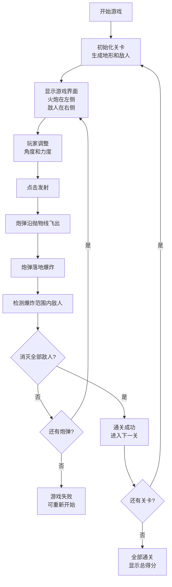

## 1. 产品概述

面向休闲玩家的火炮瞄准射击游戏，玩家通过调整火炮角度和发射力度，发射炮弹消灭右侧地形上的敌人。游戏采用关卡制，炮弹数量有限，考验玩家的物理计算能力和策略思维。

- 目标用户：休闲游戏玩家，喜欢策略和物理类游戏的用户
- 核心价值：提供轻松有趣的游戏体验，通过物理抛物线机制带来益智乐趣

## 2. 核心功能

### 2.1 功能模块

1. **游戏主界面**：游戏画布、控制面板、信息显示
2. **火炮控制系统**：角度调节、力度调节、发射机制
3. **物理引擎**：抛物线轨迹计算、碰撞检测
4. **敌人系统**：敌人生成、敌人位置、生命值管理
5. **关卡系统**：多关卡设计、地形生成、难度递增
6. **计分系统**：得分计算、剩余炮弹显示、通关判定

### 2.2 页面详情

| 页面名称 | 模块名称 | 功能描述 |
|----------|----------|----------|
| 游戏主界面 | 游戏画布 | 渲染火炮、敌人、地形、炮弹、爆炸效果 |
| 游戏主界面 | 控制面板 | 角度滑块、力度滑块、发射按钮、重置按钮 |
| 游戏主界面 | 信息显示区 | 剩余炮弹数、当前得分、关卡信息 |
| 游戏主界面 | 结果弹窗 | 通关成功/失败提示、下一关/重新开始选项 |

## 3. 核心流程

## 4. 用户界面设计

### 4.1 设计风格

- **设计主题**：复古军事风格，采用军绿色和土黄色为主色调
- **主色调**：军绿色 (#4a5d23)、土黄色 (#c9a227)、深棕色 (#3d2914)
- **辅助色**：爆炸橙色 (#ff6b35)、天空蓝色 (#87ceeb)
- **按钮风格**：圆角矩形，带立体阴影效果，悬停时有缩放动画
- **字体**：使用像素风格字体或等宽字体，营造复古游戏氛围
- **布局**：固定画布居中，控制面板在底部，信息显示在顶部
- **图标风格**：使用emoji和Canvas绘制的图形元素

### 4.2 页面设计概述

| 页面名称 | 模块名称 | UI元素 |
|----------|----------|----------|
| 游戏主界面 | 游戏画布 | Canvas绘制的天空、地形、火炮、敌人、炮弹轨迹、爆炸效果 |
| 游戏主界面 | 控制面板 | 水平滑块（角度/力度）、大号发射按钮、重置按钮 |
| 游戏主界面 | 信息显示区 | 顶部状态栏，显示炮弹图标数量、分数数字、关卡编号 |
| 游戏主界面 | 结果弹窗 | 半透明遮罩，居中弹窗，带装饰边框和动画效果 |

### 4.3 响应性

- 采用固定画布尺寸设计（900x600），居中显示
- 控制面板使用响应式布局，适配不同屏幕宽度
- 触摸设备支持滑块拖动和按钮点击操作

### 4.4 动画效果

- 炮弹飞行：平滑的抛物线运动，带拖尾效果
- 爆炸效果：圆形扩散动画，粒子飞散效果
- 敌人消灭：缩放消失动画
- 按钮交互：悬停缩放、点击反馈
- 关卡过渡：淡入淡出效果
