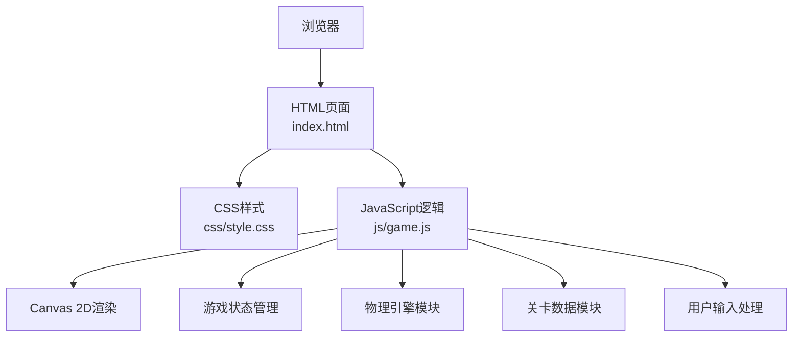

## 1. 架构设计



## 2. 技术描述

- **前端**：原生 HTML5 + CSS3 + Vanilla JavaScript (ES6+)
- **渲染技术**：HTML5 Canvas 2D API
- **项目初始化**：手动创建目录结构，无构建工具
- **后端**：无（纯前端单机游戏）
- **数据库**：无（使用 localStorage 存储最高分）
- **物理引擎**：自行实现简单抛物线物理计算

## 3. 目录结构

```
火炮瞄准射击/
├── index.html          # 主HTML页面
├── css/
│   └── style.css       # 样式文件
├── js/
│   └── game.js         # 游戏逻辑
├── assets/             # 静态资源（可选）
└── .trae/
    └── documents/      # 项目文档
```

## 4. 核心数据结构

### 4.1 游戏状态

```javascript
const gameState = {
  currentLevel: 1,      // 当前关卡
  score: 0,             // 总得分
  ammo: 5,              // 剩余炮弹
  angle: 45,            // 火炮角度
  power: 50,            // 发射力度
  isPlaying: true,      // 游戏进行中
  isFiring: false,      // 正在发射
  cannon: { x, y },     // 火炮位置
  enemies: [],          // 敌人列表
  terrain: [],          // 地形数据
  projectiles: [],      // 飞行中的炮弹
  explosions: []        // 爆炸效果
};
```

### 4.2 关卡数据

```javascript
const levels = [
  {
    id: 1,
    ammo: 5,
    terrain: [/* 地形坐标点 */],
    enemies: [
      { x: 600, y: 300, health: 1 },
      { x: 750, y: 200, health: 1 }
    ]
  }
];
```

## 5. 核心模块

### 5.1 渲染模块 (Renderer)
- `drawSky()` - 绘制天空背景
- `drawTerrain()` - 绘制地形
- `drawCannon()` - 绘制火炮
- `drawEnemies()` - 绘制敌人
- `drawProjectiles()` - 绘制炮弹
- `drawExplosions()` - 绘制爆炸效果

### 5.2 物理模块 (Physics)
- `calculateTrajectory()` - 计算抛物线轨迹
- `checkCollision()` - 碰撞检测
- `updateProjectile()` - 更新炮弹位置

### 5.3 游戏逻辑模块 (Game)
- `initLevel()` - 初始化关卡
- `fire()` - 发射炮弹
- `explode()` - 处理爆炸
- `checkWinLose()` - 检查胜负
- `nextLevel()` - 进入下一关

### 5.4 输入处理模块 (Input)
- `handleAngleChange()` - 角度调节
- `handlePowerChange()` - 力度调节
- `handleFire()` - 发射按钮处理
