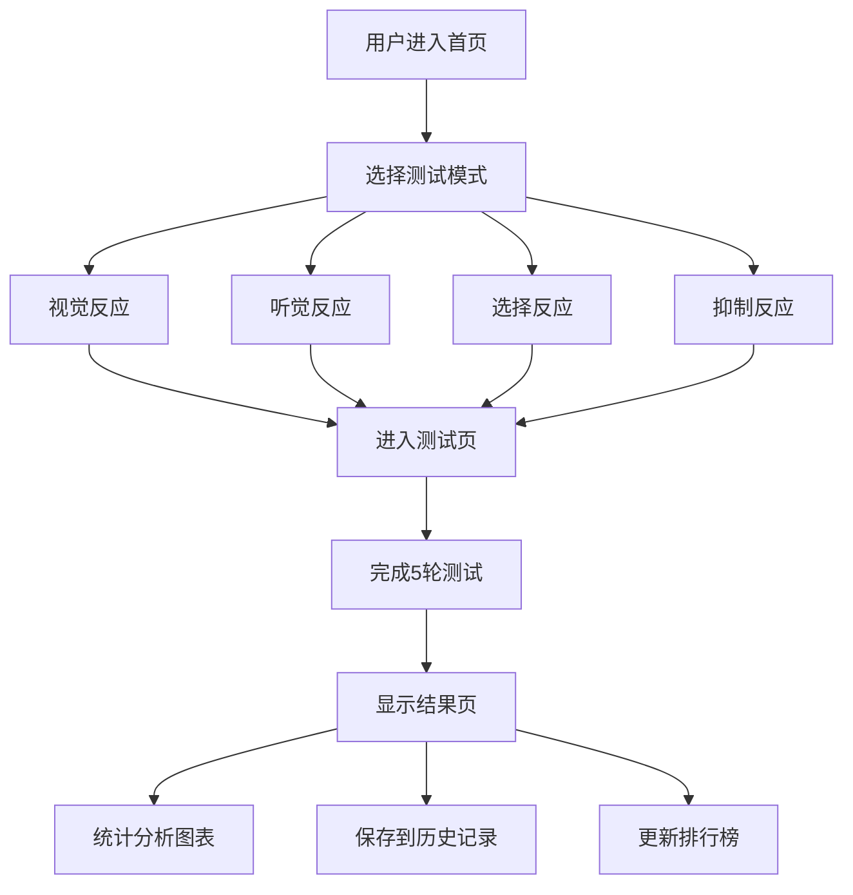
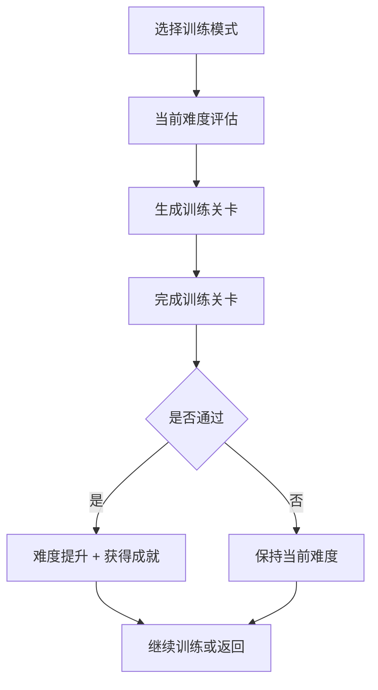

## 1. 产品概述

反应速度测试平台是一个综合性的反应能力评估与训练系统。支持多种测试模式、数据统计分析、游戏化训练、用户账号体系、全球排行榜和数据导出，为用户提供从测试到训练到追踪的完整闭环。

- 主要用途：科学评估反应速度、游戏化训练提升、长期数据追踪、学术研究数据支持
- 目标用户：普通用户（测试与训练）、科研人员（数据采集）、竞技选手（能力评估）
- 产品价值：多维度反应能力量化 + 游戏化激励 + 全球对标 + 数据科研支持

## 2. 核心功能

### 2.1 用户角色

| 角色 | 注册方式 | 核心权限 |
|------|-----------|-----------|
| 游客 | 无需注册 | 免费体验视觉反应测试 |
| 普通用户 | 邮箱注册 | 全部测试模式、个人历史、训练模式、排行榜 |
| 研究人员 | 邮箱注册 + 申请 | 批量数据导出、API访问 |

### 2.2 功能模块

1. **多模式测试**：视觉反应、听觉反应、选择反应、抑制反应
2. **数据统计**：反应时间分布图、趋势变化、百分位排名
3. **训练模式**：渐进式难度、成就系统、每日挑战
4. **用户系统**：注册/登录、个人资料、历史记录
5. **排行榜**：全球排名、年龄段分组、地区分组
6. **多设备同步**：数据云端存储、跨设备访问
7. **数据导出**：CSV格式导出、科研数据标准

### 2.3 测试模式详情

| 模式名称 | 刺激类型 | 用户操作 | 说明 |
|-----------|-----------|-----------|------|
| 视觉反应 | 屏幕颜色变化（红→绿） | 点击/按键 | 基础反应速度测试 |
| 听觉反应 | 声音播放（静音→提示音） | 点击/按键 | 听觉通道反应测试 |
| 选择反应 | 随机显示不同颜色/形状 | 按对应键或点击 | 需要判断后反应 |
| 抑制反应 | Go/No-Go 信号 | Go时点击，No-Go时抑制 | 测试冲动控制能力 |

### 2.4 页面详情

| 页面名称 | 模块名称 | 功能描述 |
|-----------|-------------|---------------------|
| 首页 | 英雄区 | 产品介绍、快速开始按钮 |
| 首页 | 模式选择 | 4种测试模式卡片入口 |
| 测试页 | 刺激区域 | 根据模式显示不同刺激 |
| 测试页 | 状态提示 | 当前轮次、状态指引 |
| 测试页 | 实时成绩 | 每轮反应时间实时显示 |
| 结果页 | 成绩概览 | 平均时间、评价等级 |
| 结果页 | 统计图表 | 分布图、趋势折线图、百分位 |
| 训练页 | 训练面板 | 渐进式训练关卡、成就展示 |
| 排行榜页 | 排名表格 | 全球排名、筛选器（年龄段/地区） |
| 个人中心 | 个人资料 | 头像、昵称、地区、年龄段 |
| 个人中心 | 历史记录 | 测试历史列表、趋势图 |
| 个人中心 | 数据导出 | CSV导出按钮、日期范围选择 |
| 登录/注册页 | 表单 | 邮箱+密码登录/注册 |

## 3. 核心流程

### 3.1 测试流程

### 3.2 训练模式流程

## 4. 用户界面设计

### 4.1 设计风格

- **主题**：深色科技风 + 霓虹强调色
- **主色调**：
  - 背景：深色渐变（#0f172a → #1e293b）
  - 视觉模式：红色（#dc2626）/ 绿色（#22c55e）
  - 听觉模式：靛蓝（#6366f1）/ 青色（#06b6d4）
  - 选择模式：多色彩方案
  - 抑制模式：绿色Go（#22c55e）/ 红色No-Go（#dc2626）
  - 强调色：霓虹紫（#a855f7）、电光蓝（#3b82f6）
- **字体**：标题使用 Orbitron（科技感），正文使用 Noto Sans SC
- **布局**：左侧导航 + 右侧内容区，响应式适配
- **动效**：霓虹光晕、粒子效果、进度条动画
- **图标**：Lucide React 图标库

### 4.2 页面设计概述

| 页面名称 | 模块名称 | UI Elements |
|-----------|-------------|-------------|
| 首页 | 英雄区 | 大标题 + 动态粒子背景 + 快速开始按钮 |
| 首页 | 模式选择 | 4张模式卡片，悬停发光效果 |
| 测试页 | 刺激区域 | 中央大区域，状态颜色过渡，进度条 |
| 结果页 | 统计图表 | Recharts柱状图/折线图，百分位仪表盘 |
| 训练页 | 训练面板 | 关卡进度条，成就徽章，难度指示器 |
| 排行榜页 | 排名表格 | 表格 + 筛选器 + 用户高亮 |
| 个人中心 | 历史记录 | 时间轴列表 + 迷你趋势图 |

### 4.3 响应式设计

- 桌面端：侧边导航 + 宽内容区，图表大面积展示
- 平板端：底部导航 + 自适应内容区
- 移动端：底部Tab导航 + 竖向布局，触控优化

### 4.4 分级评价标准

| 等级 | 视觉反应 | 听觉反应 | 选择反应 | 抑制反应 | 图标 |
|------|-----------|-----------|-----------|-----------|------|
| 闪电 | <200ms | <180ms | <350ms | <400ms | ⚡ |
| 极快 | 200-300ms | 180-280ms | 350-500ms | 400-600ms | 🚀 |
| 正常 | 300-500ms | 280-450ms | 500-700ms | 600-850ms | 👍 |
| 偏慢 | >500ms | >450ms | >700ms | >850ms | 🐢 |

## 5. 数据导出规格

### 5.1 CSV 格式

| 字段 | 说明 |
|------|------|
| user_id | 用户ID |
| test_date | 测试日期时间 |
| mode | 测试模式（visual/audio/choice/inhibition） |
| round | 轮次 |
| reaction_time_ms | 反应时间（毫秒） |
| is_foul | 是否犯规 |
| stimulus_detail | 刺激详情（选择反应的颜色/抑制反应的信号类型） |
