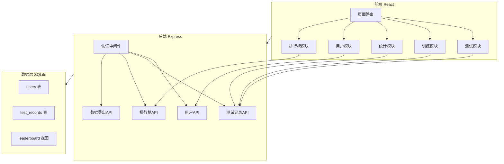
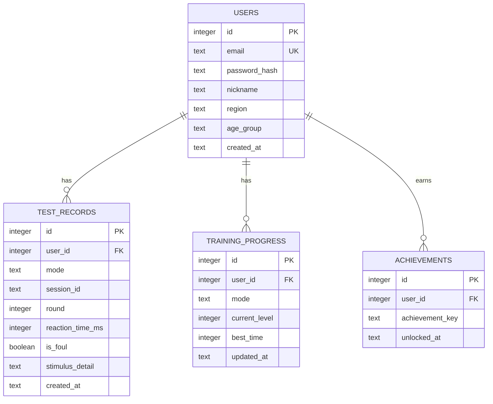

## 1. 架构设计



## 2. 技术描述

- **前端**：React@18 + TypeScript + Tailwind CSS@3 + Vite
- **状态管理**：Zustand
- **图表库**：Recharts
- **路由**：React Router DOM
- **后端**：Express@4 + TypeScript (ESM)
- **数据库**：SQLite (better-sqlite3)
- **认证**：JWT (jsonwebtoken + bcryptjs)
- **初始化工具**：vite-init (react-express-ts 模板)

### 目录结构

```
反应速度测试/
├── src/                         # 前端源码
│   ├── components/              # 通用组件
│   │   ├── Layout.tsx           # 布局组件（侧边栏+内容区）
│   │   ├── Navbar.tsx           # 导航栏
│   │   ├── TestCard.tsx         # 测试模式卡片
│   │   └── StatsChart.tsx       # 统计图表组件
│   ├── pages/                   # 页面
│   │   ├── Home.tsx             # 首页
│   │   ├── Test.tsx             # 测试页（多模式）
│   │   ├── Result.tsx           # 结果页
│   │   ├── Training.tsx         # 训练页
│   │   ├── Leaderboard.tsx      # 排行榜页
│   │   ├── Profile.tsx          # 个人中心
│   │   ├── Login.tsx            # 登录页
│   │   └── Register.tsx         # 注册页
│   ├── hooks/                   # 自定义Hooks
│   │   ├── useTestEngine.ts     # 测试引擎Hook
│   │   └── useAuth.ts           # 认证Hook
│   ├── utils/                   # 工具函数
│   │   ├── rating.ts            # 评价算法
│   │   ├── audio.ts             # 音频工具
│   │   └── csv.ts               # CSV导出工具
│   ├── store/                   # Zustand状态
│   │   ├── authStore.ts         # 认证状态
│   │   └── testStore.ts         # 测试状态
│   ├── App.tsx
│   └── main.tsx
├── api/                         # 后端源码
│   ├── index.ts                 # Express入口
│   ├── middleware/
│   │   └── auth.ts              # JWT认证中间件
│   ├── routes/
│   │   ├── auth.ts              # 认证路由
│   │   ├── tests.ts             # 测试记录路由
│   │   ├── leaderboard.ts       # 排行榜路由
│   │   └── export.ts            # 数据导出路由
│   └── db/
│       ├── index.ts             # 数据库初始化
│       └── migrations/          # SQL迁移文件
├── shared/                      # 前后端共享类型
│   └── types.ts
├── package.json
├── tsconfig.json
└── vite.config.ts
```

## 3. 路由定义

| 前端路由 | 用途 |
|-----------|------|
| / | 首页，模式选择入口 |
| /test/:mode | 测试页（visual/audio/choice/inhibition） |
| /result/:sessionId | 测试结果页 |
| /training | 训练模式页 |
| /leaderboard | 全球排行榜 |
| /profile | 个人中心 |
| /login | 登录页 |
| /register | 注册页 |

## 4. API 定义

### 4.1 认证 API

| 方法 | 路径 | 说明 | 请求体 | 响应 |
|------|------|------|--------|------|
| POST | /api/auth/register | 注册 | { email, password, nickname, region, ageGroup } | { token, user } |
| POST | /api/auth/login | 登录 | { email, password } | { token, user } |
| GET | /api/auth/me | 获取当前用户 | - | { user } |

### 4.2 测试记录 API

| 方法 | 路径 | 说明 | 请求体 | 响应 |
|------|------|------|--------|------|
| POST | /api/tests | 提交测试结果 | { mode, rounds: [{round, reactionTime, isFoul, stimulusDetail}] } | { sessionId, average, rating } |
| GET | /api/tests/history | 获取历史记录 | query: { mode?, limit?, offset? } | { records: [], total } |
| GET | /api/tests/stats | 获取统计数据 | query: { mode? } | { distribution, trend, percentile } |

### 4.3 排行榜 API

| 方法 | 路径 | 说明 | 请求体 | 响应 |
|------|------|------|--------|------|
| GET | /api/leaderboard | 获取排行榜 | query: { mode, ageGroup?, region?, limit?, offset? } | { rankings: [] } |

### 4.4 数据导出 API

| 方法 | 路径 | 说明 | 请求体 | 响应 |
|------|------|------|--------|------|
| GET | /api/export/csv | 导出CSV | query: { mode?, startDate?, endDate? } | CSV文件流 |

### 4.5 训练 API

| 方法 | 路径 | 说明 | 请求体 | 响应 |
|------|------|------|--------|------|
| GET | /api/training/status | 获取训练状态 | - | { level, achievements, dailyChallenge } |
| POST | /api/training/complete | 完成训练关卡 | { mode, level, results } | { passed, newLevel, achievements } |

## 5. 数据模型

### 5.1 ER 图



### 5.2 DDL

```sql
CREATE TABLE users (
    id INTEGER PRIMARY KEY AUTOINCREMENT,
    email TEXT UNIQUE NOT NULL,
    password_hash TEXT NOT NULL,
    nickname TEXT NOT NULL,
    region TEXT DEFAULT 'unknown',
    age_group TEXT DEFAULT 'adult',
    created_at TEXT DEFAULT (datetime('now'))
);

CREATE TABLE test_records (
    id INTEGER PRIMARY KEY AUTOINCREMENT,
    user_id INTEGER NOT NULL,
    mode TEXT NOT NULL CHECK(mode IN ('visual','audio','choice','inhibition')),
    session_id TEXT NOT NULL,
    round INTEGER NOT NULL,
    reaction_time_ms INTEGER,
    is_foul BOOLEAN DEFAULT 0,
    stimulus_detail TEXT,
    created_at TEXT DEFAULT (datetime('now')),
    FOREIGN KEY (user_id) REFERENCES users(id)
);

CREATE TABLE training_progress (
    id INTEGER PRIMARY KEY AUTOINCREMENT,
    user_id INTEGER NOT NULL,
    mode TEXT NOT NULL,
    current_level INTEGER DEFAULT 1,
    best_time INTEGER,
    updated_at TEXT DEFAULT (datetime('now')),
    FOREIGN KEY (user_id) REFERENCES users(id),
    UNIQUE(user_id, mode)
);

CREATE TABLE achievements (
    id INTEGER PRIMARY KEY AUTOINCREMENT,
    user_id INTEGER NOT NULL,
    achievement_key TEXT NOT NULL,
    unlocked_at TEXT DEFAULT (datetime('now')),
    FOREIGN KEY (user_id) REFERENCES users(id),
    UNIQUE(user_id, achievement_key)
);

CREATE INDEX idx_test_records_user ON test_records(user_id);
CREATE INDEX idx_test_records_mode ON test_records(mode);
CREATE INDEX idx_test_records_session ON test_records(session_id);
CREATE INDEX idx_test_records_created ON test_records(created_at);
```

## 6. 测试模式技术实现

### 6.1 视觉反应

与现有逻辑一致：红→绿变色，点击计时。

### 6.2 听觉反应

- 使用 Web Audio API (`AudioContext`) 生成提示音
- 初始状态静音，随机延迟后播放短促提示音
- 用户听到声音后点击/按键

### 6.3 选择反应

- 随机显示4种颜色（红/蓝/绿/黄）之一
- 屏幕底部显示4个对应颜色按钮
- 用户需点击与显示颜色匹配的按钮
- 点击错误按钮计为错误反应（非犯规）

### 6.4 抑制反应 (Go/No-Go)

- 随机显示 Go 信号（绿色圆圈）或 No-Go 信号（红色叉号）
- Go信号比例约 70%，No-Go 约 30%
- Go信号：用户需尽快点击
- No-Go信号：用户需抑制点击冲动
- No-Go时误点计为抑制失败

## 7. 统计分析算法

### 7.1 百分位排名

```sql
SELECT ROUND(
    (COUNT(*) - 1) * 100.0 / (SELECT COUNT(DISTINCT user_id) FROM test_records WHERE mode = ?),
    1
) AS percentile
FROM test_records
WHERE mode = ? AND avg_time > ?
```

### 7.2 反应时间分布

将反应时间按50ms区间分桶，统计每个区间的频次，用柱状图展示。

### 7.3 趋势分析

按日期聚合每日平均反应时间，用折线图展示趋势变化。
