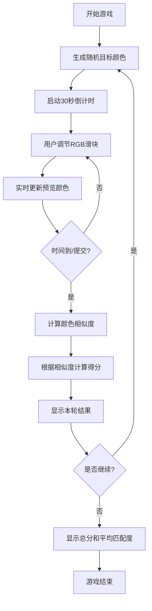

## 1. 产品概述
色彩大师调色游戏是一款基于RGB色彩模型的休闲益智游戏，玩家通过调节红、绿、蓝三个颜色通道来匹配目标颜色，考验玩家对色彩的感知能力和调配技巧。

- 核心目标：通过调节RGB滑块尽可能接近目标颜色，获得高分
- 目标用户：所有年龄段用户，尤其适合设计师、艺术爱好者和普通休闲玩家
- 产品价值：锻炼色彩感知能力，寓教于乐，学习RGB配色原理

## 2. 核心功能

### 2.1 功能模块
1. **游戏主界面**：目标颜色展示区、颜色调配区、实时预览区
2. **计时系统**：每轮30秒倒计时，时间到自动进入结算
3. **评分系统**：基于颜色相似度计算得分，匹配度越高分数越高
4. **多轮游戏**：支持多轮游戏，累计总分和平均匹配度
5. **结果展示**：每轮结算展示得分、匹配度，最终展示统计结果

### 2.3 页面详情
| 页面名称 | 模块名称 | 功能描述 |
|-----------|-------------|---------------------|
| 游戏主界面 | 目标颜色区 | 展示随机生成的目标RGB颜色 |
| 游戏主界面 | 颜色调配区 | RGB三个滑块，支持0-255范围调节 |
| 游戏主界面 | 实时预览区 | 实时显示玩家调配的颜色 |
| 游戏主界面 | 倒计时区 | 显示30秒倒计时进度条 |
| 游戏主界面 | 得分区 | 显示当前轮次、总分、平均匹配度 |
| 游戏主界面 | 控制区 | 开始游戏、下一轮、重新开始按钮 |
| 结算弹窗 | 结果展示 | 展示本轮得分、匹配度、颜色对比 |

## 3. 核心流程
用户点击开始游戏 → 系统随机生成目标颜色 → 30秒倒计时开始 → 用户拖动RGB滑块调配颜色 → 实时预览调配效果 → 时间到或用户提交 → 计算颜色相似度和得分 → 显示本轮结果 → 进入下一轮或结束游戏 → 显示最终统计结果

## 4. 用户界面设计

### 4.1 设计风格
- **主色调**：深色背景（#1a1a2e）突出色彩展示，配合霓虹风格的强调色
- **按钮风格**：圆角渐变按钮，悬停时有发光效果
- **字体**：使用现代无衬线字体，标题使用粗体，数字使用等宽字体
- **布局风格**：卡片式布局，居中对称，强调视觉层次
- **视觉元素**：使用彩色光晕、渐变边框、微妙的动画效果增强游戏感

### 4.2 页面设计概述
| 页面名称 | 模块名称 | UI元素 |
|-----------|-------------|-------------|
| 游戏主界面 | 目标颜色区 | 大色块展示，RGB数值标签，圆角边框 |
| 游戏主界面 | 颜色调配区 | 三个彩色滑块（红、绿、蓝），数值显示 |
| 游戏主界面 | 实时预览区 | 色块预览，与目标色对比布局 |
| 游戏主界面 | 倒计时区 | 进度条动画，数字倒计时闪烁效果 |
| 游戏主界面 | 控制区 | 大按钮，悬停效果，禁用状态 |
| 结算弹窗 | 结果展示 | 匹配度百分比环形图，得分动画 |

### 4.3 响应性
- 桌面端：双列布局，目标色和预览色并排显示
- 移动端：单列布局，堆叠展示，优化触摸交互
- 滑块支持触摸和鼠标操作

### 4.4 视觉效果
- 页面加载时的渐入动画
- 滑块调节时的颜色实时过渡效果
- 倒计时最后5秒的警告闪烁
- 得分更新时的数字跳动动画
- 高匹配度时的庆祝特效
