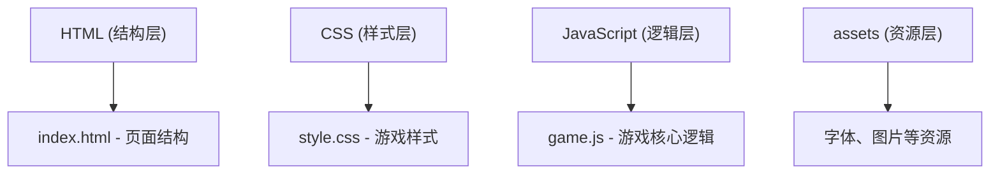

## 1. 架构设计
本项目为纯前端静态网页游戏，采用原生 HTML/CSS/JavaScript 实现，无需后端服务。



## 2. 技术描述
- **前端技术栈**：原生 HTML5 + CSS3 + JavaScript (ES6+)
- **项目结构**：按职责分离目录，HTML、CSS、JS 分别存放
- **构建工具**：无需构建工具，直接运行
- **部署方式**：静态文件部署，可直接在浏览器打开

## 3. 目录结构
```
色彩大师调色/
├── index.html          # 主页面
├── css/
│   └── style.css       # 样式文件
├── js/
│   └── game.js         # 游戏逻辑
└── .trae/
    └── documents/
        ├── PRD.md
        └── 技术架构.md
```

## 4. 核心模块设计

### 4.1 游戏状态管理
```javascript
// 游戏状态
const gameState = {
  currentRound: 1,       // 当前轮次
  totalScore: 0,         // 总分
  totalMatches: [],      // 每轮匹配度记录
  targetColor: { r: 0, g: 0, b: 0 },  // 目标颜色
  currentColor: { r: 128, g: 128, b: 128 },  // 当前调配颜色
  timeLeft: 30,          // 剩余时间
  isPlaying: false,      // 游戏进行中
  timer: null            // 定时器
};
```

### 4.2 颜色相似度计算
采用欧氏距离计算RGB颜色相似度：
- 相似度 = 100% - (RGB三维空间距离 / 最大可能距离) × 100%
- 最大可能距离 = √(255² + 255² + 255²) ≈ 441.67
- 得分 = 相似度 × 100（满分100分）

### 4.3 核心功能函数
| 函数名 | 功能描述 |
|--------|----------|
| `generateTargetColor()` | 生成随机目标颜色 |
| `updatePreviewColor()` | 更新预览颜色显示 |
| `calculateSimilarity()` | 计算颜色匹配度 |
| `calculateScore()` | 根据匹配度计算得分 |
| `startTimer()` | 启动倒计时 |
| `submitColor()` | 提交颜色进行评分 |
| `nextRound()` | 进入下一轮 |
| `showFinalResult()` | 显示最终统计结果 |

## 5. 事件绑定
- RGB滑块 `input` 事件：实时更新预览颜色
- 开始按钮 `click` 事件：开始游戏
- 提交按钮 `click` 事件：提交当前颜色
- 下一轮按钮 `click` 事件：开始新一轮
- 重新开始按钮 `click` 事件：重置游戏

## 6. UI 交互设计
- 滑块拖动时实时改变预览区背景色
- 倒计时进度条平滑动画
- 数字变化时的过渡效果
- 弹窗淡入淡出动画
- 按钮悬停和点击状态反馈
