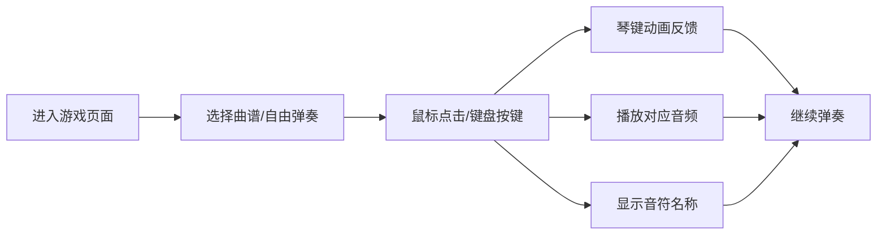

## 1. 产品概述

沉浸式音乐钢琴模拟游戏，让用户通过键盘或鼠标在浏览器中弹奏钢琴，体验音乐创作的乐趣。
- 面向音乐爱好者、初学者和休闲玩家，提供简单易用的钢琴弹奏体验
- 产品价值：降低音乐学习门槛，随时随地享受弹奏钢琴的乐趣

## 2. 核心功能

### 2.1 用户角色
| 角色 | 注册方式 | 核心权限 |
|------|---------|----------|
| 普通用户 | 无需注册 | 弹奏钢琴、跟随曲谱练习、查看音符显示 |

### 2.2 功能模块
1. **主界面**：钢琴键盘、音符显示区、曲谱选择区
2. **钢琴键盘模块**：2个八度的可视化琴键，支持鼠标点击和键盘按键
3. **音频播放模块**：Web Audio API生成对应音高的钢琴音色
4. **视觉反馈模块**：琴键按下动画、颜色变化效果
5. **音符显示模块**：实时显示当前弹奏的音符名称
6. **曲谱跟弹模块**：提供简单曲谱，高亮提示下一个要按的琴键

### 2.3 页面详情
| 页面名称 | 模块名称 | 功能描述 |
|---------|----------|----------|
| 主界面 | 钢琴键盘 | 显示2个八度的黑白琴键，支持鼠标点击和键盘按键映射 |
| 主界面 | 音符显示 | 实时显示当前正在弹奏的音符名称和组合和弦 |
| 主界面 | 曲谱选择 | 提供多首简单曲谱供用户跟弹练习 |
| 主界面 | 曲谱跟弹 | 高亮提示当前应该弹奏的琴键，支持进度指示 |

## 3. 核心流程

用户进入页面 → 选择曲谱（可选）→ 通过鼠标点击或键盘按键弹奏 → 琴键显示按下动画并播放音频 → 界面显示当前音符 → 完成曲谱或自由弹奏

## 4. 用户界面设计

### 4.1 设计风格
- **主色调**：深色背景（#1a1a2e）配白色琴键，黑色琴键使用深灰色，按下时使用蓝紫色渐变高亮
- **辅助色**：琴键按下使用霓虹蓝紫渐变（#667eea → #764ba2）
- **按钮样式**：圆角设计，带有微阴影，悬停时有缩放效果
- **字体**：使用 Google Fonts 的 'Playfair Display'（标题）和 'Roboto'（正文）
- **布局风格**：居中布局，钢琴键盘为视觉焦点，采用卡片式设计
- **图标风格**：简约线性图标，使用音乐相关emoji增强趣味性

### 4.2 页面设计概述
| 页面名称 | 模块名称 | UI元素 |
|---------|----------|--------|
| 主界面 | 标题区域 | 渐变色标题、装饰性音乐符号、副标题说明 |
| 主界面 | 钢琴键盘 | 3D立体琴键设计、按下时的下沉动画、发光效果 |
| 主界面 | 音符显示 | 大号字体显示音符、和弦名称高亮显示 |
| 主界面 | 曲谱区域 | 曲谱列表卡片、选中状态高亮、进度条显示 |
| 主界面 | 键盘映射提示 | 显示电脑键盘对应琴键的提示 |

### 4.3 响应式
- 桌面端优先设计，钢琴键盘居中显示
- 移动端适配：琴键宽度自适应，支持触摸操作
- 曲谱区域在小屏幕上可折叠显示

### 4.4 动效设计
- 页面加载：琴键依次淡入的动画效果
- 琴键按下：快速下沉 + 发光效果 + 轻微缩放
- 琴键释放：快速回弹恢复原位
- 音符显示：弹入动画效果
- 曲谱跟弹：呼吸灯效果提示下一个琴键
