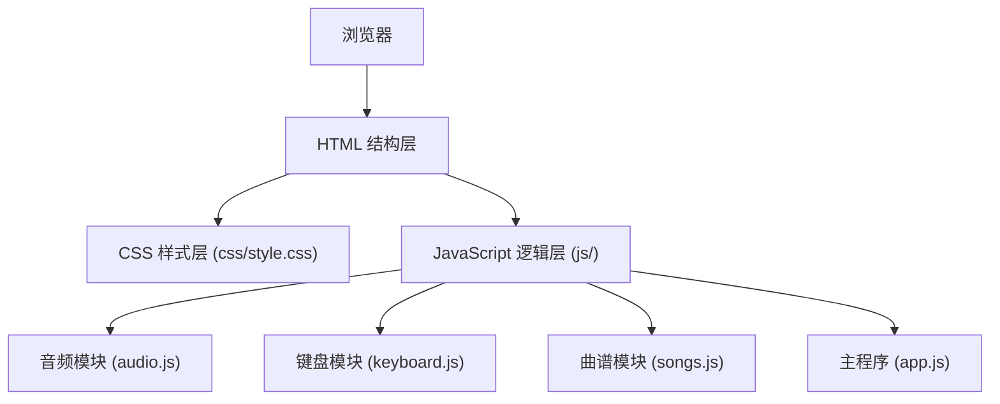

## 1. 架构设计



## 2. 技术描述

- **前端技术栈**：原生 HTML5 + CSS3 + JavaScript (ES6+)
- **音频技术**：Web Audio API 生成钢琴音色
- **动画技术**：CSS3 动画 + JavaScript 事件驱动
- **目录结构**：
  - `index.html` - 主页面
  - `css/style.css` - 样式文件
  - `js/app.js` - 主程序逻辑
  - `js/audio.js` - 音频生成模块
  - `js/keyboard.js` - 键盘映射模块
  - `js/songs.js` - 曲谱数据模块

## 3. 目录结构定义

| 路径 | 用途 |
|------|------|
| /index.html | 主入口HTML文件 |
| /css/style.css | 样式文件，包含所有CSS |
| /js/app.js | 主应用逻辑，事件绑定和UI控制 |
| /js/audio.js | Web Audio API音频生成器 |
| /js/keyboard.js | 电脑键盘与琴键映射配置 |
| /js/songs.js | 内置曲谱数据和跟弹逻辑 |

## 4. 核心技术实现

### 4.1 音频生成
- 使用 Web Audio API 的 OscillatorNode 生成正弦波
- 通过 GainNode 控制音量包络（ADSR）模拟钢琴音色
- 支持同时播放多个音符（和弦）

### 4.2 钢琴键盘
- 2个八度（C4 - B5）共24个白键 + 17个黑键
- 白键对应键盘 A-K 和 W-U 行
- 黑键对应键盘上的数字键和符号键

### 4.3 曲谱数据结构
```javascript
{
  name: "曲谱名称",
  difficulty: "难度",
  notes: [
    { note: "C4", duration: 500 },
    { note: "E4", duration: 500 },
    // ...
  ]
}
```

### 4.4 事件处理
- 鼠标事件：mousedown, mouseup, mouseleave
- 键盘事件：keydown, keyup
- 支持多键同时按下，使用 Set 数据结构跟踪按下的键
